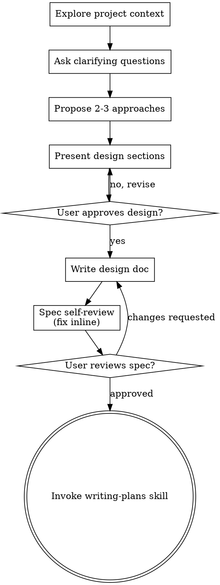
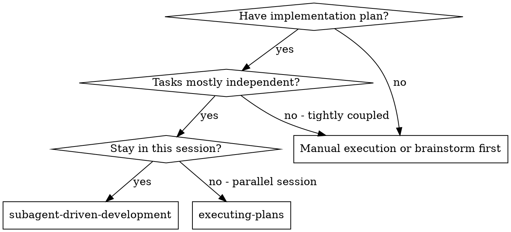
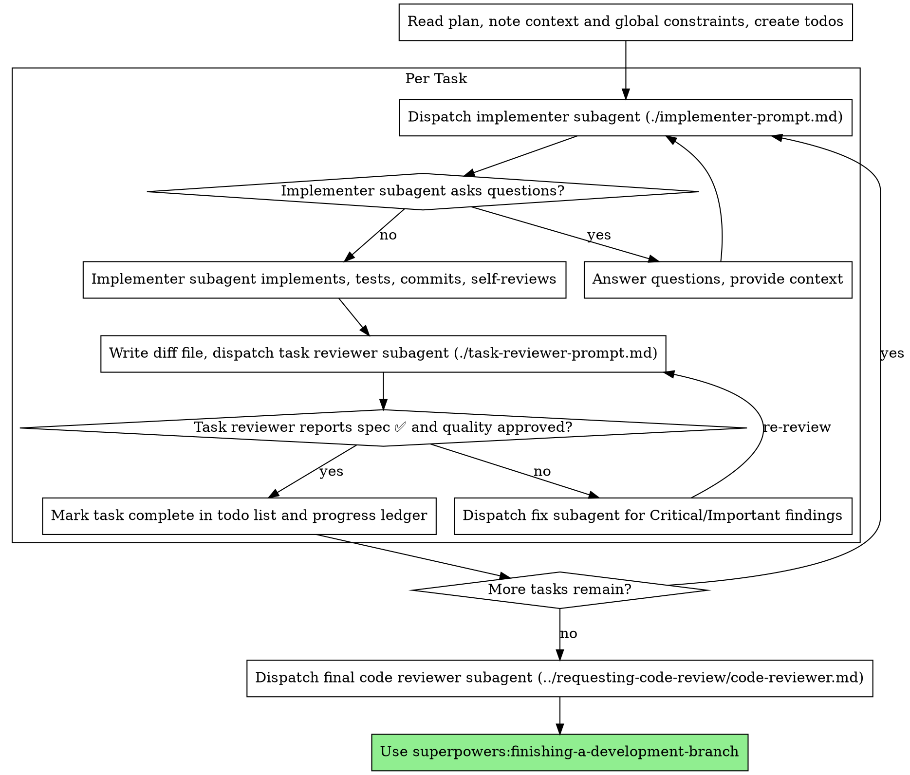

# Session transcript

Verbatim record rendered from `316e09ec-f736-4f1e-97f3-cd921370dcc1.jsonl`.

---

### 🧑 User · 2026-07-18T19:33:39.249Z

<local-command-caveat>Caveat: The messages below were generated by the user while running local commands. DO NOT respond to these messages or otherwise consider them in your response unless the user explicitly asks you to.</local-command-caveat>

### 🧑 User · 2026-07-18T19:33:39.208Z

<command-name>/clear</command-name>
            <command-message>clear</command-message>
            <command-args></command-args>

### 🧑 User · 2026-07-18T19:35:37.432Z

since there are different genre in bible, including history, poems, revelation, letters etc
how does the genre of a book or pericope influences its content bank?
what's your idea?

### 🤖 Assistant · 2026-07-18T19:35:44.669Z

<details>
<summary>💭 thinking</summary>


</details>

### 🤖 Assistant · 2026-07-18T19:35:44.855Z

**⚙️ Tool call: `Skill`**

```json
{
  "skill": "superpowers:brainstorming"
}
```

**↳ Tool result**

```
Launching skill: superpowers:brainstorming
```

### 🧑 User · 2026-07-18T19:35:44.861Z

Base directory for this skill: /home/pb/.claude/plugins/cache/claude-plugins-official/superpowers/6.1.1/skills/brainstorming

# Brainstorming Ideas Into Designs

Help turn ideas into fully formed designs and specs through natural collaborative dialogue.

Start by understanding the current project context, then ask questions one at a time to refine the idea. Once you understand what you're building, present the design and get user approval.

<HARD-GATE>
Do NOT invoke any implementation skill, write any code, scaffold any project, or take any implementation action until you have presented a design and the user has approved it. This applies to EVERY project regardless of perceived simplicity.
</HARD-GATE>

## Anti-Pattern: "This Is Too Simple To Need A Design"

Every project goes through this process. A todo list, a single-function utility, a config change — all of them. "Simple" projects are where unexamined assumptions cause the most wasted work. The design can be short (a few sentences for truly simple projects), but you MUST present it and get approval.

## Checklist

You MUST create a task for each of these items and complete them in order:

1. **Explore project context** — check files, docs, recent commits
2. **Offer the visual companion just-in-time** — NOT upfront. The first time a question would genuinely be clearer shown than described, offer it then (its own message); on approval its browser tab opens for you. If no visual question ever arises, never offer it. See the Visual Companion section below.
3. **Ask clarifying questions** — one at a time, understand purpose/constraints/success criteria
4. **Propose 2-3 approaches** — with trade-offs and your recommendation
5. **Present design** — in sections scaled to their complexity, get user approval after each section
6. **Write design doc** — save to `docs/superpowers/specs/YYYY-MM-DD-<topic>-design.md` and commit
7. **Spec self-review** — quick inline check for placeholders, contradictions, ambiguity, scope (see below)
8. **User reviews written spec** — ask user to review the spec file before proceeding
9. **Transition to implementation** — invoke writing-plans skill to create implementation plan

## Process Flow



**The terminal state is invoking writing-plans.** Do NOT invoke frontend-design, mcp-builder, or any other implementation skill. The ONLY skill you invoke after brainstorming is writing-plans.

## The Process

**Understanding the idea:**

- Check out the current project state first (files, docs, recent commits)
- Before asking detailed questions, assess scope: if the request describes multiple independent subsystems (e.g., "build a platform with chat, file storage, billing, and analytics"), flag this immediately. Don't spend questions refining details of a project that needs to be decomposed first.
- If the project is too large for a single spec, help the user decompose into sub-projects: what are the independent pieces, how do they relate, what order should they be built? Then brainstorm the first sub-project through the normal design flow. Each sub-project gets its own spec → plan → implementation cycle.
- For appropriately-scoped projects, ask questions one at a time to refine the idea
- Prefer multiple choice questions when possible, but open-ended is fine too
- Only one question per message - if a topic needs more exploration, break it into multiple questions
- Focus on understanding: purpose, constraints, success criteria

**Exploring approaches:**

- Propose 2-3 different approaches with trade-offs
- Present options conversationally with your recommendation and reasoning
- Lead with your recommended option and explain why

**Presenting the design:**

- Once you believe you understand what you're building, present the design
- Scale each section to its complexity: a few sentences if straightforward, up to 200-300 words if nuanced
- Ask after each section whether it looks right so far
- Cover: architecture, components, data flow, error handling, testing
- Be ready to go back and clarify if something doesn't make sense

**Design for isolation and clarity:**

- Break the system into smaller units that each have one clear purpose, communicate through well-defined interfaces, and can be understood and tested independently
- For each unit, you should be able to answer: what does it do, how do you use it, and what does it depend on?
- Can someone understand what a unit does without reading its internals? Can you change the internals without breaking consumers? If not, the boundaries need work.
- Smaller, well-bounded units are also easier for you to work with - you reason better about code you can hold in context at once, and your edits are more reliable when files are focused. When a file grows large, that's often a signal that it's doing too much.

**Working in existing codebases:**

- Explore the current structure before proposing changes. Follow existing patterns.
- Where existing code has problems that affect the work (e.g., a file that's grown too large, unclear boundaries, tangled responsibilities), include targeted improvements as part of the design - the way a good developer improves code they're working in.
- Don't propose unrelated refactoring. Stay focused on what serves the current goal.

## After the Design

**Documentation:**

- Write the validated design (spec) to `docs/superpowers/specs/YYYY-MM-DD-<topic>-design.md`
  - (User preferences for spec location override this default)
- Use elements-of-style:writing-clearly-and-concisely skill if available
- Commit the design document to git

**Spec Self-Review:**
After writing the spec document, look at it with fresh eyes:

1. **Placeholder scan:** Any "TBD", "TODO", incomplete sections, or vague requirements? Fix them.
2. **Internal consistency:** Do any sections contradict each other? Does the architecture match the feature descriptions?
3. **Scope check:** Is this focused enough for a single implementation plan, or does it need decomposition?
4. **Ambiguity check:** Could any requirement be interpreted two different ways? If so, pick one and make it explicit.

Fix any issues inline. No need to re-review — just fix and move on.

**User Review Gate:**
After the spec review loop passes, ask the user to review the written spec before proceeding:

> "Spec written and committed to `<path>`. Please review it and let me know if you want to make any changes before we start writing out the implementation plan."

Wait for the user's response. If they request changes, make them and re-run the spec review loop. Only proceed once the user approves.

**Implementation:**

- Invoke the writing-plans skill to create a detailed implementation plan
- Do NOT invoke any other skill. writing-plans is the next step.

## Key Principles

- **One question at a time** - Don't overwhelm with multiple questions
- **Multiple choice preferred** - Easier to answer than open-ended when possible
- **YAGNI ruthlessly** - Remove unnecessary features from all designs
- **Explore alternatives** - Always propose 2-3 approaches before settling
- **Incremental validation** - Present design, get approval before moving on
- **Be flexible** - Go back and clarify when something doesn't make sense

## Visual Companion

A browser-based companion for showing mockups, diagrams, and visual options during brainstorming. Available as a tool — not a mode. Accepting the companion means it's available for questions that benefit from visual treatment; it does NOT mean every question goes through the browser.

**Offering the companion (just-in-time):** Do NOT offer it upfront. Wait until a question would genuinely be clearer shown than told — a real mockup / layout / diagram question, not merely a UI *topic*. The first time that happens, offer it then, as its own message:
> "This next part might be easier if I show you — I can put together mockups, diagrams, and comparisons in a browser tab as we go. It's still new and can be token-intensive. Want me to? I'll open it for you."

**This offer MUST be its own message.** Only the offer — no clarifying question, summary, or other content. Wait for the user's response. If they accept, start the server with `--open` so their browser opens to the first screen automatically. If they decline, continue text-only and don't offer again unless they raise it.

**Per-question decision:** Even after the user accepts, decide FOR EACH QUESTION whether to use the browser or the terminal. The test: **would the user understand this better by seeing it than reading it?**

- **Use the browser** for content that IS visual — mockups, wireframes, layout comparisons, architecture diagrams, side-by-side visual designs
- **Use the terminal** for content that is text — requirements questions, conceptual choices, tradeoff lists, A/B/C/D text options, scope decisions

A question about a UI topic is not automatically a visual question. "What does personality mean in this context?" is a conceptual question — use the terminal. "Which wizard layout works better?" is a visual question — use the browser.

If they agree to the companion, read the detailed guide before proceeding:
`skills/brainstorming/visual-companion.md`


### 🤖 Assistant · 2026-07-18T19:35:52.859Z

<details>
<summary>💭 thinking</summary>


</details>

### 🤖 Assistant · 2026-07-18T19:35:53.460Z

I'll ground myself in how the content bank is actually structured before sharing ideas. Let me look.

### 🤖 Assistant · 2026-07-18T19:35:55.406Z

**⚙️ Tool call: `Bash`**

```json
{
  "command": "ls content_bank/ 2>/dev/null; echo \"---\"; find . -type d -name \"content_bank*\" 2>/dev/null; echo \"--- docs ---\"; ls docs/",
  "description": "Locate content bank tree and docs"
}
```

**↳ Tool result**

```
author
__init__.py
lib
PROVENANCE.md
__pycache__
README.md
store
tests
---
./content_bank
./work/content_bank_quality
--- docs ---
bible_licenses.md
chinese_resource_licenses.md
core_principles.md
design-kit_generator.md
feature-listening_transcription.md
motto.md
sample-kit-matthew_5_1-12.md
sessions
superpowers
unplug_assitant.md
```

### 🤖 Assistant · 2026-07-18T19:36:00.525Z

**⚙️ Tool call: `Bash`**

```json
{
  "command": "cat content_bank/README.md",
  "description": "Read content bank README"
}
```

**↳ Tool result**

```
# Content bank

The static, human-reviewed study-content library above the corpus. Items are
indexed by corpus pericope × dimension × age tier and served through one gated
read path.

- `store/<book>.json` — the content, one file per book, keyed on corpus pericope
  ids (e.g. `MAT-014`). Only `review_status: published` items are served in
  product mode.
- `lib/content.py: get_content(book, ...)` — the single read path + content
  gate (`mode="product"` serves published-only; `mode="author"` sees all).
- `lib/schema.py` — the controlled vocabularies and per-item validation.
- `lib/validate.py: validate_store(book)` — referential integrity against corpus
  pericopes, id uniqueness, and bilingual coverage counts.
- `lib/corpus_bridge.py` — read-only access to corpus pericopes, book names, the
  Westminster guardrail, and passage text.
- `lib/prototype_bank.py` — adapter to the kit-generator prototype's bank shape.
- `author/` — the offline drafting harness: `build_draft_prompt.py` assembles a
  per-pericope prompt pack (passage + WCF guardrail + dimensions + schema);
  `review_checklist.py` prints the draft→reviewed→published checklist. No API
  calls; drafting is human-in-the-loop.

Run tests: `python3 -m unittest discover -s content_bank/tests -v`

Bilingual: items carry per-language text (`text: {en, zh}`); one id per logical
item regardless of render language. Content authoring at scale is a separate
effort (see `docs/superpowers/specs/2026-07-18-content-bank-design.md`).
```

### 🤖 Assistant · 2026-07-18T19:36:03.677Z

**⚙️ Tool call: `Bash`**

```json
{
  "command": "cd content_bank && python3 -c \"import json,glob;\nf=glob.glob('store/*.json')[0];\nd=json.load(open(f));\nprint(f);\nimport itertools;\nprint(json.dumps(d, ensure_ascii=False)[:2500])\"",
  "description": "Peek at a content bank store item shape"
}
```

**↳ Tool result**

```
store/mat.json
{"book": "MAT", "items": [{"id": "mt4-d1-who-led-q", "passage": "MAT-009", "dimension": "D1", "type": "question", "age_tier": "pre_reader", "difficulty": 1, "review_status": "published", "text": {"en": "Who led Jesus into the wilderness?"}, "version": 1, "provenance": {"drafted_by": "claude", "reviewed_by": "claude-adversarial", "reviewed_date": "2026-07-18", "guardrail": "WCF-1", "brief": "author/briefs/mat-009.md", "confirmed_by": "kyhhdm"}, "leader_reference": {"kind": "answer_key", "text": {"en": "The Spirit. \"Jesus was led by the Spirit into the wilderness to be tempted by the devil.\""}, "verse": {"en": "Matthew 4:1"}, "provenance": {"drafted_by": "claude", "reviewed_by": "claude-adversarial", "reviewed_date": "2026-07-19", "guardrail": "WCF-1", "confirmed_by": "kyhhdm"}}}, {"id": "mt4-d2-first-temptation-q", "passage": "MAT-009", "dimension": "D2", "type": "question", "age_tier": "child", "difficulty": 1, "review_status": "published", "text": {"en": "What did the devil ask Jesus to do first: turn stones into bread, jump from the temple, or worship him for the kingdoms of the world?"}, "version": 1, "provenance": {"drafted_by": "claude", "reviewed_by": "claude-adversarial", "reviewed_date": "2026-07-18", "guardrail": "WCF-1", "brief": "author/briefs/mat-009.md", "confirmed_by": "kyhhdm"}, "leader_reference": {"kind": "answer_key", "text": {"en": "Turn stones into bread — the devil says, \"If You are the Son of God, tell these stones to become bread.\""}, "verse": {"en": "Matthew 4:3"}, "provenance": {"drafted_by": "claude", "reviewed_by": "claude-adversarial", "reviewed_date": "2026-07-19", "guardrail": "WCF-1", "confirmed_by": "kyhhdm"}}}, {"id": "mt4-d2-three-places-q", "passage": "MAT-009", "dimension": "D2", "type": "question", "age_tier": "youth", "difficulty": 2, "review_status": "published", "text": {"en": "This passage names three places: the wilderness, where the Spirit led Jesus (v.1), and two more places the devil took him afterward. Name all three, in the order they happen."}, "version": 1, "provenance": {"drafted_by": "claude", "reviewed_by": "claude-adversarial", "reviewed_date": "2026-07-18", "guardrail": "WCF-1", "brief": "author/briefs/mat-009.md", "confirmed_by": "kyhhdm"}, "leader_reference": {"kind": "answer_key", "text": {"en": "In order: the wilderness, where the Spirit led Jesus and the devil first tempted him (v.1-3); the holy city, on the pinnacle of the temple (v.5); and a very high mountain, showing him all the kingdoms of
```

### 🤖 Assistant · 2026-07-18T19:36:11.074Z

<details>
<summary>💭 thinking</summary>


</details>

### 🤖 Assistant · 2026-07-18T19:36:12.302Z

**⚙️ Tool call: `Bash`**

```json
{
  "command": "cd content_bank && grep -nE \"D1|D2|D3|D4|D5|D6|D7|D8|dimension|TYPES|type|VOCAB|=.*\\[\" lib/schema.py | head -60",
  "description": "Extract controlled vocab from schema"
}
```

**↳ Tool result**

```
Exit code 1
/bin/bash: line 1: cd: content_bank: No such file or directory
```

### 🤖 Assistant · 2026-07-18T19:36:18.977Z

**⚙️ Tool call: `Bash`**

```json
{
  "command": "grep -nE \"D[1-8]|dimension|TYPE|VOCAB|= *[\\[{(]|answer_key|kind\" /media/pb/data/pjllc/scripture_loom/content_bank/lib/schema.py | head -80",
  "description": "Extract controlled vocab from schema"
}
```

**↳ Tool result**

```
8:DIMENSIONS = {f"D{i}" for i in range(1, 9)}
9:TYPES = {"question", "activity", "vocab_list", "memory_verse",
11:AGE_TIERS = {"pre_reader", "child", "youth", "adult", "all"}
12:REVIEW_STATUSES = {"draft", "reviewed", "published"}
13:LANGS = {"en", "zh"}
14:GUARDRAILS = {"WCF-1"}
15:DIFFICULTIES = {1, 2, 3}
17:REFERENCE_KINDS = {"answer_key", "leader_note"}
18:CLOSED_DIMENSIONS = {"D1", "D2", "D3", "D4", "D5"}
19:OPEN_DIMENSIONS = {"D6", "D7", "D8"}
21:_REQUIRED = ("id", "passage", "dimension", "type", "age_tier",
41:    kind = ref.get("kind")
42:    if kind not in REFERENCE_KINDS:
43:        errors.append(f"leader_reference.kind: invalid '{kind}'")
48:    dim = item.get("dimension")
49:    if kind == "answer_key" and dim not in CLOSED_DIMENSIONS:
51:            f"leader_reference: answer_key only on closed dimensions "
53:    if kind == "leader_note" and dim not in OPEN_DIMENSIONS:
55:            f"leader_reference: leader_note only on open dimensions "
59:        if kind != "answer_key":
60:            errors.append("leader_reference.verse: only allowed on answer_key")
75:    errors = []
82:    if item["dimension"] not in DIMENSIONS:
83:        errors.append(f"dimension: invalid '{item['dimension']}'")
84:    if item["type"] not in TYPES:
```

### 🤖 Assistant · 2026-07-18T19:36:24.080Z

**⚙️ Tool call: `Read`**

```json
{
  "file_path": "/media/pb/data/pjllc/scripture_loom/content_bank/lib/schema.py",
  "offset": 1,
  "limit": 20
}
```

**↳ Tool result**

```
1	"""ContentItem controlled vocabularies and structural validation.
2	
3	Single source of truth for the content-bank vocabularies. Structural checks
4	only; referential integrity (passage resolves to a corpus pericope) and ID
5	uniqueness are store-level concerns (see validate.py).
6	"""
7	
8	DIMENSIONS = {f"D{i}" for i in range(1, 9)}
9	TYPES = {"question", "activity", "vocab_list", "memory_verse",
10	         "key_facts", "narration_prompt", "pre_reading_quest"}
11	AGE_TIERS = {"pre_reader", "child", "youth", "adult", "all"}
12	REVIEW_STATUSES = {"draft", "reviewed", "published"}
13	LANGS = {"en", "zh"}
14	GUARDRAILS = {"WCF-1"}
15	DIFFICULTIES = {1, 2, 3}
16	
17	REFERENCE_KINDS = {"answer_key", "leader_note"}
18	CLOSED_DIMENSIONS = {"D1", "D2", "D3", "D4", "D5"}
19	OPEN_DIMENSIONS = {"D6", "D7", "D8"}
20	
```

### 🤖 Assistant · 2026-07-18T19:36:28.688Z

<details>
<summary>💭 thinking</summary>


</details>

### 🤖 Assistant · 2026-07-18T19:36:29.821Z

**⚙️ Tool call: `Bash`**

```json
{
  "command": "grep -nE \"D[1-8][^0-9]\" /media/pb/data/pjllc/scripture_loom/docs/design-kit_generator.md | grep -iE \"D[1-8]\" | head -40",
  "description": "Find D1-D8 dimension definitions"
}
```

**↳ Tool result**

```
47:#### D1. People & Places
56:#### D2. Event Sequence
65:#### D3. Vocabulary
74:#### D4. Memory
83:#### D5. Connections
92:#### D6. Questions
101:#### D7. Interpretation
110:#### D8. Application
129:Activation is a scaffold designed to fade. Its arc is dimension D6's progression made operational:
187:  dimension      D1–D8
206:The library is **not theologically agnostic**. All content authoring and review is anchored to a fixed confessional standard: the **Westminster Confession of Faith, especially Chapter 1** on Holy Scripture — its inspiration, infallibility, inerrancy, sufficiency, clarity, and the principle that Scripture interprets Scripture (WCF 1.9, which is dimension D5 stated confessionally).
222:  dimension       D1–D8 (confirmed by leader)
239:3. **Observation targets (2–3, never more):** rotate through D1–D8 across sessions, biased toward each member's weakest recent dimensions and any dimension not observed for several sessions.
241:5. **Pre-reading quests (one per member):** selected like discussion questions, but scaled to each member's activation stage — full quest, category-only, "write your own," or omitted entirely for members who now ask unprompted. The activation stage is derived from the member's recent `prompted: no` evidence in D6 and related dimensions.
```

### 🤖 Assistant · 2026-07-18T19:36:32.234Z

**⚙️ Tool call: `Read`**

```json
{
  "file_path": "/media/pb/data/pjllc/scripture_loom/docs/design-kit_generator.md",
  "offset": 45,
  "limit": 75
}
```

**↳ Tool result**

```
45	### The eight dimensions
46	
47	#### D1. People & Places
48	
49	Knowing who the people of Scripture are and where events happen; the biblical "cast and map."
50	
51	- **Observable evidence:** names a person and says who they are; locates an event on a map; distinguishes similar figures (the Johns, the Herods, the Marys); knows relationships (Ruth → David).
52	- **Question templates:** Who did ___? Who was ___'s father/brother/king? Where did this happen? Which land did they travel from/to?
53	- **Paper activities:** match people to actions; mark places on a map; family-tree filling; "who am I?" riddle cards.
54	- **Progression:** recognizes major names → places figures in their book and era → explains a figure's role in the larger story.
55	
56	#### D2. Event Sequence
57	
58	The order and flow of events — within a passage, within a book, and across the biblical timeline.
59	
60	- **Observable evidence:** retells events in order; places a story before/after another; positions an event on the wall timeline; notices narrative cause and effect ("this happened *because*…").
61	- **Question templates:** What happened first/next/after? What happened right before this passage? Put these in order.
62	- **Paper activities:** event strips to arrange; timeline placement; comic-panel ordering; "what's missing from this sequence?"
63	- **Progression:** orders events inside one story → orders stories inside one book → places books and eras on the whole-Bible timeline.
64	
65	#### D3. Vocabulary
66	
67	The Bible's own words — key terms, names, and repeated phrases — understood in their biblical sense.
68	
69	- **Observable evidence:** explains a word in their own words ("blessed," "covenant," "meek"); notices a word repeating within a passage; flags a word as unfamiliar (the Word finder role produces this directly).
70	- **Question templates:** What does ___ mean here? What word or phrase repeats? Is ___ used the same way as in [earlier passage]?
71	- **Paper activities:** word-hunt (circle repeats in the printed text); fill in missing words; match word to meaning; the family word list page.
72	- **Progression:** notices and asks about words → gives own-words definitions → tracks a word's usage across books.
73	
74	#### D4. Memory
75	
76	Holding Scripture itself: memory verses, key phrases, and passage recall.
77	
78	- **Observable evidence:** recites a verse (unaided / with hints / partially); identifies which passage a quoted line comes from; recalls last session's passage content.
79	- **Question templates:** Which verse did we memorize last time? Finish this sentence: "Blessed are the…" Where is this verse from?
80	- **Paper activities:** verse cards; arrange cut-up verse strips; write the verse from memory; first-letters prompt sheets.
81	- **Progression:** recognizes a memorized verse → recites unaided → recalls verse + reference and uses it in discussion unprompted.
82	
83	#### D5. Connections
84	
85	Linking the current passage to other passages, to earlier sessions, and to the Bible's larger patterns.
86	
87	- **Observable evidence:** "this reminds me of…" with a concrete referent; notices a quotation or allusion (Jesus quoting Deuteronomy); links a theme across books; connects to a previous session's material.
88	- **Question templates:** What does this remind you of? Where have we seen this pattern/word/promise before? How is this like/unlike [earlier story]?
89	- **Paper activities:** connection cards ("I think this connects to…"); thread lines between passages on the timeline; pattern-pair matching.
90	- **Progression:** connects to last week → connects across a book → connects across Testaments and recognizes recurring biblical patterns.
91	
92	#### D6. Questions
93	
94	The learner's own question-asking — a leading indicator of engagement and growing understanding, tracked as a skill in itself.
95	
96	- **Observable evidence:** asks a factual question; asks an interpretive question ("why does Jesus say…"); asks an application question; refines or follows up on an earlier question.
97	- **Question templates:** (prompts, since the learner supplies the questions) What is confusing? What do you wonder about? Write one question for the family.
98	- **Paper activities:** question cards (Question keeper role); the exit card's "one thing I still wonder"; question round.
99	- **Progression:** asks factual "what" questions → interpretive "why" questions → questions that connect passages or probe application.
100	
101	#### D7. Interpretation
102	
103	Understanding what the text means — first observing what it actually says, then explaining why.
104	
105	- **Observable evidence:** accurately narrates the passage's point in own words; answers a "why" question from the text rather than guessing; corrects a misreading; distinguishes what the text says from what they assumed.
106	- **Question templates:** What is the main thing this passage says? Why did ___ do/say that? What in the text tells you so? What surprised you?
107	- **Paper activities:** narration (retell, then the family checks against the text); sort statements into "the text says / the text doesn't say"; choose the best summary.
108	- **Progression:** accurate observation of what is written → explains meaning within the passage → explains the passage within the book's argument.
109	
110	#### D8. Application
111	
112	Bringing the passage into the learner's own life — kept observable and never graded as spirituality.
113	
114	- **Observable evidence:** states a concrete personal application ("I could make peace with my classmate"); recalls a past application and reports on it; turns the passage into a prayer topic.
115	- **Question templates:** Is there anything here for us to do or remember this week? How would this look at school/home? What should we pray from this passage?
116	- **Paper activities:** application card; prayer-topic slip; "this week I will…" line on the exit card.
117	- **Progression:** offers an application when prompted → applies unprompted → reports back on a previous application.
118	
119	**Boundary (core principle 4):** the record stores *stated applications and reports*, never assessments of sincerity, faith, or maturity.
```

### 🤖 Assistant · 2026-07-18T19:37:07.920Z

<details>
<summary>💭 thinking</summary>


</details>

### 🤖 Assistant · 2026-07-18T19:37:21.983Z

This is a good question, and I've now got the concrete grounding to answer it well. Here's my thesis, then one question about where you want to take it.

## My idea: genre doesn't add dimensions — it reweights and reshapes the eight

The content bank is keyed on **pericope × dimension (D1–D8) × age tier**. The eight dimensions are meant to be universal, and I think they should stay that way. Genre shouldn't add a ninth dimension or a "poetry mode." Instead it does two things:

**1. It changes which dimensions are load-bearing vs. forced (a per-pericope *dimension profile*).**

Your published Matthew items sit in narrative, where D1 (People & Places) and D2 (Event Sequence) are the natural anchors — "Who led Jesus?", "Name the three places in order." Those same two dimensions collapse in other genres:

| Genre | Natural anchors | Nearly empty / forced |
|---|---|---|
| Narrative / History (Gospels, Kings) | D1, D2, D7 | — |
| Poetry (Psalms, Song) | D3 imagery, D4 memory, D7 | D2 sequence, D1 |
| Wisdom (Proverbs, Job, Eccl.) | D3, D7, D8 | D2 |
| Prophecy / Apocalyptic (Isaiah, Rev.) | D5, D7 symbol→referent, D3 | D2, D8 (guard against speculation) |
| Epistle (Romans, Eph.) | D7 argument, D5, D3, D8 | D1, D2 |
| Law (Lev., Deut.) | D3, D5 (points to Christ), D7 | D2 |

The payoff is concrete for the *selector*: it already "rotates observation targets across D1–D8, biased toward weak dimensions." Without genre awareness it will eventually try to assign a **D2 event-sequence** target on Psalm 23 — where no such content can exist. A dimension profile tells both the author harness (what to draft) and the selector (what to pick) which dimensions a given pericope actually supports.

**2. It reshapes the *templates* inside a surviving dimension — not the schema, just the author brief.**

D7 "what does the text say" is genre-specific in practice: narrative → *retell the event*; poetry → *what is this image comparing, and to what*; epistle → *trace the "therefore" — find the conclusion and its ground*. Same D2 "sequence" becomes **argument-flow** (premise→conclusion strips) in an epistle rather than temporal event strips. This is guidance in `author/briefs/`, not new `TYPES`.

**One theological note:** reading each text according to its kind is itself a WCF-1 concern, not just pedagogy — "Scripture interprets Scripture," and apocalyptic in particular needs the guardrail *against* over-reading symbols. So genre-sensitivity is part of interpreting faithfully, which fits how the bank is already anchored.

**Where it lives:** genre is a property of the pericope/book, so it belongs in the **corpus** layer as metadata, surfaced to the content bank through `corpus_bridge`. The bank gains a genre→dimension-profile table; no new during-session anything, no new schema types.

---

Before I go further — what's the intent here?

### 🤖 Assistant · 2026-07-18T19:37:26.225Z

**⚙️ Tool call: `AskUserQuestion`**

```json
{
  "questions": [
    {
      "question": "How do you want to take the genre question forward?",
      "header": "Intent",
      "multiSelect": false,
      "options": [
        {
          "label": "Spec a genre-profile feature",
          "description": "Treat this as a design to build: genre metadata in corpus + a dimension-profile table the author harness and selector consult. Move toward a written spec."
        },
        {
          "label": "Just thinking aloud",
          "description": "Explore the concept conceptually for now — pressure-test the idea, discuss edge cases, no doc or code yet."
        },
        {
          "label": "Focus on the author-brief side",
          "description": "Set aside the selector/schema; work on genre-specific question & activity template guidance for the drafting harness."
        },
        {
          "label": "Pressure-test my thesis first",
          "description": "You think the reweighting framing might be wrong or incomplete — challenge it before committing to any direction."
        }
      ]
    }
  ]
}
```

**↳ Tool result**

```
Your questions have been answered: "How do you want to take the genre question forward?"="Pressure-test my thesis first". You can now continue with these answers in mind.
```

### 🤖 Assistant · 2026-07-18T19:41:49.769Z

<details>
<summary>💭 thinking</summary>


</details>

### 🤖 Assistant · 2026-07-18T19:41:50.454Z

Good — that's the right instinct. Let me genuinely try to break my own thesis, including with the data that's already in the bank rather than just theory.

### 🤖 Assistant · 2026-07-18T19:41:53.222Z

**⚙️ Tool call: `Bash`**

```json
{
  "command": "python3 -c \"\nimport json, collections\nd=json.load(open('store/mat.json'))\n# dimension distribution per pericope\nbyp=collections.defaultdict(lambda: collections.Counter())\ntypes=collections.Counter()\nfor it in d['items']:\n    byp[it['passage']][it['dimension']]+=1\n    types[it['type']]+=1\nprint('items:', len(d['items']))\nprint('types:', dict(types))\nprint()\nprint('per-pericope dimension spread:')\nfor p in sorted(byp):\n    print(' ', p, dict(sorted(byp[p].items())))\n\"",
  "description": "Dimension distribution per pericope in Matthew bank"
}
```

**↳ Tool result**

```
items: 62
types: {'question': 38, 'activity': 9, 'pre_reading_quest': 8, 'memory_verse': 3, 'narration_prompt': 4}

per-pericope dimension spread:
  MAT-009 {'D1': 2, 'D2': 5, 'D3': 3, 'D4': 2, 'D5': 2, 'D6': 2, 'D7': 3, 'D8': 1}
  MAT-013 {'D1': 4, 'D2': 3, 'D6': 1}
  MAT-014 {'D2': 4, 'D3': 3, 'D4': 2, 'D5': 3, 'D6': 1, 'D7': 3, 'D8': 2}
  MAT-015 {'D2': 3, 'D3': 4, 'D4': 2, 'D5': 2, 'D6': 1, 'D7': 2, 'D8': 2}
```

### 🤖 Assistant · 2026-07-18T19:42:00.874Z

<details>
<summary>💭 thinking</summary>


</details>

### 🤖 Assistant · 2026-07-18T19:42:03.425Z

**⚙️ Tool call: `Bash`**

```json
{
  "command": "python3 -c \"\nfrom content_bank.lib import corpus_bridge as cb\n\" 2>/dev/null; grep -rniE \"MAT-01[3-5]|beatitud|5:1|sermon\" /media/pb/data/pjllc/scripture_loom/corpus/ 2>/dev/null | grep -iE \"beatitud|5:1|sermon|title|MAT-01[3-5].*[A-Za-z]\" | head -20",
  "description": "Identify Beatitudes pericope id"
}
```

**↳ Tool result**

```
/media/pb/data/pjllc/scripture_loom/corpus/sources/jfb/helloao/SNG.json:12:   "introduction": "rose--if applied to Jesus Christ, it, with the white lily (lowly, Co2 8:9), answers to \"white and ruddy\" (Sol 5:10). But it is rather the meadow-saffron: the Hebrew means radically a plant with a pungent bulb, inapplicable to the rose. So Syriac. It is of a white and violet color [MAURER, GESENIUS, and WEISS]. The bride thus speaks of herself as lowly though lovely, in contrast with the lordly \"apple\" or citron tree, the bridegroom (Sol 2:3); so the \"lily\" is applied to her (Sol 2:2), \n\nSharon-- (Isa 35:1-2). In North Palestine, between Mount Tabor and Lake Tiberias (Ch1 5:16). Septuagint and Vulgate translate it, \"a plain\"; though they err in this, the Hebrew Bible not elsewhere favoring it, yet the parallelism to valleys shows that, in the proper name Sharon, there is here a tacit reference to its meaning of lowliness. Beauty, delicacy, and lowliness, are to be in her, as they were in Him (Mat 11:29).\n\n"
/media/pb/data/pjllc/scripture_loom/corpus/sources/jfb/helloao/SNG.json:17:   "introduction": "By night--literally, \"By nights.\" Continuation of the longing for the dawn of the Messiah (Sol 2:17; Psa 130:6; Mal 4:2). The spiritual desertion here (Sol 2:17; Sol 3:5) is not due to indifference, as in Sol 5:2-8. \"As nights and dews are better for flowers than a continual sun, so Christ's absence (at times) giveth sap to humility, and putteth an edge on hunger, and furnisheth a fair field to faith to put forth itself\" [RUTHERFORD]. Contrast Sol 1:13; Psa 30:6-7. \n\non . . . bed--the secret of her failure (Isa 64:7; Jer 29:13; Amo 6:1, Amo 6:4; Hos 7:14). \n\nloveth--no want of sincerity, but of diligence, which she now makes up for by leaving her bed to seek Him (Psa 22:2; Psa 63:8; Isa 26:9; Joh 20:17). Four times (Sol 3:1-4) she calls Jesus Christ, \"Him whom my soul loveth,\" designating Him as absent; language of desire: \"He loved me,\" would be language of present fruition (Rev 1:5). In questioning the watchmen (Sol 3:3), she does not even name Him, so full is her heart of Him. Having found Him at dawn (for throughout He is the morning), she charges the daughters not to abridge by intrusion the period of His stay. Compare as to the thoughtful seeking for Jesus Christ in the time of John the Baptist, in vain at first, but presently after successful (Luk 3:15-22; John 1:19-34). \n\nfound him not--Oh, for such honest dealings with ourselves (Pro 25:14; Jde 1:12)!\n\n"
/media/pb/data/pjllc/scripture_loom/corpus/sources/jfb/helloao/SNG.json:27:   "introduction": "Answer to her prayer (Isa 65:24; Rev 3:20). \n\nam come--already (Sol 4:16); \"come\" (Gen 28:16). \n\nsister . . . spouse--As Adam's was created of his flesh, out of his opened side, there being none on earth on a level with him, so the bride out of the pierced Saviour (Eph 5:30-32). \n\nhave gathered . . . myrrh--His course was already complete; the myrrh, &c. (Mat 2:11; Mat 26:7-12; Joh 19:39), emblems of the indwelling of the anointing Holy Ghost, were already gathered. \n\nspice--literally, \"balsam.\" \n\nhave eaten--answering to her \"eat\" (Sol 4:16). \n\nhoneycomb--distinguished here from liquid \"honey\" dropping from trees. The last supper, here set forth, is one of espousal, a pledge of the future marriage (Sol 8:14; Rev 19:9). Feasts often took place in gardens. In the absence of sugar, then unknown, honey was more widely used than with us. His eating honey with milk indicates His true, yet spotless, human nature from infancy (Isa 7:15); and after His resurrection (Luk 24:42). \n\nmy wine-- (Joh 18:11) --a cup of wrath to Him, of mercy to us, whereby God's Word and promises become to us \"milk\" (Psa 19:10; Pe1 2:2). \"My\" answers to \"His\" (Sol 4:16). The myrrh (emblem, by its bitterness, of repentance), honey, milk (incipient faith), wine (strong faith), in reference to believers, imply that He accepts all their graces, however various in degree. \n\neat--He desires to make us partakers in His joy (Isa 55:1-2; Joh 6:53-57; Jo1 1:3). \n\ndrink abundantly--so as to be filled (Eph 5:18; as Hag 1:6). \n\nfriends-- (Joh 15:15).\n\n"
/media/pb/data/pjllc/scripture_loom/corpus/sources/jfb/helloao/SNG.json:32:   "introduction": "Historically, at Jesus Christ's crucifixion and burial, Joseph of Arimathea, and Nicodemus, and others, joined with His professed disciples. By speaking of Jesus Christ, the bride does good not only to her own soul, but to others (see on Sol 1:4; Mal 3:16; Mat 5:14-16). Compare the hypocritical use of similar words (Mat 2:8).\n\n"
/media/pb/data/pjllc/scripture_loom/corpus/sources/jfb/helloao/SNG.json:37:   "introduction": "thy feet--rather, \"thy goings\" (Psa 17:5). Evident allusion to Isa 52:7 : \"How beautiful . . . are the feet of him . . . that publisheth peace\" (Shulamite, Sol 6:13). \n\nshoes--Sandals are richly jewelled in the East (Luk 15:22; Eph 6:15). She is evidently \"on the mountains,\" whither she was wafted (Sol 6:12), above the daughters of Jerusalem, who therefore portray her feet first. \n\ndaughter--of God the Father, with whom Jesus Christ is one (Mat 5:9), \"children of (the) God\" (of peace), equivalent to Shulamite (Psa 45:10-15; Co2 6:18), as well as bride of Jesus Christ. \n\nprince's--therefore princely herself, freely giving the word of life to others, not sparing her \"feet,\" as in Sol 5:3; Exo 12:11. To act on the offensive is defensive to ourselves. \n\njoints--rather, \"the rounding\"; the full graceful curve of the hips in the female figure; like the rounding of a necklace (as the Hebrew for \"jewels\" means). Compare with the English Version, Eph 4:13-16; Col 2:19. Or, applying it to the girdle binding together the robes round the hips (Eph 6:14). \n\ncunning workman-- (Psa 139:14-16; Eph 2:10, Eph 2:22; Eph 5:29-30, Eph 5:32).\n\n"
/media/pb/data/pjllc/scripture_loom/corpus/sources/jfb/helloao/HAG.json:11:      "the Lord of hosts--Jehovah, Lord of the powers of heaven and earth, and therefore requiring implicit obedience. \n\nThis people--\"This\" sluggish and selfish \"people.\" He does not say, My people, since they had neglected the service of God. \n\nThe time--the proper time for building the temple. Two out of the seventy predicted years of captivity (dating from the destruction of the temple, 558 B.C., Kg2 25:9) were yet unexpired; this they make their plea for delay [HENDERSON]. The seventy years of captivity were completed long ago in the first year of Cyrus, 536 B.C. (Jer 29:10); dating from 606 B.C., Jehoiakim's captivity (Ch2 36:6). The seventy years to the completion of the temple (Jer 25:12) were completed this very year, the second of Darius [VATABLUS]. Ingenious in excuses, they pretended that the interruption in the work caused by their enemies proved it was not yet the proper time; whereas their real motive was selfish dislike of the trouble, expense, and danger from enemies. \"God,\" say they, \"hath interposed many difficulties to punish our rash haste\" [CALVIN]. Smerdis' interdict was no longer in force, now that Darius the rightful king was on the throne; therefore they had no real excuse for not beginning at once to build. AUBERLEN denies that by \"Artaxerxes\" in Ezra 4:7-22 is meant Smerdis. Whether Smerdis or Artaxerxes Longimanus be meant, the interdict referred only to the rebuilding of the city, which the Persian kings feared might, if rebuilt, cause them trouble to subdue; not to the rebuilding of the temple. But the Jews were easily turned aside from the work. Spiritually, like the Jews, men do not say they will never be religious, but, It is not time yet. So the great work of life is left undone.\n\n"
/media/pb/data/pjllc/scripture_loom/corpus/sources/jfb/helloao/HAG.json:60:      "I called--what the \"heaven\" and \"earth,\" the second causes, were said to do (Hag 1:10), being the visible instruments, Jehovah, in this verse, the invisible first cause, declares to be His doing. He \"calls for\" famine, &c., as instruments of His wrath (Kg2 8:1; Psa 105:16). The contrast is striking between the prompt obedience of these material agencies, and the slothful disobedience of living men, His people. \n\ndrought--Hebrew, Choreb, like in sound to Chareeb, \"waste\" (Hag 1:4, Hag 1:9), said of God's house; implying the correspondence between the sin and its punishment. Ye have let My house be waste, and I will send on all that is yours a wasting drought. This would affect not merely the \"corn,\" &c., but also \"men\" and \"cattle,\" who must perish in the absence of the \"corn,\" &c., lost by the drought. \n\nlabour of the hands--all the fruits of lands, gardens, and vineyards, obtained by labor of the hands (Deu 28:33; Psa 78:46).\n\n"
/media/pb/data/pjllc/scripture_loom/corpus/sources/jfb/helloao/HAG.json:92:   "introduction": "\n\n\nHAGGAI CALLS THE PEOPLE TO CONSIDER THEIR WAYS IN NEGLECTING TO BUILD GOD'S HOUSE: THE EVIL OF THIS NEGLECT TO THEMSELVES: THE HONOR TO GOD OF ATTENDING TO IT: THE PEOPLE'S PENITENT OBEDIENCE UNDER ZERUBBABEL FOLLOWED BY GOD'S GRACIOUS ASSURANCE. (Hag 1:1-15)\n\nsecond year of Darius--Hystaspes, the king of Medo-Persia, the second of the world empires, Babylon having been overthrown by the Persian Cyrus. The Jews having no king of their own, dated by the reign of the world kings to whom they were subject. Darius was a common name of the Persian kings, as Pharaoh of those of Egypt, and CÃ&brvbrsar of those of Rome. The name in the cuneiform inscriptions at Persepolis is written Daryawus, from the root Darh, \"to preserve,\" the Conservator [LASSEN]. HERODOTUS [6.98] explains it Coercer. Often opposite attributes are assigned to the same god; in which light the Persians viewed their king. Ezr 4:24 harmonizes with Haggai in making this year the date of the resumption of the building. \n\nsixth month--of the Hebrew year, not of Darius' reign (compare Zac 1:7; Zac 7:1, Zac 7:3; Zac 8:19). Two months later (\"the eighth month,\" Zac 1:1) Zechariah began to prophesy, seconding Haggai. \n\nthe Lord--Hebrew, JEHOVAH: God's covenant title, implying His unchangeableness, the guarantee of His faithfulness in keeping His promises to His people. \n\nby Haggai--Hebrew, \"in the hand of Haggai\"; God being the real speaker, His prophet but the instrument (compare Act 7:35; Gal 3:19). \n\nZerubbabel--called also Shesh-bazzar in Ezr 1:8; Ezr 5:14, Ezr 5:16, where the same work is attributed to Shesh-bazzar that in Ezr 3:8 is attributed to Zerubbabel. Shesh-bazzar is probably his Chaldean name; as Belteshazzar was that of Daniel. Zerubbabel, his Hebrew name, means \"one born in Babylon.\" \n\nson of Shealtiel--or Salathiel. But Ch1 3:17, Ch1 3:19 makes Pedaiah his father. Probably he was adopted by his uncle Salathiel, or Shealtiel, at the death of his father (compare Mat 1:12; Luk 3:27). \n\ngovernor of Judah--to which office Cyrus had appointed him. The Hebrew Pechah is akin to the original of the modern Turkish Pasha; one ruling a region of the Persian empire of less extent than that under a satrap. \n\nJoshua--called Jeshua (Ezr 2:2); so the son of Nun in Neh 8:17. \n\nJosedech--or Jehozadak (Ch1 6:15), one of those carried captive by Nebuchadnezzar. Haggai addresses the civil and the religious representatives of the people, so as to have them as his associates in giving God's commands; thus priest, prophet, and ruler jointly testify in God's name.\n\n"
/media/pb/data/pjllc/scripture_loom/corpus/sources/jfb/helloao/HAG.json:115:      "According to the word that--literally, \"(I am with you) the word (or thing) which I covenanted\"; that is, I am with you as I covenanted with you when ye came out of Egypt (Exo 19:5-6; Exo 34:10-11). The covenant promise of God to the elect people at Sinai is an additional motive for their persevering. The Hebrew for to \"covenant\" is literally \"to cut,\" alluding to the sacrificial victims cut in ratification of a covenant. \n\nso--or, \"and.\" \n\nmy Spirit remaineth among you--to strengthen you for the work (Hag 1:14; Zac 4:6). The inspiration of Haggai and Zechariah at this time was a specimen of the presence of God's Spirit remaining still with His people, as He had been with Moses and Israel of old (Ezr 5:1; Isa 63:11).\n\n"
/media/pb/data/pjllc/scripture_loom/corpus/sources/jfb/helloao/HAG.json:129:      "shake--not convert; but cause that agitation which is to precede Messiah's coming as the healer of the nations' agitations. The previous shaking shall cause the yearning \"desire\" for the Prince of peace. MOORE and others translate \"the beauty,\" or \"the desirable things (the precious gifts) of all nations shall come\" (Isa 60:5, Isa 60:11; Isa 61:6). He brings these objections to applying \"the desire of all nations\" to Messiah: (1) The Hebrew means the quality, not the thing desired, namely, its desirableness or beauty, But the abstract is often put for the concrete. So \"a man of desires,\" that is, one desired or desirable (Dan 9:23; Dan 10:11, Margin; Dan 10:3, Margin). (2) Messiah was not desired by all nations, but \"a root out of a dry ground,\" having \"no beauty that we should desire Him\" (Isa 53:2). But what is implied is not that the nations definitely desired Him, but that He was the only one to satisfy the yearning desires which all felt unconsciously for a Saviour, shown in their painful rites and bloody sacrifices. Moreover, while the Jews as a nation desired Him not (to which people Isa 53:2 refers), the Gentiles, who are plainly pointed out by \"all nations,\" accepted Him; and so to them He was peculiarly desirable. (3) The verb, \"shall come,\" is plural, which requires the noun to be understood in the plural, whereas if Messiah be intended, the noun is singular. But when two nouns stand together, of which one is governed by the other, the verb agrees sometimes in number with the latter, though it really has the former as its nominative, that is, the Hebrew \"come\" is made in number to agree with \"nations,\" though really agreeing with \"the desire.\" Besides, Messiah may be described as realizing in Himself at His coming \"the desires (the noun expressing collectively the plural) of all nations\"; whence the verb is plural. So in Sol 5:16, \"He is altogether lovely,\" in the Hebrew the same word as here, \"all desires,\" that is, altogether desirable, or the object of desires. (4) Hag 2:8, \"The silver is mine,\" &c.; accords with the translation, \"the choice things of all nations\" shall be brought in. But Hag 2:8 harmonizes quite as well with English Version of Hag 2:7, as the note on eighth verse will show; see on Hag 2:8. (5) the Septuagint and Syriac versions agree with MOORE'S translation. But Vulgate confirms English Version. So also early Jewish Rabbis before JEROME'S time. PLATO [Alcibiades, 2] shows the yearning of the Gentiles after a spiritual deliverer: \"It is therefore necessary,\" says Alcibiades on the subject of acceptable worship, \"to wait until One teach us how we ought to behave towards the gods and men.\" Alcibiades replies, \"When shall that time arrive, and who shall that Teacher be? For most glad would I be to see such a man.\" The \"good tidings of great joy\" were \"to all people\" (Luk 2:10). The Jews, and those in the adjoining nations instructed by them, looked for Shiloh to come unto whom the gathering of the people was to be, from Jacob's prophecy (Gen 49:10). The early patriarchs, Job (Job 19:25-27; Job 33:23-26) and Abraham (Joh 8:56), desired Him. \n\nfill this house with glory-- (Hag 2:9). As the first temple was filled with the cloud of glory, the symbol of God (Kg1 8:11; Ch2 5:14), so this second temple was filled with the \"glory\" of God (Joh 1:14) veiled in the flesh (as it were in the cloud) at Christ's first coming, when He entered it and performed miracles there (Mat 21:12-14); but that \"glory\" is to be revealed at His second coming, as this prophecy in its ulterior reference foretells (Mal 3:1). The Jews before the destruction of Jerusalem all expected Messiah would appear in the second temple. Since that time they invent various forced and false interpretations of such plain Messianic prophecies.\n\n"
/media/pb/data/pjllc/scripture_loom/corpus/sources/jfb/helloao/HAG.json:143:      "The glory of this latter house . . . greater than of the former--namely, through the presence of Messiah, in (whose) face is given the light of the knowledge of the glory of God (Co2 4:6; compare Heb 1:2), and who said of Himself, \"in this place is one greater than the temple\" (Mat 12:6), and who \"sat daily teaching in it\" (Mat 26:55). Though Zerubbabel's temple was taken down to the foundations when Herod rebuilt the temple, the latter was considered, in a religious point of view, as not a third temple, but virtually the second temple. \n\nin this place . . . peace--namely, at Jerusalem, the metropolis of the kingdom of God, whose seat was the temple: where Messiah \"made peace through the blood of His cross\" (Col 1:20). Thus the \"glory\" consists in this \"peace.\" This peace begins by the removal of the difficulty in the way of the just God accepting the guilty (Psa 85:8, Psa 85:10; Isa 9:6-7; Isa 53:5; Zac 6:13; Co2 5:18-19); then it creates peace in the sinner's own heart (Isa 57:19; Act 10:36; Rom 5:1; Rom 14:17; Eph 2:13-17; Phi 4:7); then peace in the whole earth (Mic 5:5; Luk 2:14). First peace between God and man, then between man and God, then between man and man (Isa 2:4; Hos 2:18; Zac 9:10). As \"Shiloh\" (Gen 49:10) means peace, this verse confirms the view that Hag 2:7, \"the desire of all nations,\" refers to Shiloh or Messiah, foretold in Gen 49:10.\n\n"
/media/pb/data/pjllc/scripture_loom/corpus/sources/jfb/helloao/HAG.json:234:      "All other world kingdoms are to be overthrown to make way for Christ's universal kingdom (Dan 2:44). War chariots are to give place to His reign of peace (Mic 5:10; Zac 9:10).\n\n"
/media/pb/data/pjllc/scripture_loom/corpus/sources/jfb/helloao/2PE.json:81:      "Wherefore--as these graces are so necessary to your abundant entrance into Christ's kingdom (Pe2 1:10-11). \n\nI will not be negligent--The oldest manuscripts read, \"I will be about always to put you in remembrance\" (an accumulated future: I will regard you as always needing to be reminded): compare \"I will endeavor,\" Pe2 1:15. \"I will be sure always to remind you\" [ALFORD]. \"Always\"; implying the reason why he writes the second Epistle so soon after the first. He feels there is likely to be more and more need of admonition on account of the increasing corruption (Pe2 2:1-2). \n\nin the present truth--the Gospel truth now present with you: formerly promised to Old Testament believers as about to be, now in the New Testament actually present with, and in, believers, so that they are \"established\" in it as a \"present\" reality. Its importance renders frequent monitions never superfluous: compare Paul's similar apology, Rom 15:14-15.\n\n"
/media/pb/data/pjllc/scripture_loom/corpus/sources/jfb/helloao/2PE.json:88:      "Yea--Greek, \"But\"; though \"you know\" the truth (Pe2 1:12). \n\nthis tabernacle--soon to be taken down (Co2 5:1): I therefore need to make the most of my short time for the good of Christ's Church. The zeal of Satan against it, the more intense as his time is short, ought to stimulate Christians on the same ground. \n\nby--Greek, \"in\" (compare Pe2 3:1).\n\n"
/media/pb/data/pjllc/scripture_loom/corpus/sources/jfb/helloao/2PE.json:148:   "introduction": "\n\n\nADDRESS: EXHORTATION TO ALL GRACES, AS GOD HAS GIVEN US, IN THE KNOWLEDGE OF CHRIST, ALL THINGS PERTAINING TO LIFE: CONFIRMED BY THE TESTIMONY OF APOSTLES, AND ALSO PROPHETS, TO THE POWER AND COMING OF CHRIST. (2Pe. 1:1-21)\n\nSimon--the Greek form: in oldest manuscripts, \"Symeon\" (Hebrew, that is, \"hearing), as in Act 15:14. His mention of his original name accords with the design of this Second Epistle, which is to warn against the coming false teachers, by setting forth the true \"knowledge\" of Christ on the testimony of the original apostolic eye-witnesses like himself. This was not required in the First Epistle. \n\nservant--\"slave\": so Paul, Rom 1:1. \n\nto them, &c.--He addresses a wider range of readers (all believers) than in the First Epistle, Pe2 1:1, but means to include especially those addressed in the First Epistle, as Pe2 3:1 proves. \n\nobtained--by grace. Applied by Peter to the receiving of the apostleship, literally, \"by allotment\": as the Greek is, Luk 1:9; Joh 19:24. They did not acquire it for themselves; the divine election is as independent of man's control, as the lot which is east forth. \n\nlike precious--\"equally precious\" to all: to those who believe, though not having seen Christ, as well as to Peter and those who have seen Him. For it lays hold of the same \"exceeding great and precious promises,\" and the same \"righteousness of God our Saviour.\" \"The common salvation . . . the faith once delivered unto the saints\" (Jde 1:3). \n\nwith us--apostles and eye-witnesses (Pe2 1:18). Though putting forward his apostleship to enforce his exhortation, he with true humility puts himself, as to \"the faith,\" on a level with all other believers. The degree of faith varies in different believers; but in respect to its objects, present justification, sanctification, and future glorification, it is common alike to all. Christ is to all believers \"made of God wisdom, righteousness, sanctification, and redemption.\" \n\nthrough--Greek, \"in.\" Translate, as the one article to both nouns requires, \"the righteousness of Him who is (at once) our God and (our) Saviour.\" Peter, confirming Pau;'s testimony to the same churches, adopts Paul's inspired phraseology. The Gospel plan sets forth God's righteousness, which is Christ's righteousness, in the brightest light. Faith has its sphere IN it as its peculiar element: God is in redemption \"righteous,\" and at the same time a \"Saviour\"; compare Isa 45:21, \"a just God and a Saviour.\n\n"
/media/pb/data/pjllc/scripture_loom/corpus/sources/jfb/helloao/2PE.json:276:      "promise . . . liberty--(Christian)--These promises are instances of their \"great swelling words\" (Pe2 2:18). The liberty which they propose is such as fears not Satan, nor loathes the flesh. Pauline language, adopted by Peter here, and Pe1 2:16; see on Pe1 2:16; (compare Pe2 3:15; Rom 6:16-22; Rom 8:15, Rom 8:21; Gal 5:1, Gal 5:13; compare Joh 8:34). \n\ncorruption--(See on Pe2 2:12); \"destroyed . . . perish . . . corruption.\" \n\nof whom--\"by whatever . . . by the same,\" &c.\n\n"
/media/pb/data/pjllc/scripture_loom/corpus/sources/jfb/helloao/2PE.json:387:      "Nevertheless--\"But\": in contrast to the destructive effects of the day of God stand its constructive effects. As the flood was the baptism of the earth, eventuating in a renovated earth, partially delivered from \"the curse,\" so the baptism with fire shall purify the earth so as to be the renovated abode of regenerated man, wholly freed from the curse. \n\nhis promise-- (Isa 65:17; Isa 66:22). The \"we\" is not emphatical as in English Version. \n\nnew heavens--new atmospheric heavens surrounding the renovated earth. \n\nrighteousness--dwelleth in that coming world as its essential feature, all pollutions having been removed.\n\n"
/media/pb/data/pjllc/scripture_loom/corpus/sources/jfb/helloao/2PE.json:408:      "also in all his epistles-- Rom 2:4 is very similar to Pe2 3:15, beginning. The Pauline Epistles were by this time become the common property of all the churches. The \"all\" seems to imply they were now completed. The subject of the Lord's coming is handled in Th1 4:13; Th1 5:11; compare Pe2 3:10 with Th1 5:2. Still Peter distinguishes Paul's Epistle, or Epistles, \"TO YOU,\" from \"all his (other) Epistles,\" showing that certain definite churches, or particular classes of believers, are meant by \"you.\" \n\nin which--Epistles. The oldest manuscripts read the feminine relative (hais); not as Received Text (hois), \"in which things.\" \n\nsome things hard to be understood--namely, in reference to Christ's coming, for example, the statements as to the man of sin and the apostasy, before Christ's coming. \"Paul seemed thereby to delay Christ's coming to a longer period than the other apostles, whence some doubted altogether His coming\" [BENGEL]. Though there be some things hard to be understood, there are enough besides, plain, easy, and sufficient for perfecting the man of God. \"There is scarce anything drawn from the obscure places, but the same in other places may be found most plain\" [AUGUSTINE]. It is our own prejudice, foolish expectations, and carnal fancies, that make Scripture difficult [JEREMY TAYLOR]. \n\nunlearned--Not those wanting human learning are meant, but those lacking the learning imparted by the Spirit. The humanly learned have been often most deficient in spiritual learning, and have originated many heresies. Compare Ti2 2:23, a different Greek word, \"unlearned,\" literally, \"untutored.\" When religion is studied as a science, nothing is more abstruse; when studied in order to know our duty and practice it, nothing is easier. \n\nunstable--not yet established in what they have learned; shaken by every seeming difficulty; who, in perplexing texts, instead of waiting until God by His Spirit makes them plain in comparing them with other Scriptures, hastily adopt distorted views. \n\nwrest--strain and twist (properly with a hand screw) what is straight in itself (for example, Ti2 2:18). \n\nother scriptures--Paul's Epistles were, therefore, by this time, recognized in the Church, as \"Scripture\": a term never applied in any of the fifty places where it occurs, save to the Old and New Testament sacred writings. Men in each Church having miraculous discernment of spirits would have prevented any uninspired writing from being put on a par with the Old Testament word of God; the apostles' lives also were providentially prolonged, Paul's and Peter's at least to thirty-four years after Christ's resurrection, John's to thirty years later, so that fraud in the canon is out of question. The three first Gospels and Acts are included in \"the other Scriptures,\" and perhaps all the New Testament books, save John and Revelation, written later. \n\nunto their own destruction--not through Paul's fault (Pe2 2:1).\n\n"
/media/pb/data/pjllc/scripture_loom/corpus/sources/jfb/helloao/HAB.json:150:      "Yea also, because--additional reason why the Jews may look for God punishing their Chaldean foe, namely, because . . . he is \n\na proud man--rather, this clause continues the reason for the Jews expecting the punishment of the Chaldeans, \"because he transgresseth by wine (a besetting sin of Babylon, compare Dan. 5:1-31, and CURTIUS [5.1]), being a proud man.\" Love of wine often begets a proud contempt of divine things, as in Belshazzar's case, which was the immediate cause of the fall of Babylon (Dan 5:2-4, Dan 5:30; compare Pro 20:1; Pro 30:9; Pro 31:5). \n\nenlargeth his desire as hell--the grave, or the unseen world, which is \"never full\" (Pro 27:20; Pro 30:16; Isa 5:14). The Chaldeans under Nebuchadnezzar were filled with an insatiable desire of conquest. Another reason for their punishment.\n\n"
/media/pb/data/pjllc/scripture_loom/corpus/sources/jfb/helloao/HAB.json:220:      "giveth . . . neighbour drink . . . puttest . . . bottle to him--literally, \"skin,\" as the Easterns use \"bottles\" of skin for wine. MAURER, from a different Hebrew root, translates, \"that pourest in thy wrath.\" English Version keeps up the metaphor better. It is not enough for thee to be \"drunken\" thyself, unless thou canst lead others into the same state. The thing meant is, that the Chaldean king, with his insatiable desires (a kind of intoxication), allured neighboring states into the same mad thirst for war to obtain booty, and then at last exposed them to loss and shame (compare Isa 51:17; Oba 1:16). An appropriate image of Babylon, which at last fell during a drunken revel (Dan. 5:1-31). \n\nthat thou mayest look on their nakedness!--with light, like Ham of old (Gen 9:22).\n\n"
```

### 🤖 Assistant · 2026-07-18T19:42:22.070Z

<details>
<summary>💭 thinking</summary>


</details>

### 🤖 Assistant · 2026-07-18T19:42:22.609Z

Let me confirm what those pericopes actually are before I lean on them.

### 🤖 Assistant · 2026-07-18T19:42:25.948Z

**⚙️ Tool call: `Bash`**

```json
{
  "command": "python3 -c \"\nimport json\nfor f in ['corpus/store/pericopes.json','corpus/store/pericopes/mat.json']:\n    try:\n        d=json.load(open(f)); print('FOUND',f); break\n    except: pass\n\" 2>/dev/null\ngrep -rhiE \"\\\"(id|ref|title|label|osis|reference)\\\"\" /media/pb/data/pjllc/scripture_loom/corpus/store/ 2>/dev/null | grep -iE \"MAT-01[3-5]\" | head\necho \"--- fallback: search pericope defs ---\"\ngrep -rniE \"MAT-01[3-5]\" /media/pb/data/pjllc/scripture_loom/corpus/ 2>/dev/null | grep -ivE \"helloao|sources\" | grep -iE \"MAT-01[3-5]\" | head",
  "description": "Find pericope titles for MAT-013/014/015"
}
```

**↳ Tool result**

```
--- fallback: search pericope defs ---
/media/pb/data/pjllc/scripture_loom/corpus/canon/structure/pericopes/mat.json:89:   "id": "MAT-013",
/media/pb/data/pjllc/scripture_loom/corpus/canon/structure/pericopes/mat.json:96:   "id": "MAT-014",
/media/pb/data/pjllc/scripture_loom/corpus/canon/structure/pericopes/mat.json:103:   "id": "MAT-015",
```

### 🤖 Assistant · 2026-07-18T19:42:32.367Z

**⚙️ Tool call: `Bash`**

```json
{
  "command": "python3 -c \"\nimport json\nd=json.load(open('corpus/canon/structure/pericopes/mat.json'))\nitems=d if isinstance(d,list) else d.get('pericopes', d.get('items', []))\nfor it in items:\n    if it.get('id') in {'MAT-009','MAT-013','MAT-014','MAT-015'}:\n        print(it.get('id'), '|', it.get('title') or it.get('label'), '|', it.get('ref') or it.get('reference') or it.get('range'))\n\"",
  "description": "Print pericope titles and refs"
}
```

**↳ Tool result**

```
Exit code 1
Traceback (most recent call last):
  File "<string>", line 3, in <module>
FileNotFoundError: [Errno 2] No such file or directory: 'corpus/canon/structure/pericopes/mat.json'
```

### 🤖 Assistant · 2026-07-18T19:42:38.714Z

**⚙️ Tool call: `Read`**

```json
{
  "file_path": "/media/pb/data/pjllc/scripture_loom/corpus/canon/structure/pericopes/mat.json",
  "offset": 80,
  "limit": 35
}
```

**↳ Tool result**

```
80	  },
81	  {
82	   "id": "MAT-012",
83	   "range": "MAT.4.23-25",
84	   "title_en": "Jesus Heals the Multitudes",
85	   "title_zh": "",
86	   "status": "seeded"
87	  },
88	  {
89	   "id": "MAT-013",
90	   "range": "MAT.5.1-2",
91	   "title_en": "The Sermon on the Mount",
92	   "title_zh": "",
93	   "status": "seeded"
94	  },
95	  {
96	   "id": "MAT-014",
97	   "range": "MAT.5.3-12",
98	   "title_en": "The Beatitudes",
99	   "title_zh": "",
100	   "status": "seeded"
101	  },
102	  {
103	   "id": "MAT-015",
104	   "range": "MAT.5.13-16",
105	   "title_en": "Salt and Light",
106	   "title_zh": "",
107	   "status": "seeded"
108	  },
109	  {
110	   "id": "MAT-016",
111	   "range": "MAT.5.17-20",
112	   "title_en": "The Fulfillment of the Law",
113	   "title_zh": "",
114	   "status": "seeded"
```

### 🤖 Assistant · 2026-07-18T19:43:09.206Z

<details>
<summary>💭 thinking</summary>


</details>

### 🤖 Assistant · 2026-07-18T19:43:31.016Z

Confirmed, and the shipped data itself is the best pressure-test I could ask for. Here's where my thesis holds, where it cracks, and where I now think I was wrong.

## The data already refutes the "we need a genre system" version of my idea

Those four pericopes span genres inside 16 verses of one Gospel, and the authors *already* reweighted by pure instinct — no genre machinery involved:

| Pericope | Genre | Dimension spread (shipped) |
|---|---|---|
| MAT-009 Temptation | narrative | full D1–D8 |
| MAT-013 Sermon setup (5:1–2) | narrative framing | **D1×4, D2×3**, D6 — nothing else |
| MAT-014 Beatitudes (5:3–12) | poetry/wisdom | **no D1 at all**; D2/D3/D5/D7/D8 |
| MAT-015 Salt & Light (5:13–16) | metaphor/wisdom | **no D1**; D3×4, D2/D5/D7/D8 |

The two poetic pericopes dropped "People & Places" to zero and leaned on vocabulary/interpretation/application. That's my reweighting thesis confirmed as a *description* — and simultaneously an indictment of it as a *feature*. The author read the Beatitudes, saw no cast or map, and wrote vocab items. The passage **is** the genre signal. A `genre → dimension-profile` table would be re-encoding what a human already does for free by looking at the text.

## The three real cracks

**1. The eight dimensions are not genre-neutral — they're narrative's own profile, universalized.** D1 People, D2 Event Sequence, D5 timeline/connections: this ontology comes straight out of story. My claim was "genre reweights the neutral eight." But they aren't neutral. Poetry's core competency — parallelism, the movement from image to referent — has *no native dimension*; it gets crammed into D3 or D7. Epistle's core competency — the "therefore," the argument connective — same. So "reweighting" doesn't dissolve the forced-fit problem I warned about; it just relabels it as D7 and moves on. **The open question my table papered over: are D1–D8 abstract enough that "observe the parallelism" is honestly D7 — or do non-narrative genres need reading-moves that live nowhere in the schema?** I can't answer that from Matthew. Nobody can until a Psalm and an epistle pericope are actually authored.

**2. Genre doesn't partition cleanly, so a genre tag is often a lie precisely where it matters.** MAT-013/014/015 proves it: narrative, poetry, and metaphor in one Gospel chapter. Jonah is narrative in a prophetic book; the Magnificat is poetry in a narrative; Isaiah 36–39 is history inside prophecy. A book-level genre field misfires constantly; even pericope-level is a tendency, not a fact. Any profile keyed on a single genre label inherits that error.

**3. The selector's real constraint is content-availability, not genre.** The one concrete failure I cited — the selector assigning a "D2 event-sequence" observation target on Psalm 23 — is better solved *without* genre at all. The rule should be: **the selector may only pick a dimension that has a published item for this pericope.** That's cheaper, exactly correct, and self-maintaining — if the author wrote no D2 for a psalm, D2 is simply unavailable. Genre never enters. My genre profile was solving a problem that "select where content exists" already solves, and solving it worse (because of crack #2).

## Where I've landed (revised)

The reweighting framing is true as an *observation* and misleading as an *architecture*. I'd now argue **don't build a genre-profile system**, and instead:

- **Fix the selector to be availability-driven**, not genre-driven — a small, correct change that kills the Psalm-D2 failure mode outright.
- **Treat genre as author-brief guidance, not data** — genre-specific question/activity templates (poetry → "what is this image comparing," epistle → "trace the therefore") belong in `author/briefs/`, where the human already applies them.
- **Run the empirical probe before any schema decision**: hand-author *one* Psalm pericope and *one* epistle pericope. What strains against D1–D8 there is the only real evidence for whether crack #1 forces a schema change. Architecture after data, not before.

The single question worth resolving is crack #1 — and it's answerable by authoring, not by arguing. Want me to set up that probe (draft the two non-narrative pericopes and see what breaks), or keep pressure-testing at the conceptual level?

### 🧑 User · 2026-07-18T20:01:58.770Z

run the probe

### 🤖 Assistant · 2026-07-18T20:02:09.577Z

<details>
<summary>💭 thinking</summary>


</details>

### 🤖 Assistant · 2026-07-18T20:02:10.596Z

On it. This is an experiment, not a feature build — I'll use the real author harness against real public-domain text and observe what strains. First, let me see the harness and what passages are actually available through the gate.

### 🤖 Assistant · 2026-07-18T20:02:12.440Z

**⚙️ Tool call: `Bash`**

```json
{
  "command": "cd /media/pb/data/pjllc/scripture_loom\necho \"=== author harness ===\"; ls content_bank/author/\necho \"=== build_draft_prompt (head) ===\"; sed -n '1,60p' content_bank/author/build_draft_prompt.py",
  "description": "Inspect author harness"
}
```

**↳ Tool result**

```
=== author harness ===
briefs
build_brief_prompt.py
build_draft_prompt.py
build_reference_prompt.py
dimensions.py
__init__.py
__pycache__
review_checklist.py
rubric.py
=== build_draft_prompt (head) ===
"""Assemble the Stage-2 drafting pack for one pericope.

Passage-first: the pericope's verses are the subject; the theological base is the
committed brief (author/briefs/<pericope>.md, produced by Stage 1). The full
lampposts are NOT here — only a compact WCF-1 guardrail. Offline, no API."""
import argparse
import pathlib

from ..lib import corpus_bridge, schema
from . import dimensions, rubric

_BRIEFS = pathlib.Path(__file__).parent / "briefs"

_WCF1_GUARDRAIL = """Draft WITHIN the Westminster Confession's doctrine of Scripture
(WCF ch.1): God-inspired, infallible, inerrant, sufficient, clear; Scripture
interprets Scripture. Hedging on this fails review. (Full chapter and this
passage's doctrinal anchors are distilled in the brief above.)"""

_RULES_BLOCK = """## How to draft (hard rules)

- ANSWERABLE FROM THIS PASSAGE: every item except a D5 (Connections) item must be
  answerable from the verses above alone. D5 may reach only a cross-reference
  named in the brief, and must name it.
- ONLY THE DIMENSIONS THIS PASSAGE GENUINELY SUPPORTS: a short setup passage may
  support D1/D2/D6 and not D7/D8 — that's correct, not a gap. Do not pad.
- EVIDENCE, NEVER JUDGMENT: prompts elicit observable behavior; never assess
  faith, character, or spiritual state.
- STAY ON THE PASSAGE: the brief is your base; items are about the PASSAGE.
- TIERS: spread across age_tiers (pre_reader/child/youth/adult/all), 1-3."""

_TYPE_BLOCK = """## What each type should be

Use ONLY these five types this cycle — not vocab_list or key_facts (the prototype
selector does not render them):
- question: one clear question; tag the dimension it exercises.
- activity: doable on paper with ordinary materials; add a pre_reader variant
  when the passage allows.
- pre_reading_quest: "listen for X" prompt with a short `category` label, at
  child/youth/adult tiers. Its "listen-for" form is fact-noticing — tag it
  D1/D2/D3/D4. Only tag it D5/D6/D7 if the prompt itself asks the listener to
  hunt for a connection, form a question, or notice a *why* (not just spot a fact).
- memory_verse: one or two verses from THIS passage, verbatim, with reference.
- narration_prompt: "retell in your own words" for the passage as a whole."""

_SCHEMA_BLOCK = """Each item MUST be a JSON object with these fields:
  id, passage (pericope id), dimension ({dimensions}),
  type ({types}), age_tier ({tiers}), difficulty (1|2|3),
  review_status "draft", text {{ "en": "..." }}, version 1,
  category {{ "en": "..." }} ONLY for pre_reading_quest.
No provenance; the reviewer stamps it."""


def _load_brief(pericope_id):
    f = _BRIEFS / f"{pericope_id.lower()}.md"
    if not f.exists():
        raise FileNotFoundError(
            f"No brief for {pericope_id}; run Stage 1 (build_brief_prompt) and "
            f"commit {f} first.")
    return f.read_text(encoding="utf-8")
```

### 🤖 Assistant · 2026-07-18T20:02:21.552Z

<details>
<summary>💭 thinking</summary>


</details>

### 🤖 Assistant · 2026-07-18T20:02:23.952Z

**⚙️ Tool call: `Bash`**

```json
{
  "command": "cd /media/pb/data/pjllc/scripture_loom\necho \"=== corpus books with pericope structure ===\"; ls corpus/canon/structure/pericopes/ 2>/dev/null\necho \"=== displayable versions available (license gate) ===\"\npython3 -c \"\nimport sys; sys.path.insert(0,'.')\nfrom content_bank.lib import corpus_bridge as cb\nprint([x for x in dir(cb) if not x.startswith('_')])\n\"",
  "description": "Check available books and corpus_bridge API"
}
```

**↳ Tool result**

```
=== corpus books with pericope structure ===
mat.json
=== displayable versions available (license gate) ===
['book_name', 'commentary', 'confessional_refs', 'crossrefs', 'json', 'passage_text', 'pathlib', 'pericope_ids', 'pericopes', 'wcf_chapter1_text']
```

### 🤖 Assistant · 2026-07-18T20:02:33.746Z

<details>
<summary>💭 thinking</summary>


</details>

### 🤖 Assistant · 2026-07-18T20:02:38.164Z

**⚙️ Tool call: `Bash`**

```json
{
  "command": "cd /media/pb/data/pjllc/scripture_loom\necho \"=== canon structure ===\"; ls corpus/canon/ 2>/dev/null\necho \"=== servable Bible text: what books/versions ===\"; find corpus/canon -maxdepth 3 -type d 2>/dev/null | head -40\necho \"=== try fetching a Psalm and an epistle verse via passage_text ===\"\npython3 -c \"\nimport sys; sys.path.insert(0,'.')\nfrom content_bank.lib import corpus_bridge as cb\nimport inspect\nprint(inspect.signature(cb.passage_text))\nfor ref in ['PSA.23.1-6','PSA.1.1-6','PHP.2.1-11','JAS.1.19-27','1JN.1.1-10']:\n    try:\n        t=cb.passage_text(ref)\n        print(ref, '->', (t[:80] if t else t))\n    except Exception as e:\n        print(ref, 'ERR', type(e).__name__, str(e)[:80])\n\"",
  "description": "Discover servable Bible text for Psalms/epistles"
}
```

**↳ Tool result**

```
=== canon structure ===
bibles
lampposts
structure
=== servable Bible text: what books/versions ===
corpus/canon
corpus/canon/structure
corpus/canon/lampposts
corpus/canon/bibles
corpus/canon/structure/pericopes
corpus/canon/lampposts/jfb
corpus/canon/lampposts/mhc
=== try fetching a Psalm and an epistle verse via passage_text ===
(range_str, version='BSB')
PSA.23.1-6 -> PSA.23.1  The LORD is my shepherd; I shall not want.
PSA.23.2  He makes me lie d
PSA.1.1-6 -> PSA.1.1  Blessed is the man who does not walk in the counsel of the wicked, or s
PHP.2.1-11 -> PHP.2.1  Therefore if you have any encouragement in Christ, if any comfort from 
JAS.1.19-27 -> JAS.1.19  My beloved brothers, understand this: Everyone should be quick to list
1JN.1.1-10 -> 1JN.1.1  That which was from the beginning, which we have heard, which we have s
```

### 🤖 Assistant · 2026-07-18T20:02:55.858Z

<details>
<summary>💭 thinking</summary>


</details>

### 🤖 Assistant · 2026-07-18T20:02:57.832Z

BSB (public-domain) text is servable for any book. I'll probe two passages: **Psalm 23** (pure Hebrew poetry) and **Philippians 2:1–11** (epistle — and it embeds a hymn, which also tests my "genre doesn't partition cleanly" crack). Let me pull the exact dimension guidance the harness feeds a drafter, plus the full text.

### 🤖 Assistant · 2026-07-18T20:03:00.261Z

**⚙️ Tool call: `Bash`**

```json
{
  "command": "cd /media/pb/data/pjllc/scripture_loom\necho \"=== dimensions.py (drafter-facing D1-D8 guidance) ===\"; cat content_bank/author/dimensions.py\necho; echo \"=== PSALM 23 (BSB) ===\"; python3 -c \"import sys;sys.path.insert(0,'.');from content_bank.lib import corpus_bridge as cb;print(cb.passage_text('PSA.23.1-6'))\"\necho; echo \"=== PHILIPPIANS 2:1-11 (BSB) ===\"; python3 -c \"import sys;sys.path.insert(0,'.');from content_bank.lib import corpus_bridge as cb;print(cb.passage_text('PHP.2.1-11'))\"",
  "description": "Pull dimension guidance and both passages"
}
```

**↳ Tool result**

```
=== dimensions.py (drafter-facing D1-D8 guidance) ===
"""The eight fluency dimensions, with drafting guidance for the prompt pack.
Source of truth for meaning remains docs/design-kit_generator.md Part 1."""

TEMPLATES = {
    "D1": "People & Places — who is present and where events happen. Good items "
          "name people/roles/locations the passage itself states. Avoid people "
          "not in this pericope's verses.",
    "D2": "Event Sequence — the order and flow of what happens. Good items ask "
          "for first/next/last, cause-then-effect, or reordering — all "
          "recoverable from this passage. Avoid sequence spanning other pericopes.",
    "D3": "Vocabulary — the Bible's own key terms and repeated phrases. Good items "
          "point at a word/phrase the passage uses and ask its sense here (the "
          "brief may inform it). Avoid importing outside definitions as the answer.",
    "D4": "Memory — memory verses, key phrases, recall. Good items quote or cue a "
          "line from THIS passage. Memory verses: one or two verses, verbatim.",
    "D5": "Connections — links to other passages and patterns. The one dimension "
          "allowed to reach outside this pericope; a good item NAMES the other "
          "text, drawn from the brief's cross-references.",
    "D6": "Questions — the learner's own question-asking, prompted here. Good "
          "items invite the learner's own wondering; they don't smuggle in the "
          "leader's answer.",
    "D7": "Interpretation — what the text says, then why. Good items anchor to "
          "what the passage states before asking why; meaning from the text (the "
          "brief may confirm), not speculation. Avoid doctrine the passage lacks.",
    "D8": "Application — bringing the passage into life, observably. Good items "
          "ask for a concrete, doable response; never assess faith or character, "
          "only observable action.",
}

=== PSALM 23 (BSB) ===
PSA.23.1  The LORD is my shepherd; I shall not want.
PSA.23.2  He makes me lie down in green pastures; He leads me beside quiet waters.
PSA.23.3  He restores my soul; He guides me in the paths of righteousness for the sake of His name.
PSA.23.4  Even though I walk through the valley of the shadow of death, I will fear no evil, for You are with me; Your rod and Your staff, they comfort me.
PSA.23.5  You prepare a table before me in the presence of my enemies. You anoint my head with oil; my cup overflows.
PSA.23.6  Surely goodness and mercy will follow me all the days of my life, and I will dwell in the house of the LORD forever.

=== PHILIPPIANS 2:1-11 (BSB) ===
PHP.2.1  Therefore if you have any encouragement in Christ, if any comfort from His love, if any fellowship with the Spirit, if any affection and compassion,
PHP.2.2  then make my joy complete by being like-minded, having the same love, being united in spirit and purpose.
PHP.2.3  Do nothing out of selfish ambition or empty pride, but in humility consider others more important than yourselves.
PHP.2.4  Each of you should look not only to your own interests, but also to the interests of others.
PHP.2.5  Let this mind be in you which was also in Christ Jesus:
PHP.2.6  Who, existing in the form of God, did not consider equality with God something to be grasped,
PHP.2.7  but emptied Himself, taking the form of a servant, being made in human likeness.
PHP.2.8  And being found in appearance as a man, He humbled Himself and became obedient to death— even death on a cross.
PHP.2.9  Therefore God exalted Him to the highest place and gave Him the name above all names,
PHP.2.10  that at the name of Jesus every knee should bow, in heaven and on earth and under the earth,
PHP.2.11  and every tongue confess that Jesus Christ is Lord, to the glory of God the Father.
```

### 🤖 Assistant · 2026-07-18T20:04:19.331Z

<details>
<summary>💭 thinking</summary>


</details>

### 🤖 Assistant · 2026-07-18T20:04:44.927Z

I drafted across all eight dimensions for both passages, using the real BSB text, the WCF-1 guardrail, and the harness's own dimension guidance (including its standing rule: *"ONLY THE DIMENSIONS THIS PASSAGE GENUINELY SUPPORTS… Do not pad"*). Here's what strained.

## Psalm 23 — Hebrew poetry

| Dim | Sample item I could draft | Verdict |
|---|---|---|
| D1 People/Places | "Who is the shepherd in this psalm?" (the LORD) | **△ forced** — one item works, but it's really a D7 "what does *shepherd* say about God" wearing a D1 hat. No cast, no map. "Green pastures / valley of the shadow" are images, not geography. |
| D2 Sequence | "Does the valley come before or after the green pastures?" | **△ forced** — constructable, but it measures *verse-order recall*, not narrative cause-effect. The psalm's meaning doesn't depend on the order. |
| D3 Vocabulary | "What does *I shall not want* mean here?" ('want' = lack) | **✓ load-bearing** |
| D4 Memory | Whole psalm as memory verse | **✓ strongest** — poetry is *built* to be memorized |
| D5 Connections | "Where else is God called a shepherd?" (John 10, Ezek 34) | **✓ strong** |
| D6 Questions | "What do you wonder about the valley of the shadow of death?" | **✓** (genre-neutral by design) |
| D7 Interpretation | "What is God compared to, and what does that say about His care?" | **✓ load-bearing but overloaded** |
| D8 Application | "Name one worry you could bring to the Shepherd this week." | **✓** |

## Philippians 2:1–11 — epistle exhortation + embedded Christ-hymn

| Dim | Sample item | Verdict |
|---|---|---|
| D1 People/Places | "Whose mind are the readers told to have?" (Christ's) | **△ strains** — persons exist, but it's argument-subject ID, not cast-and-map |
| D2 Sequence | v1–4: none possible · v6–11: "Put in order: form of God → emptied → servant → death → exalted" | **✗ / ✓ SPLIT within one pericope** |
| D3 Vocabulary | "What does *emptied Himself* mean?" (kenosis) | **✓ load-bearing** |
| D4 Memory | The hymn (v5–11) | **✓** — again the poetic sub-section is the memorable one |
| D5 Connections | v10–11 directly quotes Isaiah 45:23 | **✓ strong** |
| D6 Questions | "What question does 'became obedient to death' raise for you?" | **✓** |
| D7 Interpretation | "Trace the *therefore* in v9 — why did God exalt Him?" | **✓ load-bearing but overloaded** |
| D8 Application | "One way to 'consider others more important' this week?" | **✓ possibly the strongest** — paraenesis is applied ethics |

## Findings

**1. D1 and D2 are the narrative-specific dimensions — confirmed empirically.** In both passages they went vacuous or forced; D3–D8 carried the whole load. The eight are narrative-shaped at their root (crack #1 stands).

**2. But no genre needed a *ninth* dimension.** Every passage was authorable. What each non-narrative genre has is a **load-bearing reading-move with no native home**, absorbed silently by D7:
- Poetry → figurative/metaphor structure (incl. the shepherd→host *shift* at v5, a real move D1–D8 cannot name).
- Epistle → argument-connective tracing (*therefore / if-then / but*).

This didn't break authoring — but it's **invisible in the longitudinal record**. A child brilliant at retelling a story and a child brilliant at tracing an argument both score "D7." The dimension conflates distinct competencies across genres. That's crack #4, now confirmed by authoring rather than theory — and it's the *only* finding with a real product consequence.

**3. Crack #2 confirmed hard.** In Philippians, D2 is **dead in v1–4 and alive in v6–11 of the same pericope** — and the embedded hymn even partially *revives* D1/D2 inside an epistle. Genre is sub-pericope. Any `genre → dimension-profile` table keyed at book or pericope level would mislabel half this passage. **That table is dead.** Good that we probed before building it.

**4. The cheap selector fix survives and is reinforced.** The harness *already* tells the drafter not to pad unsupported dimensions — which is why the shipped Beatitudes items carry zero D1. So the reweighting happens correctly **at authoring time, with no genre knowledge at all**. The matching selector rule — *"only offer a dimension that has a published item for this pericope"* — needs no genre system to skip D2 on Psalm 23.

## Where this leaves the design

- **No new dimensions. No genre field. No profile table.** The probe killed the systematic version of my original idea, exactly where I hoped it might.
- **Two things are real and cheap:** (a) the availability-driven selector rule, and (b) genre-specific *brief templates* for D3/D7 drafting ("for poetry, D7 = image→referent"; "for epistle, D7 = trace the connective").
- **One open product question the probe surfaced but can't decide:** does the longitudinal record need to distinguish *kinds* of D7 (narrative-meaning vs. argument-tracing vs. figurative-reading)? That's a sub-label on existing items, not a schema overhaul — and only worth it if you want per-genre fluency resolution in the member record.

Want me to (a) write this up as a findings doc in `docs/`, (b) spec the two cheap changes, or (c) dig into that open D7-sub-label question — the one thing the probe couldn't settle?

### 🧑 User · 2026-07-18T20:25:43.753Z

write it up as a findings doc

### 🤖 Assistant · 2026-07-18T20:25:53.977Z

<details>
<summary>💭 thinking</summary>


</details>

### 🤖 Assistant · 2026-07-18T20:26:29.158Z

**⚙️ Tool call: `Write`**

```json
{
  "file_path": "/media/pb/data/pjllc/scripture_loom/docs/2026-07-19-genre-dimension-probe-findings.md",
  "content": "# Genre × dimension probe — findings\n\n**Date:** 2026-07-19\n**Question:** How does the genre of a book or pericope influence the content bank?\n**Method:** Empirical probe. Rather than design a genre system up front, hand-author\ncontent items across all eight fluency dimensions (D1–D8) for two deliberately\n*non-narrative* passages and observe which dimensions have a natural home, which\nstrain, and which find no home at all. All shipped content to date (Matthew) is\nnarrative; the framework had never been stressed against another genre.\n\nPassages (real BSB public-domain text, served through the corpus license gate),\ndrafted under the WCF-1 guardrail and the author harness's own dimension guidance\n(including its standing rule: *\"ONLY THE DIMENSIONS THIS PASSAGE GENUINELY SUPPORTS…\nDo not pad\"*):\n\n- **Psalm 23** — pure Hebrew poetry (shepherd + host metaphors, first person).\n- **Philippians 2:1–11** — epistle exhortation with an embedded Christ-hymn\n  (v6–11), chosen because it also tests whether genre partitions cleanly per\n  pericope.\n\n## Starting thesis (being pressure-tested)\n\nGenre does not add new dimensions; the eight are universal, and genre merely\n**reweights** which dimensions are load-bearing per pericope and **reshapes the\nquestion/activity templates** inside a surviving dimension. The systematic version\nof this idea was a `genre → dimension-profile` table consulted by the author\nharness and the selector. The probe was run to decide whether that table is worth\nbuilding.\n\n## Result — Psalm 23 (Hebrew poetry)\n\n| Dim | Representative item drafted | Verdict |\n|---|---|---|\n| D1 People/Places | \"Who is the shepherd in this psalm?\" (the LORD) | **△ forced** — one item works, but it is really a D7 \"what does *shepherd* say about God\" wearing a D1 hat. No cast, no map; \"green pastures / valley of the shadow\" are images, not geography. |\n| D2 Sequence | \"Does the valley come before or after the green pastures?\" | **△ forced** — constructable, but measures *verse-order recall*, not narrative cause-and-effect. The psalm's meaning does not depend on the order. |\n| D3 Vocabulary | \"What does *I shall not want* mean here?\" ('want' = lack) | **✓ load-bearing** |\n| D4 Memory | Whole psalm as memory verse | **✓ strongest** — poetry is built to be memorized |\n| D5 Connections | \"Where else is God called a shepherd?\" (John 10, Ezek 34) | **✓ strong** |\n| D6 Questions | \"What do you wonder about the valley of the shadow of death?\" | **✓** (genre-neutral by design) |\n| D7 Interpretation | \"What is God compared to, and what does that say about His care?\" | **✓ load-bearing but overloaded** |\n| D8 Application | \"Name one worry you could bring to the Shepherd this week.\" | **✓** |\n\nLoad-bearing genre skill with **no native dimension**: figurative/metaphor structure,\nincluding the *shift* from the shepherd metaphor (v1–4) to the host/banquet metaphor\n(v5). Absorbed silently into D3 + D7.\n\n## Result — Philippians 2:1–11 (epistle + embedded hymn)\n\n| Dim | Representative item drafted | Verdict |\n|---|---|---|\n| D1 People/Places | \"Whose mind are the readers told to have?\" (Christ's) | **△ strains** — persons exist, but this is argument-subject ID, not cast-and-map |\n| D2 Sequence | v1–4: none possible · v6–11: \"Put in order: form of God → emptied → servant → death → exalted\" | **✗ / ✓ SPLIT within one pericope** |\n| D3 Vocabulary | \"What does *emptied Himself* mean?\" (kenosis) | **✓ load-bearing** |\n| D4 Memory | The hymn (v5–11) | **✓** — the poetic sub-section is the memorable one |\n| D5 Connections | v10–11 directly quotes Isaiah 45:23 | **✓ strong** |\n| D6 Questions | \"What question does 'became obedient to death' raise for you?\" | **✓** |\n| D7 Interpretation | \"Trace the *therefore* in v9 — why did God exalt Him?\" | **✓ load-bearing but overloaded** |\n| D8 Application | \"One way to 'consider others more important' this week?\" | **✓ possibly strongest** — paraenesis is applied ethics |\n\nLoad-bearing genre skill with **no native dimension**: argument-connective tracing\n(*therefore / if-then / but / so that*). Absorbed silently into D7.\n\n## Findings\n\n1. **D1 and D2 are the narrative-specific dimensions — confirmed empirically.** In\n   both passages they went vacuous or forced; D3–D8 carried the entire load. The\n   eight dimensions are narrative-shaped at their root (an ontology of cast, map,\n   and event sequence). This is not a flaw to fix — it is a fact to design around.\n\n2. **No genre needed a ninth dimension.** Every passage was fully authorable within\n   D1–D8. What each non-narrative genre has instead is a **load-bearing reading-move\n   with no native home**, absorbed silently by D7 (and D3):\n   - Poetry → figurative/metaphor structure and metaphor shifts.\n   - Epistle → argument-connective tracing.\n\n   This did not break authoring. But it is **invisible in the longitudinal record**:\n   a child brilliant at retelling a story and a child brilliant at tracing an\n   argument both score \"D7.\" The dimension conflates distinct competencies across\n   genres. This is the only finding with a real product consequence.\n\n3. **Genre does not partition cleanly per pericope.** In Philippians 2, D2 is dead\n   in v1–4 (paraenesis) and alive in v6–11 (the hymn's kenosis→exaltation arc) — in\n   the *same pericope* — and the embedded hymn even partially *revives* D1/D2 inside\n   an epistle. Genre is sub-pericope. **This kills the `genre → dimension-profile`\n   table**: keyed at book or pericope level, it would mislabel half of this passage.\n\n4. **The reweighting already happens at authoring time, with no genre system.** The\n   harness already instructs the drafter not to pad unsupported dimensions, which is\n   why the shipped Beatitudes items (MAT-014) carry zero D1 while the narrative\n   temptation pericope (MAT-009) uses all eight. The authors reweighted by instinct\n   from the text itself. The passage *is* the genre signal.\n\n## Implications for design\n\n- **No new dimensions. No `genre` field. No dimension-profile table.** The probe\n  killed the systematic version of the original idea — which is the outcome we\n  wanted before building it.\n- **Two changes are real, cheap, and worth specifying:**\n  - **Availability-driven selector.** The selector should offer a dimension for a\n    pericope only when a published item exists for that pericope × dimension. This\n    kills the concrete failure mode (assigning a D2 event-sequence observation\n    target on a psalm that has no D2 content) with zero genre knowledge, because the\n    author simply never drafted the unsupported dimension.\n  - **Genre-specific brief templates for D3/D7 drafting.** Guidance in\n    `author/briefs/`, not schema: \"for poetry, D7 = image→referent and metaphor\n    shift\"; \"for epistle, D7 = trace the connective.\" This shapes templates inside a\n    surviving dimension, matching how authors already work.\n- **One open product question the probe surfaced but cannot decide:** should the\n  longitudinal member record distinguish *kinds* of D7 (narrative-meaning vs.\n  argument-tracing vs. figurative-reading)? That would be an optional sub-label on\n  existing items, not a schema overhaul — and is only worth it if per-genre fluency\n  resolution in the member record is a product goal. Left for a separate decision.\n\n## Status\n\nExploratory probe. No content committed; no schema changed. Drafted items above are\nillustrative, not reviewed or published. Input to a possible future spec for the two\ncheap changes.\n"
}
```

**↳ Tool result**

```
File created successfully at: /media/pb/data/pjllc/scripture_loom/docs/2026-07-19-genre-dimension-probe-findings.md (file state is current in your context — no need to Read it back)
```

### 🤖 Assistant · 2026-07-18T20:26:38.717Z

Written to `docs/2026-07-19-genre-dimension-probe-findings.md`.

It captures the whole probe: method, the two per-passage dimension tables with the actual drafted items and verdicts, the four findings, and the design implications — leading with the fact that the probe **killed** the systematic version of the idea (no new dimensions, no `genre` field, no profile table), and surfacing the two cheap changes plus the one open D7-sub-label question.

I left it as an uncommitted findings doc rather than a spec, since that's what it is — input to a possible future spec, not a decided design. Want me to commit it, or move on to specing the two cheap changes?

### 🧑 User · 2026-07-18T20:26:56.792Z

commit it, then spec the two cheap changes

### 🤖 Assistant · 2026-07-18T20:27:15.478Z

<details>
<summary>💭 thinking</summary>


</details>

### 🤖 Assistant · 2026-07-18T20:27:15.990Z

I'll branch (we're on `main`), commit the findings doc, then explore the actual selector and brief code so the spec is concrete rather than hand-wavy.

### 🤖 Assistant · 2026-07-18T20:27:21.212Z

**⚙️ Tool call: `Bash`**

```json
{
  "command": "cd /media/pb/data/pjllc/scripture_loom\ngit checkout -b feature/genre-aware-content-bank 2>&1 | tail -1\ngit add docs/2026-07-19-genre-dimension-probe-findings.md\ngit commit -q -m \"$(cat <<'EOF'\ndocs: genre × dimension probe findings\n\nEmpirical probe (Psalm 23, Philippians 2:1-11) testing how genre\ninfluences the content bank. Result: no new dimensions, no genre field,\nno dimension-profile table — D1/D2 are narrative-specific and go forced\nin poetry/epistle, but D3-D8 carry the load and every passage is\nauthorable. Genre does not partition cleanly per pericope (D2 is dead in\nPhil 2:1-4, alive in 2:6-11), killing the profile-table idea. Surfaces\ntwo cheap changes: availability-driven selector and genre-specific D3/D7\nbrief templates.\n\nCo-Authored-By: Claude Opus 4.8 <noreply@anthropic.com>\nEOF\n)\"\necho \"--- committed ---\"; git log --oneline -1",
  "description": "Branch and commit findings doc"
}
```

**↳ Tool result**

```
Switched to a new branch 'feature/genre-aware-content-bank'
--- committed ---
51b153b docs: genre × dimension probe findings
```

### 🤖 Assistant · 2026-07-18T20:27:28.175Z

Committed. Now let me understand the actual code both changes touch — the selector's dimension logic and the brief pipeline.

### 🤖 Assistant · 2026-07-18T20:27:29.860Z

**⚙️ Tool call: `Bash`**

```json
{
  "command": "cd /media/pb/data/pjllc/scripture_loom\necho \"=== selector: where observation targets / dimensions get chosen ===\"\ngrep -rniE \"observation|dimension|target|rotate|D[1-8]\" prototype/*.py content_bank/lib/prototype_bank.py 2>/dev/null | grep -iE \"dimension|observation|target|rotate\" | head -30\necho; echo \"=== prototype files ===\"; ls prototype/",
  "description": "Locate selector dimension logic"
}
```

**↳ Tool result**

```
=== selector: where observation targets / dimensions get chosen ===
prototype/generate_kit.py:27:                 "silent observation → hand out quests → second reading → narration → "
prototype/generate_kit.py:46:        add(f"- {q['body']}  `[{q['dimension']} {selector.DIMENSIONS[q['dimension']]}]`")
prototype/generate_kit.py:50:    add("\n\n### Listen for — this session's observation targets\n")
prototype/generate_kit.py:51:    for i, t in enumerate(kit["observation_targets"], 1):
prototype/generate_kit.py:52:        add(f"{i}. **{names[t['member']]}** — {selector.DIMENSIONS[t['dimension']]}"
prototype/generate_kit.py:53:            f"  `[{t['dimension']}]`")
prototype/generate_kit.py:58:        add(f"{i}. {q['body']}  `[{q['dimension']}]`")
prototype/generate_kit.py:84:    add("\n## Page 4 — Leader observation grid\n")
prototype/generate_kit.py:91:        f"{names[t['member']]}: {selector.DIMENSIONS[t['dimension']]}"
prototype/generate_kit.py:92:        for t in kit["observation_targets"])
prototype/test_selector.py:51:            "member": "grace", "dimension": "D6", "code": "Q", "quality": "✓",
prototype/test_selector.py:63:            "member": "grace", "dimension": "D6", "code": "Q", "quality": "✓",
prototype/test_selector.py:83:    def test_review_targets_weak_dimensions(self):
prototype/test_selector.py:86:        The selector ranks review candidates weak-dimension-first; with the weakest
prototype/test_selector.py:87:        dimension (D2) well-stocked it fills from there, so the guarantee we assert
prototype/test_selector.py:88:        is that the review is drawn from the weak dimensions, led by the weakest."""
prototype/test_selector.py:91:        dims = {q["dimension"] for q in kit["review_questions"]}
prototype/test_selector.py:92:        weak = set(selector.weak_dimensions(family))
prototype/test_selector.py:93:        self.assertIn("D2", dims)                 # the weakest dimension is targeted
prototype/test_selector.py:109:class TestObservationTargets(unittest.TestCase):
prototype/test_selector.py:110:    def test_at_most_three_targets(self):
prototype/test_selector.py:113:        self.assertLessEqual(len(kit["observation_targets"]), 3)
prototype/test_selector.py:115:    def test_targets_include_libertys_weak_event_sequence(self):
prototype/test_selector.py:118:        pairs = {(t["member"], t["dimension"]) for t in kit["observation_targets"]}
prototype/test_selector.py:121:    def test_targets_never_name_the_leader(self):
prototype/test_selector.py:124:        self.assertNotIn("aquila", {t["member"] for t in kit["observation_targets"]})
prototype/selector.py:9:DIMENSIONS = {
prototype/selector.py:78:def weak_dimensions(family):
prototype/selector.py:79:    """Dimensions where any member showed △/? (or a U code) recently, most-marked first."""
prototype/selector.py:83:            counts[ev["dimension"]] = counts.get(ev["dimension"], 0) + 1

=== prototype files ===
family.json
generate_kit.py
__pycache__
README.md
sample_output.md
selector.py
test_selector.py
```

### 🤖 Assistant · 2026-07-18T20:27:35.181Z

**⚙️ Tool call: `Read`**

```json
{
  "file_path": "/media/pb/data/pjllc/scripture_loom/prototype/selector.py"
}
```

**↳ Tool result**

```
1	"""Kit selector: reads the static content bank and a family's member records,
2	returns the selections for one session kit.
3	
4	Implements the pipeline from docs/design-kit_generator.md:
5	  content library (static) + member records -> selector/scheduler -> kit.
6	Deterministic; no generation at kit time.
7	"""
8	
9	DIMENSIONS = {
10	    "D1": "People & Places",
11	    "D2": "Event Sequence",
12	    "D3": "Vocabulary",
13	    "D4": "Memory",
14	    "D5": "Connections",
15	    "D6": "Questions",
16	    "D7": "Interpretation",
17	    "D8": "Application",
18	}
19	
20	WEAK = ("△", "?")
21	ROLES = ["Reader (second reading)", "Question keeper", "Word finder",
22	         "Memory keeper", "Recorder (notebook page)"]
23	
24	RECENT_SESSIONS = 6  # window for activation and weakness signals
25	
26	
27	# ---------- helpers ----------
28	
29	def _published(bank, passage=None, type_=None):
30	    for item in bank["items"]:
31	        if item["review_status"] != "published":
32	            continue
33	        if passage and item["passage"] != passage:
34	            continue
35	        if type_ and item["type"] != type_:
36	            continue
37	        yield item
38	
39	
40	def _recent_evidence(family):
41	    for session in family["sessions"][-RECENT_SESSIONS:]:
42	        for ev in session["evidence"]:
43	            yield ev
44	
45	
46	def _tier_fits(item, member_tier):
47	    return item["age_tier"] in (member_tier, "all")
48	
49	
50	# ---------- selection steps ----------
51	
52	def next_passage(bank, family):
53	    """Next unstudied pericope in the family's reading sequence."""
54	    studied = {s["passage"] for s in family["sessions"]}
55	    for pid in family["reading_sequence"]:
56	        if pid not in studied:
57	            return next(p for p in bank["pericopes"] if p["id"] == pid)
58	    raise ValueError("Reading sequence exhausted — extend it.")
59	
60	
61	def activation_stage(family, member_id):
62	    """Stage 1-4 from unprompted questions in the recent window.
63	    0 -> 1 (full quest), 1 -> 2 (category only), 2-3 -> 3 (write your own),
64	    4+ -> 4 (no prompt needed)."""
65	    unprompted = sum(
66	        1 for ev in _recent_evidence(family)
67	        if ev["member"] == member_id and ev["code"] == "Q" and not ev["prompted"]
68	    )
69	    if unprompted == 0:
70	        return 1
71	    if unprompted == 1:
72	        return 2
73	    if unprompted <= 3:
74	        return 3
75	    return 4
76	
77	
78	def weak_dimensions(family):
79	    """Dimensions where any member showed △/? (or a U code) recently, most-marked first."""
80	    counts = {}
81	    for ev in _recent_evidence(family):
82	        if ev["quality"] in WEAK or ev["code"] == "U":
83	            counts[ev["dimension"]] = counts.get(ev["dimension"], 0) + 1
84	    return sorted(counts, key=lambda d: (-counts[d], d))
85	
86	
87	def select_review_questions(bank, family, limit=3):
88	    """Spaced review from studied passages, weak dimensions first."""
89	    studied = [s["passage"] for s in family["sessions"]]
90	    weak = weak_dimensions(family)
91	    candidates = [i for p in studied for i in _published(bank, passage=p, type_="question")]
92	
93	    def rank(item):
94	        dim_rank = weak.index(item["dimension"]) if item["dimension"] in weak else len(weak)
95	        used = item["id"] in family["used_item_ids"]
96	        return (dim_rank, used, item["id"])
97	
98	    return sorted(candidates, key=rank)[:limit]
99	
100	
101	def select_observation_targets(family, limit=3):
102	    """(member, dimension) pairs: weakness first, then staleness; never the leader;
103	    at most two targets per member."""
104	    members = [m for m in family["members"] if not m["leader"]]
105	    weakness, last_observed = {}, {}
106	    for idx, session in enumerate(family["sessions"]):
107	        for ev in session["evidence"]:
108	            key = (ev["member"], ev["dimension"])
109	            last_observed[key] = idx
110	            if ev["quality"] in WEAK or ev["code"] == "U":
111	                weakness[key] = weakness.get(key, 0) + 1
112	
113	    n_sessions = len(family["sessions"])
114	    scored = []
115	    for m in members:
116	        for dim in DIMENSIONS:
117	            key = (m["id"], dim)
118	            staleness = n_sessions - 1 - last_observed.get(key, -1)
119	            score = weakness.get(key, 0) * 10 + staleness
120	            scored.append((-score, m["id"], dim))
121	
122	    targets, per_member = [], {}
123	    for _neg, member_id, dim in sorted(scored):
124	        if per_member.get(member_id, 0) >= 2:
125	            continue
126	        targets.append({"member": member_id, "dimension": dim})
127	        per_member[member_id] = per_member.get(member_id, 0) + 1
128	        if len(targets) == limit:
129	            break
130	    return targets
131	
132	
133	def select_discussion_questions(bank, family, passage, targets, limit=4):
134	    """Questions for the new passage: target dimensions and D6 first, unused first,
135	    tier must fit some family member."""
136	    tiers = {m["age_tier"] for m in family["members"]} | {"all"}
137	    preferred = [t["dimension"] for t in targets] + ["D6"]
138	    candidates = [i for i in _published(bank, passage=passage, type_="question")
139	                  if i["age_tier"] in tiers]
140	
141	    def rank(item):
142	        dim_rank = preferred.index(item["dimension"]) if item["dimension"] in preferred else len(preferred)
143	        used = item["id"] in family["used_item_ids"]
144	        return (used, dim_rank, item["difficulty"], item["id"])
145	
146	    chosen, seen_dims = [], set()
147	    for item in sorted(candidates, key=rank):  # one question per dimension
148	        if item["dimension"] in seen_dims:
149	            continue
150	        chosen.append(item)
151	        seen_dims.add(item["dimension"])
152	        if len(chosen) == limit:
153	            break
154	    return chosen
155	
156	
157	def select_activity(bank, family, passage):
158	    """Main activity for the youngest reading tier present, plus a pre-reader
159	    variant if the family needs one."""
160	    order = {"pre_reader": 0, "child": 1, "youth": 2, "adult": 3}
161	    tiers = sorted({m["age_tier"] for m in family["members"] if not m["leader"]},
162	                   key=order.get)
163	    activities = sorted(_published(bank, passage=passage, type_="activity"),
164	                        key=lambda i: (i["id"] in family["used_item_ids"], i["id"]))
165	    main = next((a for a in activities
166	                 if a["age_tier"] in tiers and a["age_tier"] != "pre_reader"), None)
167	    young = next((a for a in activities if a["age_tier"] == "pre_reader"), None) \
168	        if "pre_reader" in tiers or "child" in tiers else None
169	    return main, young
170	
171	
172	def select_quests(bank, family, passage):
173	    """One quest per member, scaled to activation stage. The leader always
174	    receives a full adult quest — it doubles as modeling."""
175	    quests, taken = [], set()
176	    items = sorted(_published(bank, passage=passage, type_="pre_reading_quest"),
177	                   key=lambda i: (i["id"] in family["used_item_ids"], i["id"]))
178	
179	    def pick(member):
180	        for item in items:
181	            if item["id"] not in taken and _tier_fits(item, member["age_tier"]):
182	                taken.add(item["id"])
183	                return item
184	        return None
185	
186	    for member in family["members"]:
187	        stage = 1 if member["leader"] else activation_stage(family, member["id"])
188	        item = pick(member) if stage <= 2 else None
189	        if stage == 1:
190	            text = item["body"] if item else None
191	        elif stage == 2:
192	            text = (item["category"] + "  Write your own question, then listen "
193	                    "for the answer.\n  My question: ________________?") if item else None
194	        elif stage == 3:
195	            text = "Write your own quest before we read. What will you listen for?"
196	        else:
197	            text = None  # stage 4: no prompt needed
198	        quests.append({
199	            "member": member["id"], "stage": stage, "text": text,
200	            "item_id": item["id"] if item else None,
201	            "leader": member["leader"],
202	        })
203	    return quests
204	
205	
206	def personalized_lines(family):
207	    """Templated composition from last session's notable / unresolved evidence."""
208	    if not family["sessions"]:
209	        return []
210	    names = {m["id"]: m["name"] for m in family["members"]}
211	    lines = []
212	    for ev in family["sessions"][-1]["evidence"]:
213	        name = names[ev["member"]]
214	        if ev["code"] == "Q" and ev["quality"] == "★":
215	            lines.append(f'Last session, {name} asked: "{ev["note"]}" — '
216	                         "return to it together if there is a natural moment.")
217	        elif ev["quality"] == "?":
218	            lines.append(f"Review with {name}: {ev['note']}")
219	    return lines
220	
221	
222	def assign_roles(family):
223	    """Rotate roles across non-leader members by session count."""
224	    members = [m for m in family["members"] if not m["leader"]]
225	    offset = len(family["sessions"])
226	    return [{"role": role, "member": members[(offset + i) % len(members)]["name"]}
227	            for i, role in enumerate(ROLES)]
228	
229	
230	# ---------- the kit ----------
231	
232	def build_kit(bank, family):
233	    passage = next_passage(bank, family)
234	    targets = select_observation_targets(family)
235	    review = select_review_questions(bank, family)
236	    discussion = select_discussion_questions(bank, family, passage["id"], targets)
237	    main_act, young_act = select_activity(bank, family, passage["id"])
238	    quests = select_quests(bank, family, passage["id"])
239	    verse = next(iter(_published(bank, passage=passage["id"], type_="memory_verse")), None)
240	    narration = next(iter(_published(bank, passage=passage["id"], type_="narration_prompt")), None)
241	
242	    selected = [i["id"] for i in review + discussion]
243	    selected += [a["id"] for a in (main_act, young_act, verse, narration) if a]
244	    selected += [q["item_id"] for q in quests if q["item_id"]]
245	
246	    return {
247	        "family": family["name"],
248	        "passage": passage,
249	        "review_questions": review,
250	        "observation_targets": targets,
251	        "discussion_questions": discussion,
252	        "activity": main_act,
253	        "activity_young": young_act,
254	        "quests": quests,
255	        "memory_verse": verse,
256	        "narration_prompt": narration,
257	        "personalized_lines": personalized_lines(family),
258	        "roles": assign_roles(family),
259	        "selected_item_ids": selected,
260	    }
261	
```

### 🤖 Assistant · 2026-07-18T20:27:47.529Z

<details>
<summary>💭 thinking</summary>


</details>

### 🤖 Assistant · 2026-07-18T20:27:47.530Z

Now the brief pipeline for change 2.

### 🤖 Assistant · 2026-07-18T20:27:50.807Z

**⚙️ Tool call: `Bash`**

```json
{
  "command": "cd /media/pb/data/pjllc/scripture_loom\necho \"=== build_draft_prompt: how dimensions.TEMPLATES is rendered ===\"\ngrep -nE \"TEMPLATES|dimensions|genre|for dim|render|def \" content_bank/author/build_draft_prompt.py | head -30\necho; echo \"=== an existing brief (head) ===\"\nls content_bank/author/briefs/ | head\necho \"---\"\nsed -n '1,40p' \"$(ls content_bank/author/briefs/*.md | head -1)\"",
  "description": "Inspect brief format and draft prompt rendering"
}
```

**↳ Tool result**

```
=== build_draft_prompt: how dimensions.TEMPLATES is rendered ===
10:from . import dimensions, rubric
34:selector does not render them):
46:  id, passage (pericope id), dimension ({dimensions}),
53:def _load_brief(pericope_id):
62:def build(pericope_id, book="MAT", brief=None):
79:    for d, desc in dimensions.TEMPLATES.items():
91:        dimensions=", ".join(sorted(schema.DIMENSIONS)),
99:def main(argv=None):

=== an existing brief (head) ===
mat-009.md
mat-013.md
mat-014.md
mat-015.md
---
# Theological Brief — MAT-009: The Temptation of Jesus (Matthew 4:1-11)

**Passage's own emphasis (primary).** Led by the Spirit into the wilderness, hungry after forty days' fasting, Jesus meets three escalating temptations (bread from stones, a presumptuous leap from the temple, worship of Satan for the kingdoms of the world). He answers each by citing Deuteronomy: "It is written." Defeated, the devil departs, and angels minister to Christ. The stress is his obedient, Scripture-armed victory over the tempter — not a treatise on fasting, angels, or worship.

**Key terms (from commentary).** "Tempted" — a real trial, not sin unless yielded to (MHC). "It is written" — though the eternal Word able to speak on his own authority, Christ chose to honor Scripture and appeal to what is written, as an example to us (MHC, v.4). "Tempt the Lord your God" — presuming on a promise rather than trusting it (JFB, v.7). "Worship... serve Him only" — exclusive allegiance (JFB, v.10).

**Doctrinal anchors.** Method: Christ models WCF 1 — Scripture is sufficient and self-interpreting; to Satan's misapplied promise (Ps 91) he answers with a governing precept from elsewhere (Deu 6:16), Scripture interpreting Scripture (WCF 1.9). Doctrine: this conflict belongs to Christ's humiliation in life (WLC Q48); the third temptation affirms exclusive worship of God alone (WCF 21.1-2; WLC Q104), and "tempting God" is a sin against the first commandment (WLC Q105).

**Cross-references.**
- DEU.8.3 — source of "man shall not live by bread alone"
- DEU.6.16 — source of "do not put the Lord to the test"
- DEU.6.13-14 — source of "worship... serve Him only"
- PSA.91.11-12 — the promise Satan misapplies
- HEB.2.18 — Christ's own temptation fits him to help the tempted
- EPH.6.17 — the word of God as the Spirit's sword

*Off-agenda: the sixth commandment (WLC Q135) and prayer (WLC Q179) proof-texts are noted only for phrases they ground, not this passage's subject.*
```

### 🤖 Assistant · 2026-07-18T20:27:58.670Z

**⚙️ Tool call: `Read`**

```json
{
  "file_path": "/media/pb/data/pjllc/scripture_loom/content_bank/author/build_draft_prompt.py",
  "offset": 62,
  "limit": 40
}
```

**↳ Tool result**

```
62	def build(pericope_id, book="MAT", brief=None):
63	    if brief is None:
64	        brief = _load_brief(pericope_id)
65	    peris = {p["id"]: p for p in corpus_bridge.pericopes(book)}
66	    if pericope_id not in peris:
67	        raise ValueError(f"{pericope_id} is not a {book} pericope")
68	    p = peris[pericope_id]
69	    name = corpus_bridge.book_name(book, "en")
70	    parts = [f"# Draft pack — {pericope_id}: {p['title_en']}\n",
71	             f"Passage: {name} ({p['range']})\n",
72	             "## THE PASSAGE — your SUBJECT\n",
73	             corpus_bridge.passage_text(p["range"]) + "\n",
74	             "## Theological base (brief — consult, do not draft about)\n",
75	             brief + "\n",
76	             "## Confessional guardrail\n",
77	             _WCF1_GUARDRAIL + "\n",
78	             "## Dimensions to cover\n"]
79	    for d, desc in dimensions.TEMPLATES.items():
80	        parts.append(f"- {d}: {desc}")
81	    parts.append("")
82	    parts.append(_RULES_BLOCK)
83	    parts.append("")
84	    parts.append(_TYPE_BLOCK)
85	    parts.append("")
86	    parts.append("## Quality rubric (all seven axes)\n")
87	    parts.append(rubric.build())
88	    parts.append("")
89	    parts.append("## Output schema\n")
90	    parts.append(_SCHEMA_BLOCK.format(
91	        dimensions=", ".join(sorted(schema.DIMENSIONS)),
92	        types=", ".join(sorted(schema.TYPES)),
93	        tiers=", ".join(sorted(schema.AGE_TIERS))))
94	    parts.append("")
95	    parts.append("Return a JSON array of draft items.")
96	    return "\n".join(parts)
97	
98	
99	def main(argv=None):
100	    ap = argparse.ArgumentParser()
101	    ap.add_argument("pericope_id")
```

### 🤖 Assistant · 2026-07-18T20:28:34.534Z

<details>
<summary>💭 thinking</summary>


</details>

### 🤖 Assistant · 2026-07-18T20:28:35.020Z

**⚙️ Tool call: `Read`**

```json
{
  "file_path": "/media/pb/data/pjllc/scripture_loom/content_bank/author/build_brief_prompt.py"
}
```

**↳ Tool result**

```
1	"""Assemble the Stage-1 distillation pack for one pericope.
2	
3	Offline: prints a self-contained pack a human/Claude runs by hand to produce a
4	compact theological brief. The brief is fidelity-reviewed and committed to
5	author/briefs/ before any item is drafted (Stage 2, build_draft_prompt)."""
6	import argparse
7	
8	from ..lib import corpus_bridge
9	
10	_SHAPE = """## Produce the THEOLOGICAL BRIEF
11	
12	~250 words (hard max 300), in exactly these four parts:
13	
14	**Passage's own emphasis (primary).** What THIS passage says and stresses, in the
15	text's own terms. This governs everything else.
16	**Key terms (from commentary).** A few words/phrases the passage uses, with the
17	sense the commentary gives them. Use only words that appear in the passage or the
18	commentary; do NOT introduce original-language (Greek/Hebrew) glosses unless the
19	commentary itself supplies them. Ground, don't speculate.
20	**Doctrinal anchors.** Method: WCF ch.1 — treat the text as inspired, sufficient,
21	Scripture-interpreting-Scripture. Doctrine: what the cited confessional/catechism
22	statements say this passage teaches.
23	**Cross-references.** The vetted links above, each with a one-phrase note.
24	
25	SAFEGUARD — a proof-text link means "the divines grounded a doctrine partly
26	here," NOT "this passage is a treatise on that doctrine." Use only the part of a
27	confessional citation that fits THIS passage's emphasis; set aside off-agenda
28	topics (e.g. a Lord's-Supper Q&A cited for a phrase about the humble heart
29	contributes only its reading of that phrase). Add NO doctrine the lampposts do
30	not support.
31	
32	PRESERVE THE COMMENTARY'S NUANCE — do not sharpen, flatten, or overstate a claim
33	beyond what the lamppost says. If the commentary qualifies a point (e.g. Christ
34	as the eternal Word who *voluntarily* honors Scripture, or one text *governing
35	the application of* another rather than *correcting* it), keep that qualification.
36	
37	CITE CONFESSIONAL STATEMENTS FAITHFULLY — attach each WCF/WLC/WSC citation to the
38	verse the pack says it was "cited via", not to some other verse; and keep its
39	qualifying clauses (e.g. "not as due to them by the law as a covenant of works").
40	Never quote only the half of a confessional statement that suits your point.
41	
42	End with a one-line note of anything set aside as off-agenda."""
43	
44	
45	def build(pericope_id, book="MAT"):
46	    peris = {p["id"]: p for p in corpus_bridge.pericopes(book)}
47	    if pericope_id not in peris:
48	        raise ValueError(f"{pericope_id} is not a {book} pericope")
49	    p = peris[pericope_id]
50	    name = corpus_bridge.book_name(book, "en")
51	    rng = p["range"]
52	    parts = [f"# Brief pack — {pericope_id}: {p['title_en']}\n",
53	             f"Passage: {name} ({rng})\n",
54	             "## The passage (public-domain text) — the SUBJECT\n",
55	             corpus_bridge.passage_text(rng) + "\n",
56	             "## WCF Chapter 1 — the method guardrail (full)\n",
57	             corpus_bridge.wcf_chapter1_text() + "\n",
58	             "## Commentary (exegesis — grounding, do not copy verbatim)\n"]
59	    comm = corpus_bridge.commentary(rng, book)
60	    if any(comm.values()):
61	        for work, blocks in comm.items():
62	            for b in blocks:
63	                parts.append(f"### {work.upper()} {b['range']}\n{b['text']}\n")
64	    else:
65	        parts.append("(No commentary block overlaps this pericope.)\n")
66	    parts.append("## Cross-references (Scripture interprets Scripture)\n")
67	    refs = corpus_bridge.crossrefs(rng)
68	    parts.append("\n".join(f"- {r['from']} -> {r['to']} (weight {r.get('weight')})"
69	                           for r in refs) if refs else "(none)")
70	    parts.append("\n## Confessional & catechism references (doctrine, by proof-text)\n")
71	    conf = corpus_bridge.confessional_refs(rng)
72	    if conf["wcf"] or conf["wlc"] or conf["wsc"]:
73	        for h in conf["wcf"]:
74	            parts.append(f"### {h['ref']} — {h['title']} (cited via {h['via']})\n{h['text']}\n")
75	        for key in ("wlc", "wsc"):
76	            for h in conf[key]:
77	                parts.append(f"### {h['ref']} (cited via {h['via']})\nQ: {h['q']}\nA: {h['a']}\n")
78	    else:
79	        parts.append("(No confessional proof-text cites this pericope — omit the "
80	                     "doctrinal-anchor detail; do not invent one.)\n")
81	    parts.append("\n" + _SHAPE)
82	    return "\n".join(parts)
83	
84	
85	def main(argv=None):
86	    ap = argparse.ArgumentParser()
87	    ap.add_argument("pericope_id")
88	    ap.add_argument("--book", default="MAT")
89	    ap.add_argument("--out")
90	    args = ap.parse_args(argv)
91	    text = build(args.pericope_id, args.book)
92	    if args.out:
93	        with open(args.out, "w", encoding="utf-8") as f:
94	            f.write(text)
95	    else:
96	        print(text)
97	
98	
99	if __name__ == "__main__":
100	    main()
101	
```

### 🤖 Assistant · 2026-07-18T20:29:08.939Z

<details>
<summary>💭 thinking</summary>


</details>

### 🤖 Assistant · 2026-07-18T20:29:08.941Z

Both change sites are clear. Writing the spec.

### 🤖 Assistant · 2026-07-18T20:29:47.979Z

**⚙️ Tool call: `Write`**

```json
{
  "file_path": "/media/pb/data/pjllc/scripture_loom/docs/superpowers/specs/2026-07-19-genre-aware-content-bank-design.md",
  "content": "# Genre-aware content bank — two cheap changes\n\n**Date:** 2026-07-19\n**Status:** design, pending review\n**Origin:** `docs/2026-07-19-genre-dimension-probe-findings.md`\n\n## Background\n\nA probe (Psalm 23, Philippians 2:1–11) tested how genre influences the content\nbank. It killed the systematic idea (no new dimensions, no `genre` field, no\n`genre → dimension-profile` table): D1/D2 are narrative-specific and go forced in\npoetry/epistle, but D3–D8 carry the load and every passage stays authorable. Two\nsmall, independent changes survived as worth building. They do **not** introduce a\ngenre concept into the data model; genre stays implicit in the passage.\n\n- **Change 1 — availability-driven observation targets** (selector correctness).\n- **Change 2 — genre-aware D3/D7 authoring guidance** (brief prose, no schema).\n\nEach is scoped to one code site with tests. Together they are one implementation\nplan.\n\n---\n\n## Change 1 — availability-driven observation targets\n\n### Problem\n\n`prototype/selector.py: select_observation_targets(family, limit=3)` scores every\n`(member, dimension)` pair over all eight `DIMENSIONS` using weakness × 10 +\nstaleness. It never receives the bank or the upcoming passage, so it cannot know\nwhich dimensions that passage actually has published content for. On a passage with\nno D2 content — e.g. a psalm, per the probe — it can hand the leader an observation\ntarget of \"watch this member on D2 (Event Sequence)\" during a session that never\nexercises D2. The target is unobservable.\n\nThis is the concrete failure the probe predicted, and the reason no genre system is\nneeded to fix it: the author already declines to draft unsupported dimensions (the\ndraft harness rule *\"ONLY THE DIMENSIONS THIS PASSAGE GENUINELY SUPPORTS… Do not\npad\"*), so *availability of published content* is already the correct signal.\n\n### Design\n\nRestrict observation-target candidate dimensions to those the upcoming passage has\npublished content for.\n\n1. New helper in `selector.py`:\n\n   ```python\n   def available_dimensions(bank, passage_id):\n       \"\"\"Dimensions with >= 1 published item for this passage (any type).\"\"\"\n       return {i[\"dimension\"] for i in _published(bank, passage=passage_id)}\n   ```\n\n2. Change the signature:\n\n   ```python\n   def select_observation_targets(family, available_dims, limit=3):\n   ```\n\n   In the scoring loop, iterate `for dim in DIMENSIONS if dim in available_dims`\n   (or intersect up front). Weakness/staleness scoring is otherwise unchanged.\n\n3. `build_kit` computes and passes it:\n\n   ```python\n   available = available_dimensions(bank, passage[\"id\"])\n   targets = select_observation_targets(family, available)\n   ```\n\n### Behavior and edge cases\n\n- A member's weakest dimension that this passage does not support is simply not\n  offered this session. Its staleness keeps climbing, so it surfaces on a later\n  passage that *does* support it. **No evidence or priority is lost** — it is\n  deferred to a session where it can actually be observed.\n- Fewer than `limit` available dimensions → fewer targets (limit is a max).\n- Empty available set (passage has no published items) → no targets (`[]`).\n- `select_discussion_questions` already filters to published items for the passage,\n  so a preferred-but-absent target dimension already falls through there; no change\n  needed. Change 1 is scoped strictly to observation targets, the one place that\n  fabricates dimension coverage.\n\n### Tests (`prototype/test_selector.py`)\n\n- **New:** a passage missing a dimension never yields an observation target on that\n  dimension, even when it is a member's weakest. Build a small bank fixture whose\n  next passage publishes items for, say, D1/D3/D7 only; assert no target has a\n  dimension outside that set.\n- **New (over-suppression guard):** a member weak in an *available* dimension still\n  gets a target on it — filtering must not drop supported weak dimensions.\n- **Regression:** `test_targets_include_libertys_weak_event_sequence` asserts a D2\n  target. Under the fix this passes **only if** that fixture's next passage\n  publishes a D2 item. Verify it does; if it does not, the test was asserting an\n  unobservable (fabricated) target — the very bug — and its expectation is corrected\n  as part of this change. Confirm which case applies before editing the test.\n\n---\n\n## Change 2 — genre-aware D3/D7 authoring guidance\n\n### Problem\n\nThe probe found that each non-narrative genre has a load-bearing reading move with\nno native dimension, silently absorbed by D3/D7:\n\n- poetry → figurative/metaphor structure and metaphor shifts (Ps 23: shepherd → host);\n- epistle → argument-connective tracing (*therefore / if-then / but*).\n\n`content_bank/author/dimensions.py: TEMPLATES` gives D3/D7 a single genre-generic\ndescription for every passage. It does not cue the drafter toward these moves. There\nis deliberately no `genre` field to switch on — and genre is **sub-pericope**\n(Philippians 2 is exhortation in v1–4 and a hymn in v6–11), so any per-pericope\ngenre tag would mislabel half that passage. The guidance therefore must be authored\nper pericope against the actual verses, which is exactly what a brief is.\n\n### Design\n\nAdd an optional fifth part to the Stage-1 brief, and point the Stage-2 draft prompt\nat it. No schema change, no genre field, no per-genre code map.\n\n1. `build_brief_prompt.py: _SHAPE` — add a fifth part after Cross-references:\n\n   > **Reading moves (per dimension — especially D3/D7).** One or two sentences\n   > naming this passage's genre-specific emphases for Vocabulary and\n   > Interpretation, and any shift within the passage. Examples — poetry: \"D7 =\n   > image → referent; note the metaphor shift at v5\"; epistle: \"D7 = trace the\n   > *therefore*; D3 on the argument's key terms.\" For a straightforward narrative\n   > passage where D3/D7 are already well served, write \"standard\" or omit.\n\n   Keep the ~250-word budget realistic: raise the hard max to ~330 to fit the extra\n   sentence(s), or state the note is excluded from the four-part word count.\n\n2. `build_draft_prompt.py` — where `dimensions.TEMPLATES` is rendered, append to the\n   D3 and D7 lines a pointer:\n   `\"→ consult the brief's *Reading moves* note for this passage's genre-specific emphasis (if present).\"`\n   Generic template stays; the drafter is routed from generic to the authored\n   specific. \"(if present)\" degrades gracefully for briefs without the section.\n\n### Why the brief, not code\n\nThe brief author (human/Claude, Stage 1) reads the actual verses, so a mixed-genre\npericope like Philippians 2 gets an accurate note (\"v1–4 exhortation: trace the\n*therefore*; v6–11 hymn: sequence + memory\") that no per-pericope genre tag could\nproduce. This is faithful to the probe's core result: the passage is the genre\nsignal; keep genre out of the data model.\n\n### Tests\n\n- `build_brief_prompt` output contains the new **Reading moves** instruction.\n- `build_draft_prompt` output D3 and D7 lines contain the *Reading moves* pointer.\n\n### Out of scope\n\nBackfilling the four existing Matthew briefs (mat-009/013/014/015) with a Reading-\nmoves note. They are narrative, where D3/D7 are already well served; add the note\nwhen those pericopes are next revised. The `(if present)` pointer handles their\nabsence.\n\n---\n\n## Non-goals (explicit)\n\n- No new fluency dimension; D1–D8 unchanged.\n- No `genre` field on pericopes or items; no genre vocabulary in `schema.py`.\n- No `genre → dimension-profile` table; the probe killed it (genre is sub-pericope).\n- No D7 sub-labels distinguishing narrative-meaning / argument-tracing / figurative-\n  reading in the member record. That is a separate open product question\n  (longitudinal-record resolution), deferred and not decided here.\n\n## Testing summary\n\n- `cd prototype && python3 -m unittest test_selector -v`\n- `python3 -m unittest discover -s content_bank/tests -v`\n\nBoth suites green, including the new selector tests and the two author-prompt string\nassertions.\n"
}
```

**↳ Tool result**

```
File created successfully at: /media/pb/data/pjllc/scripture_loom/docs/superpowers/specs/2026-07-19-genre-aware-content-bank-design.md (file state is current in your context — no need to Read it back)
```

### 🤖 Assistant · 2026-07-18T20:29:57.983Z

<details>
<summary>💭 thinking</summary>


</details>

### 🤖 Assistant · 2026-07-18T20:29:58.500Z

Let me resolve the one genuine ambiguity in the spec — whether the existing D2 regression test passes under the fix — by actually checking the fixture rather than leaving it open.

### 🤖 Assistant · 2026-07-18T20:30:01.028Z

**⚙️ Tool call: `Bash`**

```json
{
  "command": "cd /media/pb/data/pjllc/scripture_loom/prototype\npython3 -c \"\nimport json, selector\n# reconstruct the bank the test uses\nimport sys; sys.path.insert(0,'..')\nfrom content_bank.lib import prototype_bank\nfam=json.load(open('family.json'))\nbank=prototype_bank.load_bank('MAT') if hasattr(prototype_bank,'load_bank') else None\nprint('adapter fns:', [x for x in dir(prototype_bank) if not x.startswith('_')])\n\"",
  "description": "Find prototype_bank adapter API"
}
```

**↳ Tool result**

```
adapter fns: ['content', 'corpus_bridge', 'display_ref', 'load_bank']
```

### 🤖 Assistant · 2026-07-18T20:30:08.409Z

**⚙️ Tool call: `Bash`**

```json
{
  "command": "cd /media/pb/data/pjllc/scripture_loom/prototype\ngrep -nE \"load_fixture|family|bank|def setUp|libertys_weak|next_passage|reading_sequence\" test_selector.py | head -20\necho \"=== how the test builds bank+family ===\"\nsed -n '1,50p' test_selector.py",
  "description": "See how the test constructs bank and family"
}
```

**↳ Tool result**

```
14:sys.path.insert(0, str(HERE.parent))          # repo root, for content_bank
15:from content_bank.lib import prototype_bank
19:    bank = prototype_bank.load_bank("MAT", lang="en")
20:    family = json.loads((HERE / "family.json").read_text())
21:    return bank, family
25:    def test_next_passage_follows_reading_sequence(self):
26:        bank, family = load()
27:        kit = selector.build_kit(bank, family)
31:        bank, family = load()
32:        family["sessions"].append({"date": "2026-07-19", "passage": "MAT-014", "evidence": []})
33:        kit = selector.build_kit(bank, family)
39:        bank, family = load()
40:        kit = selector.build_kit(bank, family)
49:        bank, family = load()
54:        family["sessions"][0]["evidence"].extend([copy.copy(extra), copy.copy(extra)])
55:        kit = selector.build_kit(bank, family)
61:        bank, family = load()
66:        family["sessions"][0]["evidence"].extend([copy.copy(extra) for _ in range(4)])
67:        kit = selector.build_kit(bank, family)
73:        bank, family = load()
=== how the test builds bank+family ===
"""Tests for the kit selector.

The central acceptance test: changing the member record changes the kit.
"""
import copy
import json
import pathlib
import sys
import unittest

import selector

HERE = pathlib.Path(__file__).parent
sys.path.insert(0, str(HERE.parent))          # repo root, for content_bank
from content_bank.lib import prototype_bank


def load():
    bank = prototype_bank.load_bank("MAT", lang="en")
    family = json.loads((HERE / "family.json").read_text())
    return bank, family


class TestPassageSelection(unittest.TestCase):
    def test_next_passage_follows_reading_sequence(self):
        bank, family = load()
        kit = selector.build_kit(bank, family)
        self.assertEqual(kit["passage"]["id"], "MAT-014")

    def test_after_studying_beatitudes_next_is_salt_and_light(self):
        bank, family = load()
        family["sessions"].append({"date": "2026-07-19", "passage": "MAT-014", "evidence": []})
        kit = selector.build_kit(bank, family)
        self.assertEqual(kit["passage"]["id"], "MAT-015")


class TestActivationStages(unittest.TestCase):
    def test_stages_from_history(self):
        bank, family = load()
        kit = selector.build_kit(bank, family)
        stages = {q["member"]: q["stage"] for q in kit["quests"]}
        # Grace has one unprompted question on record -> stage 2
        self.assertEqual(stages["grace"], 2)
        # Liberty has none -> stage 1
        self.assertEqual(stages["liberty"], 1)

    def test_more_unprompted_questions_advance_grace_to_write_your_own(self):
        """The acceptance test: change the record, the kit changes."""
        bank, family = load()
        extra = {
```

### 🤖 Assistant · 2026-07-18T20:30:16.114Z

<details>
<summary>💭 thinking</summary>


</details>

### 🤖 Assistant · 2026-07-18T20:30:19.392Z

**⚙️ Tool call: `Bash`**

```json
{
  "command": "cd /media/pb/data/pjllc/scripture_loom/prototype\nsed -n '109,125p' test_selector.py\necho \"=== available dims per pericope (published) ===\"\npython3 -c \"\nimport sys; sys.path.insert(0,'..')\nfrom content_bank.lib import prototype_bank\nbank=prototype_bank.load_bank('MAT', lang='en')\nimport collections\nd=collections.defaultdict(set)\nfor i in bank['items']:\n    if i['review_status']=='published': d[i['passage']].add(i['dimension'])\nfor p in sorted(d): print(p, sorted(d[p]))\n\"",
  "description": "Check D2 test passage and available dims"
}
```

**↳ Tool result**

```
class TestObservationTargets(unittest.TestCase):
    def test_at_most_three_targets(self):
        bank, family = load()
        kit = selector.build_kit(bank, family)
        self.assertLessEqual(len(kit["observation_targets"]), 3)

    def test_targets_include_libertys_weak_event_sequence(self):
        bank, family = load()
        kit = selector.build_kit(bank, family)
        pairs = {(t["member"], t["dimension"]) for t in kit["observation_targets"]}
        self.assertIn(("liberty", "D2"), pairs)

    def test_targets_never_name_the_leader(self):
        bank, family = load()
        kit = selector.build_kit(bank, family)
        self.assertNotIn("aquila", {t["member"] for t in kit["observation_targets"]})

=== available dims per pericope (published) ===
MAT-009 ['D1', 'D2', 'D3', 'D4', 'D5', 'D6', 'D7', 'D8']
MAT-013 ['D1', 'D2', 'D6']
MAT-014 ['D2', 'D3', 'D4', 'D5', 'D6', 'D7', 'D8']
MAT-015 ['D2', 'D3', 'D4', 'D5', 'D6', 'D7', 'D8']
```

### 🤖 Assistant · 2026-07-18T20:30:26.944Z

<details>
<summary>💭 thinking</summary>


</details>

### 🤖 Assistant · 2026-07-18T20:30:27.483Z

Resolved — and it surfaces a clean real-world example. Let me sharpen the spec with the concrete facts.

### 🤖 Assistant · 2026-07-18T20:30:34.753Z

**⚙️ Tool call: `Edit`**

```json
{
  "replace_all": false,
  "file_path": "/media/pb/data/pjllc/scripture_loom/docs/superpowers/specs/2026-07-19-genre-aware-content-bank-design.md",
  "old_string": "This is the concrete failure the probe predicted, and the reason no genre system is\nneeded to fix it: the author already declines to draft unsupported dimensions (the\ndraft harness rule *\"ONLY THE DIMENSIONS THIS PASSAGE GENUINELY SUPPORTS… Do not\npad\"*), so *availability of published content* is already the correct signal.",
  "new_string": "This is the concrete failure the probe predicted, and the reason no genre system is\nneeded to fix it: the author already declines to draft unsupported dimensions (the\ndraft harness rule *\"ONLY THE DIMENSIONS THIS PASSAGE GENUINELY SUPPORTS… Do not\npad\"*), so *availability of published content* is already the correct signal.\n\nThe bug is already reachable in the shipped bank, not just in theory. Published\ndimension coverage per Matthew pericope:\n\n| Pericope | Published dimensions |\n|---|---|\n| MAT-009 Temptation (narrative) | D1 D2 D3 D4 D5 D6 D7 D8 |\n| MAT-013 Sermon setup | D1 D2 D6 |\n| MAT-014 Beatitudes (poetry) | **D2** D3 D4 D5 D6 D7 D8 — **no D1** |\n| MAT-015 Salt & Light | D2 D3 D4 D5 D6 D7 D8 — **no D1** |\n\nOn a Beatitudes session (MAT-014) the current selector can still emit a **D1\n(People & Places)** observation target — a dimension with zero content for that\npassage. The fix stops exactly that."
}
```

**↳ Tool result**

```
The file /media/pb/data/pjllc/scripture_loom/docs/superpowers/specs/2026-07-19-genre-aware-content-bank-design.md has been updated successfully. (file state is current in your context — no need to Read it back)
```

### 🤖 Assistant · 2026-07-18T20:30:44.592Z

**⚙️ Tool call: `Edit`**

```json
{
  "replace_all": false,
  "file_path": "/media/pb/data/pjllc/scripture_loom/docs/superpowers/specs/2026-07-19-genre-aware-content-bank-design.md",
  "old_string": "- **Regression:** `test_targets_include_libertys_weak_event_sequence` asserts a D2\n  target. Under the fix this passes **only if** that fixture's next passage\n  publishes a D2 item. Verify it does; if it does not, the test was asserting an\n  unobservable (fabricated) target — the very bug — and its expectation is corrected\n  as part of this change. Confirm which case applies before editing the test.",
  "new_string": "- **Regression (resolved):** `test_targets_include_libertys_weak_event_sequence`\n  asserts a D2 target. The fixture's next passage is MAT-014 (Beatitudes), which\n  publishes four D2 items, so D2 is available and the test passes unchanged under\n  the fix. No edit needed. (Confirmed: `available_dimensions(bank, \"MAT-014\")`\n  includes D2 but not D1.)\n- **New (concrete):** on MAT-014, no observation target has dimension D1 — the\n  Beatitudes publish no D1 content. This is the shipped-bank instance of the bug and\n  makes a good direct assertion."
}
```

**↳ Tool result**

```
The file /media/pb/data/pjllc/scripture_loom/docs/superpowers/specs/2026-07-19-genre-aware-content-bank-design.md has been updated successfully. (file state is current in your context — no need to Read it back)
```

### 🤖 Assistant · 2026-07-18T20:30:51.316Z

<details>
<summary>💭 thinking</summary>


</details>

### 🤖 Assistant · 2026-07-18T20:30:51.954Z

Spec self-reviewed and the one open ambiguity resolved against the real fixture. Committing it.

### 🤖 Assistant · 2026-07-18T20:30:56.222Z

**⚙️ Tool call: `Bash`**

```json
{
  "command": "cd /media/pb/data/pjllc/scripture_loom\ngit add docs/superpowers/specs/2026-07-19-genre-aware-content-bank-design.md\ngit commit -q -m \"$(cat <<'EOF'\ndocs: spec the two genre-aware content-bank changes\n\nFrom the probe findings. (1) Availability-driven observation targets:\nselect_observation_targets restricted to dimensions the upcoming passage\npublishes content for, killing unobservable targets (e.g. a D1 target on\nthe Beatitudes, which publish no D1). (2) Genre-aware D3/D7 authoring\nguidance as an optional fifth brief part plus a draft-prompt pointer — no\ngenre field, no schema change, handles sub-pericope mixed genre because\nthe note is authored against the verses.\n\nCo-Authored-By: Claude Opus 4.8 <noreply@anthropic.com>\nEOF\n)\"\ngit log --oneline -3",
  "description": "Commit the design spec"
}
```

**↳ Tool result**

```
90bd89c docs: spec the two genre-aware content-bank changes
51b153b docs: genre × dimension probe findings
5765780 Merge pull request #4 from kyhhdm/feature/content-bank-leader-references
```

### 🤖 Assistant · 2026-07-18T20:31:11.001Z

Both committed on `feature/genre-aware-content-bank`. The spec is at `docs/superpowers/specs/2026-07-19-genre-aware-content-bank-design.md`.

Here's what it commits to:

**Change 1 — availability-driven observation targets** (selector correctness). `select_observation_targets` gains an `available_dims` argument and only offers dimensions the upcoming passage actually publishes content for. Concrete payoff verified against the shipped bank: today the selector can hand out a **D1 observation target on the Beatitudes**, which publish zero D1 content — the fix stops exactly that. The one open question — whether the existing D2 regression test survives — I resolved: the fixture's next passage (MAT-014) publishes D2, so it passes unchanged.

**Change 2 — genre-aware D3/D7 authoring guidance** (brief prose, no schema). An optional fifth brief part, *"Reading moves,"* naming the passage's genre-specific D3/D7 emphases (poetry: image→referent + metaphor shift; epistle: trace the *therefore*), plus a pointer from the draft prompt's D3/D7 lines to it. Authored per pericope against the verses, so it handles the sub-pericope mixed-genre case (Philippians 2) that killed the profile-table idea.

Explicit non-goals are listed: no new dimension, no `genre` field, no profile table, and the D7-sub-label question is deferred, not decided.

Please review the spec and tell me if you want changes. Once you're happy with it, the next step is the writing-plans skill to turn it into an implementation plan — want me to go ahead when you've reviewed?

### 🧑 User · 2026-07-18T20:33:21.619Z

dig into that open D7-sub-label question first

### 🤖 Assistant · 2026-07-18T20:34:09.124Z

<details>
<summary>💭 thinking</summary>


</details>

### 🤖 Assistant · 2026-07-18T20:34:09.624Z

Good — this is the one question the spec punted on, and it deserves a real answer rather than a shrug. Let me ground it in how the record actually works before reasoning.

### 🤖 Assistant · 2026-07-18T20:34:13.891Z

**⚙️ Tool call: `Bash`**

```json
{
  "command": "cd /media/pb/data/pjllc/scripture_loom/prototype\necho \"=== evidence record shape (one session) ===\"\npython3 -c \"\nimport json\nf=json.load(open('family.json'))\ns=f['sessions'][0]\nprint('session keys:', list(s.keys()))\nprint('passage on session:', s.get('passage'))\nprint('one evidence:', json.dumps(s['evidence'][0], ensure_ascii=False))\nprint('distinct dims in evidence:', sorted({e['dimension'] for ss in f['sessions'] for e in ss['evidence']}))\nprint('sessions and their passages:', [(ss.get('passage')) for ss in f['sessions']])\n\"\necho; echo \"=== is progression tracked in code anywhere, or only docs? ===\"\ngrep -rniE \"progress|ladder|rung|stage.*dimension|D7.*within|book's argument\" *.py ../content_bank/ 2>/dev/null | grep -viE \"activation_stage|test_\" | head",
  "description": "Inspect evidence shape and whether progression is coded"
}
```

**↳ Tool result**

```
=== evidence record shape (one session) ===
session keys: ['date', 'passage', 'evidence']
passage on session: MAT-009
one evidence: {"member": "grace", "dimension": "D6", "code": "Q", "quality": "★", "prompted": false, "note": "Why didn't Jesus just tell the devil to leave at the beginning?"}
distinct dims in evidence: ['D2', 'D3', 'D4', 'D5', 'D6']
sessions and their passages: ['MAT-009', 'MAT-013']

=== is progression tracked in code anywhere, or only docs? ===
```

### 🤖 Assistant · 2026-07-18T20:34:53.196Z

<details>
<summary>💭 thinking</summary>


</details>

### 🤖 Assistant · 2026-07-18T20:35:10.356Z

Grounded now. Two facts settle most of this:

1. **Every evidence record already carries its passage** — it lives under a session with a `passage` field (`{member, dimension, code, quality, prompted, note}` under `session.passage`). Genre is *not* stored anywhere, but it's **derivable from the passage**.
2. **Progression ladders are docs-only.** Code uses D7 evidence for exactly three things: `weak_dimensions` (counts △/? per dimension), observation-target staleness (last-observed per member×dimension), and activation stage (D6 only). No "interpretation level" is ever computed.

## Where conflation could actually cause harm — tested

**1. The weakness signal.** `weak_dimensions` counts △/? D7 marks across the recent window. If Liberty reads narrative-D7 fluently but stumbles on argument-D7 in Philippians, that △ inflates "D7 weakness," and the selector then biases review/observation toward D7 *generally* — including on narrative passages where she's fine. **Real — but bounded**: families read *through* a book or sequence, so a recent window is largely one genre. The misfire only bites across genre-mixed windows, which are the exception.

**2. Staleness.** "D7 not observed for N sessions" could be false — narrative-D7 seen, argument-D7 not. Same boundedness.

**3. Cross-genre progress reporting.** A future "how is Liberty's interpretation growing?" view would average figurative-reading and argument-tracing together. This is the *one* place a sub-label would genuinely help — and it's a future analytic, not a v1 need.

## The decisive point: derive, don't store

Because the passage is on every evidence record, any genre-stratified view of D7 can be computed **at read time** from passage→genre, if and when cross-genre reporting becomes a product goal. That's the same principle that killed the `genre` field in the probe. Storing a sub-label on each mark instead would:

- **burden the reflect phase** — the leader would have to classify each D7 mark's *kind*, violating "the leader is not a data-entry clerk";
- **fragment already-thin data** — one passage per session; per-genre D7 evidence would be sparse for a long time;
- **multiply the schema** against the deliberate "eight universal dimensions" design;
- be **redundant** — the passage a mark was collected on already implies its genre, and a leader reading "Liberty △ D7 on Philippians 2" has that context for free.

**Decision: no D7/D3 sub-labels in the evidence schema.** Genre-of-D7 stays a derived attribute of the passage, not stored data.

## But the question surfaced a *different*, real defect

Sub-labels were the wrong fix for a real problem: **the D7/D3 assessment standard is itself narrative-shaped.** D7's top progression rung — *"explains the passage within the book's argument"* — is coherent for an epistle and awkward for a psalm; the D1/D2 ladders are frankly narrative. A leader marking △/✓ on D7 for Psalm 23 is judging figurative-reading against a standard written for narrative meaning. That unfairness lives in the *rubric language in `design-kit_generator.md`*, not the data model — and if the standard is unfair, the weakness signal built on it is untrustworthy, which is what makes point 1 above actually matter.

The genuine residual, and it's cheap: **genre-general D7/D3 progression language for the leader.** This is the mirror of Change 2 — that change adds genre-aware D3/D7 guidance for the *author*; this adds it for the *leader's assessment*. Docs-only, no schema.

## What I'd change in the spec

- **Upgrade the non-goal** from "D7 sub-labels — deferred" to **"decided: no sub-labels; genre-of-D7 is derived from the passage (derive-don't-store), revisit only if cross-genre interpretation reporting becomes a goal *and* reading diets go genre-mixed."** Neither holds now.
- **Add a small third change** (docs-only): genre-general D7/D3 progression/assessment language in `design-kit_generator.md`, so leader marks are fair across genres and the weakness signal stays trustworthy.

Want me to fold both into the spec? The third change is small enough to ride in the same implementation plan, or I can keep it as a separate docs-only follow-up — your call.

### 🧑 User · 2026-07-18T20:41:47.730Z

fold both into the spec

### 🤖 Assistant · 2026-07-18T20:41:55.413Z

I'll fold both into the spec: convert the deferred non-goal into a decided one, and add the third (docs-only) change. Let me read the relevant sections as they stand now.

### 🤖 Assistant · 2026-07-18T20:41:57.319Z

**⚙️ Tool call: `Read`**

```json
{
  "file_path": "/media/pb/data/pjllc/scripture_loom/docs/superpowers/specs/2026-07-19-genre-aware-content-bank-design.md",
  "offset": 140,
  "limit": 80
}
```

**↳ Tool result**

```
140	   > **Reading moves (per dimension — especially D3/D7).** One or two sentences
141	   > naming this passage's genre-specific emphases for Vocabulary and
142	   > Interpretation, and any shift within the passage. Examples — poetry: "D7 =
143	   > image → referent; note the metaphor shift at v5"; epistle: "D7 = trace the
144	   > *therefore*; D3 on the argument's key terms." For a straightforward narrative
145	   > passage where D3/D7 are already well served, write "standard" or omit.
146	
147	   Keep the ~250-word budget realistic: raise the hard max to ~330 to fit the extra
148	   sentence(s), or state the note is excluded from the four-part word count.
149	
150	2. `build_draft_prompt.py` — where `dimensions.TEMPLATES` is rendered, append to the
151	   D3 and D7 lines a pointer:
152	   `"→ consult the brief's *Reading moves* note for this passage's genre-specific emphasis (if present)."`
153	   Generic template stays; the drafter is routed from generic to the authored
154	   specific. "(if present)" degrades gracefully for briefs without the section.
155	
156	### Why the brief, not code
157	
158	The brief author (human/Claude, Stage 1) reads the actual verses, so a mixed-genre
159	pericope like Philippians 2 gets an accurate note ("v1–4 exhortation: trace the
160	*therefore*; v6–11 hymn: sequence + memory") that no per-pericope genre tag could
161	produce. This is faithful to the probe's core result: the passage is the genre
162	signal; keep genre out of the data model.
163	
164	### Tests
165	
166	- `build_brief_prompt` output contains the new **Reading moves** instruction.
167	- `build_draft_prompt` output D3 and D7 lines contain the *Reading moves* pointer.
168	
169	### Out of scope
170	
171	Backfilling the four existing Matthew briefs (mat-009/013/014/015) with a Reading-
172	moves note. They are narrative, where D3/D7 are already well served; add the note
173	when those pericopes are next revised. The `(if present)` pointer handles their
174	absence.
175	
176	---
177	
178	## Non-goals (explicit)
179	
180	- No new fluency dimension; D1–D8 unchanged.
181	- No `genre` field on pericopes or items; no genre vocabulary in `schema.py`.
182	- No `genre → dimension-profile` table; the probe killed it (genre is sub-pericope).
183	- No D7 sub-labels distinguishing narrative-meaning / argument-tracing / figurative-
184	  reading in the member record. That is a separate open product question
185	  (longitudinal-record resolution), deferred and not decided here.
186	
187	## Testing summary
188	
189	- `cd prototype && python3 -m unittest test_selector -v`
190	- `python3 -m unittest discover -s content_bank/tests -v`
191	
192	Both suites green, including the new selector tests and the two author-prompt string
193	assertions.
194	
```

### 🤖 Assistant · 2026-07-18T20:42:04.250Z

<details>
<summary>💭 thinking</summary>


</details>

### 🤖 Assistant · 2026-07-18T20:42:19.670Z

**⚙️ Tool call: `Edit`**

```json
{
  "replace_all": false,
  "file_path": "/media/pb/data/pjllc/scripture_loom/docs/superpowers/specs/2026-07-19-genre-aware-content-bank-design.md",
  "old_string": "Backfilling the four existing Matthew briefs (mat-009/013/014/015) with a Reading-\nmoves note. They are narrative, where D3/D7 are already well served; add the note\nwhen those pericopes are next revised. The `(if present)` pointer handles their\nabsence.\n\n---\n\n## Non-goals (explicit)",
  "new_string": "Backfilling the four existing Matthew briefs (mat-009/013/014/015) with a Reading-\nmoves note. They are narrative, where D3/D7 are already well served; add the note\nwhen those pericopes are next revised. The `(if present)` pointer handles their\nabsence.\n\n---\n\n## Change 3 — genre-general D3/D7 assessment language (docs only)\n\n### Problem\n\nThe probe asked whether the longitudinal record should distinguish *kinds* of D7\n(narrative-meaning vs. argument-tracing vs. figurative-reading). It should **not**\nstore that (see the decision under Non-goals). But investigating it surfaced a real,\nseparate defect: the D7 and D3 *assessment standard* is narrative-shaped. D7's top\nprogression rung in `docs/design-kit_generator.md` is *\"explains the passage within\nthe book's argument\"* — coherent for an epistle, awkward for a psalm. A leader\nmarking △/✓ on D7 for Psalm 23 is judging figurative-reading against a standard\nwritten for narrative meaning.\n\nThis matters because the selector's weakness signal (`weak_dimensions`, counting △/?\nper dimension) is only as trustworthy as the marks feeding it. An unfair standard\nproduces misleading weakness, which then mis-biases review and observation targets.\nChange 3 is the leader-facing mirror of Change 2: that change makes D3/D7 *authoring*\nguidance genre-aware; this makes D3/D7 *assessment* guidance genre-aware.\n\n### Design\n\nDocs only — no code, no schema. In `docs/design-kit_generator.md`, revise the D3 and\nD7 entries (the \"Progression\" and evidence lines) so the standard reads fairly across\ngenres. Two acceptable shapes:\n\n- make the ladder language genre-general (e.g. D7 top rung: \"explains the passage\n  within its larger context — the book's argument, the psalm's movement, the\n  proverb's contrast\"); or\n- keep the narrative ladder and add a one-line genre gloss per non-narrative genre.\n\nPrefer the genre-general phrasing; it keeps one ladder while removing the narrative\nassumption. Leave D1/D2 as-is — the probe established they are legitimately\nnarrative-specific and simply go unused on non-narrative passages (Change 1 already\nprevents them being assessed where absent).\n\n### Tests\n\nNone (prose in a design doc). Verification is editorial review that each revised D3/D7\nrung reads fairly for narrative, poetry, and epistle.\n\n### Scope note\n\nSmall and docs-only; rides in the same implementation plan as Changes 1–2 but has no\ncode dependency on them.\n\n---\n\n## Non-goals (explicit)"
}
```

**↳ Tool result**

```
The file /media/pb/data/pjllc/scripture_loom/docs/superpowers/specs/2026-07-19-genre-aware-content-bank-design.md has been updated successfully. (file state is current in your context — no need to Read it back)
```

### 🤖 Assistant · 2026-07-18T20:42:30.083Z

**⚙️ Tool call: `Edit`**

```json
{
  "replace_all": false,
  "file_path": "/media/pb/data/pjllc/scripture_loom/docs/superpowers/specs/2026-07-19-genre-aware-content-bank-design.md",
  "old_string": "- No D7 sub-labels distinguishing narrative-meaning / argument-tracing / figurative-\n  reading in the member record. That is a separate open product question\n  (longitudinal-record resolution), deferred and not decided here.",
  "new_string": "- **No D7/D3 sub-labels in the evidence schema** (decided, not deferred).\n  Distinguishing narrative-meaning / argument-tracing / figurative-reading is\n  handled by *derive-don't-store*: every evidence record already carries its session's\n  `passage`, so genre context is a derived attribute of the passage and any\n  genre-stratified D7 view can be computed at read time if ever needed. Storing a\n  per-mark sub-label would burden the reflect phase (the leader is not a data-entry\n  clerk), fragment already-thin per-genre evidence, and multiply the schema against\n  the eight-universal-dimensions design. Revisit **only if** cross-genre\n  interpretation *reporting* becomes a product goal **and** reading diets go\n  genre-mixed enough that per-passage derivation is insufficient — neither holds now.\n  The real residual of that question (an unfair, narrative-shaped assessment standard)\n  is addressed by Change 3, not by sub-labels."
}
```

**↳ Tool result**

```
The file /media/pb/data/pjllc/scripture_loom/docs/superpowers/specs/2026-07-19-genre-aware-content-bank-design.md has been updated successfully. (file state is current in your context — no need to Read it back)
```

### 🤖 Assistant · 2026-07-18T20:42:35.870Z

Now the intro, so the spec announces three changes and the derive-don't-store decision up front.

### 🤖 Assistant · 2026-07-18T20:42:40.470Z

**⚙️ Tool call: `Edit`**

```json
{
  "replace_all": false,
  "file_path": "/media/pb/data/pjllc/scripture_loom/docs/superpowers/specs/2026-07-19-genre-aware-content-bank-design.md",
  "old_string": "- **Change 1 — availability-driven observation targets** (selector correctness).\n- **Change 2 — genre-aware D3/D7 authoring guidance** (brief prose, no schema).\n\nEach is scoped to one code site with tests. Together they are one implementation\nplan.",
  "new_string": "- **Change 1 — availability-driven observation targets** (selector correctness).\n- **Change 2 — genre-aware D3/D7 authoring guidance** (brief prose, no schema).\n- **Change 3 — genre-general D3/D7 assessment language** (docs only).\n\nA fourth question the probe raised — whether the member record should sub-label\n*kinds* of D7 — is **decided against** here (derive-don't-store; see Non-goals); its\none real residual becomes Change 3.\n\nChanges 1–2 are each scoped to one code site with tests; Change 3 is docs-only.\nTogether they are one implementation plan."
}
```

**↳ Tool result**

```
The file /media/pb/data/pjllc/scripture_loom/docs/superpowers/specs/2026-07-19-genre-aware-content-bank-design.md has been updated successfully. (file state is current in your context — no need to Read it back)
```

### 🤖 Assistant · 2026-07-18T20:42:47.437Z

<details>
<summary>💭 thinking</summary>


</details>

### 🤖 Assistant · 2026-07-18T20:42:48.157Z

Spec is internally consistent — intro, the new Change 3, and the rewritten non-goal all align, and Change 3 correctly claims no tests. Committing.

### 🤖 Assistant · 2026-07-18T20:42:51.901Z

**⚙️ Tool call: `Bash`**

```json
{
  "command": "cd /media/pb/data/pjllc/scripture_loom\ngit add docs/superpowers/specs/2026-07-19-genre-aware-content-bank-design.md\ngit commit -q -m \"$(cat <<'EOF'\ndocs: resolve the D7-sub-label question in the spec\n\nDecide against D7/D3 evidence sub-labels (derive-don't-store: every\nevidence record already carries its passage, so genre context is derived,\nnot stored). Fold the question's real residual into a new docs-only\nChange 3: make the D3/D7 assessment/progression language in\ndesign-kit_generator.md genre-general so leader marks are fair across\ngenres and the weakness signal stays trustworthy.\n\nCo-Authored-By: Claude Opus 4.8 <noreply@anthropic.com>\nEOF\n)\"\ngit log --oneline -4",
  "description": "Commit spec update"
}
```

**↳ Tool result**

```
3a714e3 docs: resolve the D7-sub-label question in the spec
90bd89c docs: spec the two genre-aware content-bank changes
51b153b docs: genre × dimension probe findings
5765780 Merge pull request #4 from kyhhdm/feature/content-bank-leader-references
```

### 🤖 Assistant · 2026-07-18T20:43:04.279Z

Both folded in and committed. The spec now covers three changes plus the resolved question:

- **Change 1** — availability-driven observation targets (selector code + tests).
- **Change 2** — genre-aware D3/D7 *authoring* guidance (brief prose + draft-prompt pointer).
- **Change 3** (new) — genre-general D3/D7 *assessment* language in `design-kit_generator.md` (docs only), the leader-facing mirror of Change 2. Its rationale is explicit: an unfair narrative-shaped standard would make the selector's weakness signal untrustworthy.
- **The D7-sub-label question** is now a *decided* non-goal, not a deferred one: no evidence sub-labels, on derive-don't-store grounds (every record already carries its passage), with a precise "revisit only if…" condition and a pointer that its real residual is Change 3.

The spec is at `docs/superpowers/specs/2026-07-19-genre-aware-content-bank-design.md`, three commits on `feature/genre-aware-content-bank`.

Please give it a review. When you're satisfied, the next step is the writing-plans skill to turn it into an implementation plan — Changes 1–2 are code with tests, Change 3 is docs-only, all one plan. Want me to proceed to the plan once you've read it?

### 🧑 User · 2026-07-18T20:43:34.406Z

write the implementation plan

### 🤖 Assistant · 2026-07-18T20:43:38.834Z

The spec is approved. Invoking the writing-plans skill to turn it into an implementation plan.

### 🤖 Assistant · 2026-07-18T20:43:38.836Z

**⚙️ Tool call: `Skill`**

```json
{
  "skill": "superpowers:writing-plans"
}
```

**↳ Tool result**

```
Launching skill: superpowers:writing-plans
```

### 🧑 User · 2026-07-18T20:43:38.842Z

Base directory for this skill: /home/pb/.claude/plugins/cache/claude-plugins-official/superpowers/6.1.1/skills/writing-plans

# Writing Plans

## Overview

Write comprehensive implementation plans assuming the engineer has zero context for our codebase and questionable taste. Document everything they need to know: which files to touch for each task, code, testing, docs they might need to check, how to test it. Give them the whole plan as bite-sized tasks. DRY. YAGNI. TDD. Frequent commits.

Assume they are a skilled developer, but know almost nothing about our toolset or problem domain. Assume they don't know good test design very well.

**Announce at start:** "I'm using the writing-plans skill to create the implementation plan."

**Context:** If working in an isolated worktree, it should have been created via the `superpowers:using-git-worktrees` skill at execution time.

**Save plans to:** `docs/superpowers/plans/YYYY-MM-DD-<feature-name>.md`
- (User preferences for plan location override this default)

## Scope Check

If the spec covers multiple independent subsystems, it should have been broken into sub-project specs during brainstorming. If it wasn't, suggest breaking this into separate plans — one per subsystem. Each plan should produce working, testable software on its own.

## File Structure

Before defining tasks, map out which files will be created or modified and what each one is responsible for. This is where decomposition decisions get locked in.

- Design units with clear boundaries and well-defined interfaces. Each file should have one clear responsibility.
- You reason best about code you can hold in context at once, and your edits are more reliable when files are focused. Prefer smaller, focused files over large ones that do too much.
- Files that change together should live together. Split by responsibility, not by technical layer.
- In existing codebases, follow established patterns. If the codebase uses large files, don't unilaterally restructure - but if a file you're modifying has grown unwieldy, including a split in the plan is reasonable.

This structure informs the task decomposition. Each task should produce self-contained changes that make sense independently.

## Task Right-Sizing

A task is the smallest unit that carries its own test cycle and is worth a
fresh reviewer's gate. When drawing task boundaries: fold setup,
configuration, scaffolding, and documentation steps into the task whose
deliverable needs them; split only where a reviewer could meaningfully
reject one task while approving its neighbor. Each task ends with an
independently testable deliverable.

## Bite-Sized Task Granularity

**Each step is one action (2-5 minutes):**
- "Write the failing test" - step
- "Run it to make sure it fails" - step
- "Implement the minimal code to make the test pass" - step
- "Run the tests and make sure they pass" - step
- "Commit" - step

## Plan Document Header

**Every plan MUST start with this header:**

```markdown
# [Feature Name] Implementation Plan

> **For agentic workers:** REQUIRED SUB-SKILL: Use superpowers:subagent-driven-development (recommended) or superpowers:executing-plans to implement this plan task-by-task. Steps use checkbox (`- [ ]`) syntax for tracking.

**Goal:** [One sentence describing what this builds]

**Architecture:** [2-3 sentences about approach]

**Tech Stack:** [Key technologies/libraries]

## Global Constraints

[The spec's project-wide requirements — version floors, dependency limits,
naming and copy rules, platform requirements — one line each, with exact
values copied verbatim from the spec. Every task's requirements implicitly
include this section.]

---
```

## Task Structure

````markdown
### Task N: [Component Name]

**Files:**
- Create: `exact/path/to/file.py`
- Modify: `exact/path/to/existing.py:123-145`
- Test: `tests/exact/path/to/test.py`

**Interfaces:**
- Consumes: [what this task uses from earlier tasks — exact signatures]
- Produces: [what later tasks rely on — exact function names, parameter
  and return types. A task's implementer sees only their own task; this
  block is how they learn the names and types neighboring tasks use.]

- [ ] **Step 1: Write the failing test**

```python
def test_specific_behavior():
    result = function(input)
    assert result == expected
```

- [ ] **Step 2: Run test to verify it fails**

Run: `pytest tests/path/test.py::test_name -v`
Expected: FAIL with "function not defined"

- [ ] **Step 3: Write minimal implementation**

```python
def function(input):
    return expected
```

- [ ] **Step 4: Run test to verify it passes**

Run: `pytest tests/path/test.py::test_name -v`
Expected: PASS

- [ ] **Step 5: Commit**

```bash
git add tests/path/test.py src/path/file.py
git commit -m "feat: add specific feature"
```
````

## No Placeholders

Every step must contain the actual content an engineer needs. These are **plan failures** — never write them:
- "TBD", "TODO", "implement later", "fill in details"
- "Add appropriate error handling" / "add validation" / "handle edge cases"
- "Write tests for the above" (without actual test code)
- "Similar to Task N" (repeat the code — the engineer may be reading tasks out of order)
- Steps that describe what to do without showing how (code blocks required for code steps)
- References to types, functions, or methods not defined in any task

## Remember
- Exact file paths always
- Complete code in every step — if a step changes code, show the code
- Exact commands with expected output
- DRY, YAGNI, TDD, frequent commits

## Self-Review

After writing the complete plan, look at the spec with fresh eyes and check the plan against it. This is a checklist you run yourself — not a subagent dispatch.

**1. Spec coverage:** Skim each section/requirement in the spec. Can you point to a task that implements it? List any gaps.

**2. Placeholder scan:** Search your plan for red flags — any of the patterns from the "No Placeholders" section above. Fix them.

**3. Type consistency:** Do the types, method signatures, and property names you used in later tasks match what you defined in earlier tasks? A function called `clearLayers()` in Task 3 but `clearFullLayers()` in Task 7 is a bug.

If you find issues, fix them inline. No need to re-review — just fix and move on. If you find a spec requirement with no task, add the task.

## Execution Handoff

After saving the plan, offer execution choice:

**"Plan complete and saved to `docs/superpowers/plans/<filename>.md`. Two execution options:**

**1. Subagent-Driven (recommended)** - I dispatch a fresh subagent per task, review between tasks, fast iteration

**2. Inline Execution** - Execute tasks in this session using executing-plans, batch execution with checkpoints

**Which approach?"**

**If Subagent-Driven chosen:**
- **REQUIRED SUB-SKILL:** Use superpowers:subagent-driven-development
- Fresh subagent per task + two-stage review

**If Inline Execution chosen:**
- **REQUIRED SUB-SKILL:** Use superpowers:executing-plans
- Batch execution with checkpoints for review


### 🤖 Assistant · 2026-07-18T20:43:44.223Z

I'm using the writing-plans skill to create the implementation plan. Let me first re-read the exact code I'll reference so every task carries real code, not paraphrase.

### 🤖 Assistant · 2026-07-18T20:43:48.331Z

**⚙️ Tool call: `Bash`**

```json
{
  "command": "cd /media/pb/data/pjllc/scripture_loom\necho \"=== selector.py: _published + select_observation_targets + build_kit (exact) ===\"\ngrep -nE \"def _published|def select_observation_targets|def build_kit|available|targets = select\" prototype/selector.py\necho \"=== D3/D7 lines in dimensions.TEMPLATES (exact) ===\"\ngrep -n \"\\\"D3\\\"\\|\\\"D7\\\"\" content_bank/author/dimensions.py\necho \"=== _SHAPE last lines in build_brief_prompt ===\"\ngrep -n \"Cross-references\\|End with a one-line\\|_SHAPE\\|four parts\\|hard max\" content_bank/author/build_brief_prompt.py",
  "description": "Pin exact line references for the plan"
}
```

**↳ Tool result**

```
=== selector.py: _published + select_observation_targets + build_kit (exact) ===
29:def _published(bank, passage=None, type_=None):
101:def select_observation_targets(family, limit=3):
232:def build_kit(bank, family):
234:    targets = select_observation_targets(family)
=== D3/D7 lines in dimensions.TEMPLATES (exact) ===
11:    "D3": "Vocabulary — the Bible's own key terms and repeated phrases. Good items "
22:    "D7": "Interpretation — what the text says, then why. Good items anchor to "
=== _SHAPE last lines in build_brief_prompt ===
10:_SHAPE = """## Produce the THEOLOGICAL BRIEF
12:~250 words (hard max 300), in exactly these four parts:
23:**Cross-references.** The vetted links above, each with a one-phrase note.
42:End with a one-line note of anything set aside as off-agenda."""
66:    parts.append("## Cross-references (Scripture interprets Scripture)\n")
81:    parts.append("\n" + _SHAPE)
```

### 🤖 Assistant · 2026-07-18T20:43:54.091Z

<details>
<summary>💭 thinking</summary>


</details>

### 🤖 Assistant · 2026-07-18T20:43:57.074Z

**⚙️ Tool call: `Bash`**

```json
{
  "command": "cd /media/pb/data/pjllc/scripture_loom\necho \"=== content_bank/tests files ===\"; ls content_bank/tests/\necho \"=== which test file covers build_draft_prompt / build_brief_prompt ===\"\ngrep -rlE \"build_draft_prompt|build_brief_prompt\" content_bank/tests/\necho \"=== how those tests import + call build ===\"\ngrep -nE \"import|build_draft_prompt|build_brief_prompt|\\.build\\(|def test_\" content_bank/tests/test_build_draft_prompt.py 2>/dev/null | head -20\necho \"--- brief prompt test ---\"\ngrep -nE \"import|\\.build\\(|def test_\" content_bank/tests/test_build_brief_prompt.py 2>/dev/null | head -20",
  "description": "Locate author-prompt tests and their patterns"
}
```

**↳ Tool result**

```
=== content_bank/tests files ===
__init__.py
__pycache__
test_author.py
test_content.py
test_corpus_bridge.py
test_prototype_bank.py
test_schema.py
test_store_matthew.py
test_validate.py
=== which test file covers build_draft_prompt / build_brief_prompt ===
content_bank/tests/test_author.py
=== how those tests import + call build ===
--- brief prompt test ---
```

### 🤖 Assistant · 2026-07-18T20:44:03.131Z

**⚙️ Tool call: `Bash`**

```json
{
  "command": "cd /media/pb/data/pjllc/scripture_loom\necho \"=== test_author.py: imports + how build_* is invoked + assertion style ===\"\ngrep -nE \"^import|^from|import |build_draft_prompt|build_brief_prompt|\\.build\\(|def test_|assertIn|class \" content_bank/tests/test_author.py | head -40",
  "description": "Read test_author.py patterns"
}
```

**↳ Tool result**

```
=== test_author.py: imports + how build_* is invoked + assertion style ===
1:import pathlib
2:import sys
3:import unittest
6:from content_bank.author import build_draft_prompt, review_checklist, dimensions, rubric, build_reference_prompt
9:class TestBuildDraftPrompt(unittest.TestCase):
13:        self.prompt = build_draft_prompt.build("MAT-014", book="MAT", brief=self.brief)
15:    def test_foregrounds_passage_text(self):
16:        self.assertIn("MAT-014", self.prompt)
17:        self.assertIn("blessed", self.prompt.lower())          # passage present
18:        self.assertIn("subject", self.prompt.lower())          # foregrounded label
20:    def test_carries_the_brief(self):
21:        self.assertIn("pronounces blessing", self.prompt)      # brief injected
23:    def test_compact_wcf_guardrail_not_full_chapter(self):
25:        self.assertIn("westminster", p)
32:    def test_states_rules_types_and_rubric(self):
34:        self.assertIn("answerable", p)
36:        self.assertIn("observable behavior", p)
37:        self.assertIn("memory_verse", p)
38:        self.assertIn("pedagog", p)                            # rubric embedded
40:    def test_all_dimension_templates_present(self):
42:            self.assertIn(d, self.prompt)
44:    def test_missing_brief_raises(self):
46:            build_draft_prompt.build("MAT-999-nobrief", book="MAT", brief=None)
49:class TestReviewChecklist(unittest.TestCase):
50:    def test_checklist_covers_all_seven_rubric_axes(self):
51:        text = review_checklist.build().lower()
54:            self.assertIn(token, text)
56:    def test_checklist_still_takes_guardrail(self):
57:        self.assertIn("WCF-1", review_checklist.build(guardrail="WCF-1"))
60:class TestRubric(unittest.TestCase):
61:    def test_axes_are_seven_ordered_titles(self):
62:        from content_bank.author import rubric
66:    def test_build_names_every_axis_and_key_rules(self):
67:        from content_bank.author import rubric
68:        text = rubric.build().lower()
71:            self.assertIn(token, text)
74:class TestDimensions(unittest.TestCase):
75:    def test_keys_still_match_schema(self):
76:        from content_bank.lib import schema
79:    def test_guidance_is_expanded_not_one_liners(self):
```

### 🤖 Assistant · 2026-07-18T20:44:07.813Z

<details>
<summary>💭 thinking</summary>


</details>

### 🤖 Assistant · 2026-07-18T20:44:09.348Z

**⚙️ Tool call: `Read`**

```json
{
  "file_path": "/media/pb/data/pjllc/scripture_loom/content_bank/tests/test_author.py",
  "offset": 1,
  "limit": 14
}
```

**↳ Tool result**

```
1	import pathlib
2	import sys
3	import unittest
4	
5	sys.path.insert(0, str(pathlib.Path(__file__).resolve().parents[2]))
6	from content_bank.author import build_draft_prompt, review_checklist, dimensions, rubric, build_reference_prompt
7	
8	
9	class TestBuildDraftPrompt(unittest.TestCase):
10	    def setUp(self):
11	        self.brief = ("**Passage's own emphasis.** Jesus pronounces blessing...\n"
12	                      "**Cross-references.** Ps 37:11 — the meek inherit.\n")
13	        self.prompt = build_draft_prompt.build("MAT-014", book="MAT", brief=self.brief)
14	
```

### 🤖 Assistant · 2026-07-18T20:45:03.213Z

<details>
<summary>💭 thinking</summary>


</details>

### 🤖 Assistant · 2026-07-18T20:45:03.827Z

I have every exact reference I need. Writing the plan.

### 🤖 Assistant · 2026-07-18T20:46:15.547Z

**⚙️ Tool call: `Write`**

```json
{
  "file_path": "/media/pb/data/pjllc/scripture_loom/docs/superpowers/plans/2026-07-19-genre-aware-content-bank.md",
  "content": "# Genre-aware Content Bank Implementation Plan\n\n> **For agentic workers:** REQUIRED SUB-SKILL: Use superpowers:subagent-driven-development (recommended) or superpowers:executing-plans to implement this plan task-by-task. Steps use checkbox (`- [ ]`) syntax for tracking.\n\n**Goal:** Make the content bank behave correctly across biblical genres without adding any genre concept to the data model — three small changes drawn from `docs/superpowers/specs/2026-07-19-genre-aware-content-bank-design.md`.\n\n**Architecture:** (1) The kit selector stops offering observation targets on dimensions a passage has no published content for. (2) The offline authoring prompts gain a per-pericope \"Reading moves\" note that routes D3/D7 drafting toward the passage's genre-specific reading move. (3) The D7 progression language in the design doc is made genre-general so leader assessment marks are fair across genres. No new dimensions, no `genre` field, no schema change.\n\n**Tech Stack:** Python 3 standard library only (no third-party packages). Tests via `unittest`.\n\n## Global Constraints\n\n- Python 3 standard library only — no third-party imports, no dependency manifest.\n- No new fluency dimension; `D1`–`D8` unchanged.\n- No `genre` field on pericopes or items; no genre vocabulary in `content_bank/lib/schema.py`.\n- No `genre → dimension-profile` table; genre stays implicit in the passage.\n- No D7/D3 sub-labels in the evidence schema (decided: derive-don't-store).\n- Selector tests: `cd prototype && python3 -m unittest test_selector -v`\n- Content-bank tests: `python3 -m unittest discover -s content_bank/tests -v`\n- Commit message trailer on every commit: `Co-Authored-By: Claude Opus 4.8 <noreply@anthropic.com>`\n\n---\n\n## File Structure\n\n- `prototype/selector.py` — kit selector. Task 1 adds `available_dimensions()` and threads it into `select_observation_targets()` and `build_kit()`.\n- `prototype/test_selector.py` — selector tests. Task 1 adds observation-target coverage.\n- `content_bank/author/build_brief_prompt.py` — Stage-1 brief prompt. Task 2 adds the fifth \"Reading moves\" part to `_SHAPE`.\n- `content_bank/author/build_draft_prompt.py` — Stage-2 draft prompt. Task 2 adds the D3/D7 pointer.\n- `content_bank/tests/test_author.py` — author-prompt tests. Task 2 adds assertions.\n- `docs/design-kit_generator.md` — the D1–D8 definitions. Task 3 revises the D7 progression line.\n\nTask 1 and Task 2 touch disjoint files and can be implemented in either order. Task 3 is docs-only and independent of both.\n\n---\n\n### Task 1: Availability-driven observation targets\n\n**Files:**\n- Modify: `prototype/selector.py` (add helper after `_published` at lines 29-37; change `select_observation_targets` at lines 101-130; change `build_kit` at lines 232-234)\n- Test: `prototype/test_selector.py` (add to `TestObservationTargets`, near line 109)\n\n**Interfaces:**\n- Produces: `available_dimensions(bank, passage_id) -> set[str]` — the set of dimension codes (e.g. `{\"D2\",\"D3\",...}`) with at least one published item for `passage_id`.\n- Produces: `select_observation_targets(family, available_dims, limit=3) -> list[dict]` — new required second positional arg `available_dims` (a set of dimension codes); return shape unchanged (`[{\"member\": ..., \"dimension\": ...}, ...]`).\n- Consumes: existing `_published(bank, passage=None, type_=None)` generator and the module-level `DIMENSIONS` dict.\n\nBackground fact (verified against the shipped bank): the default `family.json` fixture's next passage is `MAT-014` (the Beatitudes), whose published dimensions are `{D2, D3, D4, D5, D6, D7, D8}` — **no D1**. Today the selector can still emit a D1 observation target there; this task stops that. The existing `test_targets_include_libertys_weak_event_sequence` asserts a `(liberty, D2)` target and keeps passing because `MAT-014` publishes D2 — it doubles as the over-suppression regression guard.\n\n- [ ] **Step 1: Write the failing test**\n\nAdd to the `TestObservationTargets` class in `prototype/test_selector.py`:\n\n```python\n    def test_no_target_on_dimension_absent_from_passage(self):\n        \"\"\"The Beatitudes (MAT-014, the fixture's next passage) publish no D1\n        content, so no member may be given a D1 observation target there.\"\"\"\n        bank, family = load()\n        self.assertEqual(kit_passage_dims(bank, \"MAT-014\") & {\"D1\"}, set())  # precondition\n        kit = selector.build_kit(bank, family)\n        self.assertEqual(kit[\"passage\"][\"id\"], \"MAT-014\")\n        target_dims = {t[\"dimension\"] for t in kit[\"observation_targets\"]}\n        self.assertNotIn(\"D1\", target_dims)\n```\n\nAdd this module-level helper near the top of `prototype/test_selector.py`, just after the `load()` function:\n\n```python\ndef kit_passage_dims(bank, passage_id):\n    return selector.available_dimensions(bank, passage_id)\n```\n\n- [ ] **Step 2: Run test to verify it fails**\n\nRun: `cd prototype && python3 -m unittest test_selector.TestObservationTargets.test_no_target_on_dimension_absent_from_passage -v`\nExpected: FAIL with `AttributeError: module 'selector' has no attribute 'available_dimensions'`.\n\n- [ ] **Step 3: Add the `available_dimensions` helper**\n\nIn `prototype/selector.py`, immediately after the `_published` function (after line 37), add:\n\n```python\ndef available_dimensions(bank, passage_id):\n    \"\"\"Dimensions with >= 1 published item for this passage (any type).\"\"\"\n    return {item[\"dimension\"] for item in _published(bank, passage=passage_id)}\n```\n\n- [ ] **Step 4: Thread it into `select_observation_targets`**\n\nIn `prototype/selector.py`, change the signature (line 101) and the scoring loop (lines 115-120). Replace:\n\n```python\ndef select_observation_targets(family, limit=3):\n    \"\"\"(member, dimension) pairs: weakness first, then staleness; never the leader;\n    at most two targets per member.\"\"\"\n    members = [m for m in family[\"members\"] if not m[\"leader\"]]\n    weakness, last_observed = {}, {}\n    for idx, session in enumerate(family[\"sessions\"]):\n        for ev in session[\"evidence\"]:\n            key = (ev[\"member\"], ev[\"dimension\"])\n            last_observed[key] = idx\n            if ev[\"quality\"] in WEAK or ev[\"code\"] == \"U\":\n                weakness[key] = weakness.get(key, 0) + 1\n\n    n_sessions = len(family[\"sessions\"])\n    scored = []\n    for m in members:\n        for dim in DIMENSIONS:\n            key = (m[\"id\"], dim)\n            staleness = n_sessions - 1 - last_observed.get(key, -1)\n            score = weakness.get(key, 0) * 10 + staleness\n            scored.append((-score, m[\"id\"], dim))\n```\n\nwith:\n\n```python\ndef select_observation_targets(family, available_dims, limit=3):\n    \"\"\"(member, dimension) pairs: weakness first, then staleness; never the leader;\n    at most two targets per member. Only dimensions in `available_dims` (those the\n    upcoming passage publishes content for) are eligible.\"\"\"\n    members = [m for m in family[\"members\"] if not m[\"leader\"]]\n    weakness, last_observed = {}, {}\n    for idx, session in enumerate(family[\"sessions\"]):\n        for ev in session[\"evidence\"]:\n            key = (ev[\"member\"], ev[\"dimension\"])\n            last_observed[key] = idx\n            if ev[\"quality\"] in WEAK or ev[\"code\"] == \"U\":\n                weakness[key] = weakness.get(key, 0) + 1\n\n    n_sessions = len(family[\"sessions\"])\n    scored = []\n    for m in members:\n        for dim in DIMENSIONS:\n            if dim not in available_dims:\n                continue\n            key = (m[\"id\"], dim)\n            staleness = n_sessions - 1 - last_observed.get(key, -1)\n            score = weakness.get(key, 0) * 10 + staleness\n            scored.append((-score, m[\"id\"], dim))\n```\n\nThe `targets`/`per_member` loop below it (lines 122-130) is unchanged.\n\n- [ ] **Step 5: Pass available dimensions from `build_kit`**\n\nIn `prototype/selector.py`, in `build_kit` (lines 232-234), replace:\n\n```python\ndef build_kit(bank, family):\n    passage = next_passage(bank, family)\n    targets = select_observation_targets(family)\n```\n\nwith:\n\n```python\ndef build_kit(bank, family):\n    passage = next_passage(bank, family)\n    available = available_dimensions(bank, passage[\"id\"])\n    targets = select_observation_targets(family, available)\n```\n\n- [ ] **Step 6: Run the new test and verify it passes**\n\nRun: `cd prototype && python3 -m unittest test_selector.TestObservationTargets.test_no_target_on_dimension_absent_from_passage -v`\nExpected: PASS.\n\n- [ ] **Step 7: Run the whole selector suite (regression guard)**\n\nRun: `cd prototype && python3 -m unittest test_selector -v`\nExpected: all tests PASS, including `test_targets_include_libertys_weak_event_sequence` (D2 is available on MAT-014) and `test_at_most_three_targets`.\n\n- [ ] **Step 8: Commit**\n\n```bash\ncd /media/pb/data/pjllc/scripture_loom\ngit add prototype/selector.py prototype/test_selector.py\ngit commit -m \"$(printf 'selector: observation targets only on dimensions the passage publishes\\n\\nselect_observation_targets now takes the set of dimensions the upcoming\\npassage has published content for and never offers a target outside it,\\nso e.g. a D1 target is never assigned on the Beatitudes (no D1 content).\\n\\nCo-Authored-By: Claude Opus 4.8 <noreply@anthropic.com>')\"\n```\n\n---\n\n### Task 2: Genre-aware D3/D7 authoring guidance\n\n**Files:**\n- Modify: `content_bank/author/build_brief_prompt.py` (`_SHAPE` string, lines 10-42)\n- Modify: `content_bank/author/build_draft_prompt.py` (add a module constant near the other `_*_BLOCK` constants; change the `TEMPLATES` render loop at lines 79-81)\n- Test: `content_bank/tests/test_author.py` (extend the import at line 6; add an assertion to `TestBuildDraftPrompt`; add a new `TestBuildBriefPrompt` class)\n\n**Interfaces:**\n- Consumes: `build_brief_prompt.build(pericope_id, book=\"MAT\") -> str` and `build_draft_prompt.build(pericope_id, book=\"MAT\", brief=None) -> str` (existing signatures, unchanged).\n- Produces: draft-prompt output where the D3 and D7 dimension lines each end with the exact substring `consult the brief's *Reading moves*`; brief-prompt output containing the substrings `Reading moves` and `five parts`.\n\n- [ ] **Step 1: Write the failing tests**\n\nIn `content_bank/tests/test_author.py`, extend the import at line 6 to include `build_brief_prompt`:\n\n```python\nfrom content_bank.author import build_draft_prompt, review_checklist, dimensions, rubric, build_reference_prompt, build_brief_prompt\n```\n\nAdd this test to the existing `TestBuildDraftPrompt` class:\n\n```python\n    def test_d3_d7_point_to_reading_moves(self):\n        # The pointer appears exactly twice — once on D3, once on D7.\n        self.assertEqual(self.prompt.count(\"consult the brief's *Reading moves*\"), 2)\n```\n\nAdd this new class after `TestBuildDraftPrompt`:\n\n```python\nclass TestBuildBriefPrompt(unittest.TestCase):\n    def setUp(self):\n        self.prompt = build_brief_prompt.build(\"MAT-014\", book=\"MAT\")\n\n    def test_asks_for_reading_moves_part(self):\n        self.assertIn(\"Reading moves\", self.prompt)\n\n    def test_brief_now_has_five_parts(self):\n        self.assertIn(\"five parts\", self.prompt)\n```\n\n- [ ] **Step 2: Run the tests to verify they fail**\n\nRun: `python3 -m unittest content_bank.tests.test_author.TestBuildBriefPrompt content_bank.tests.test_author.TestBuildDraftPrompt.test_d3_d7_point_to_reading_moves -v`\nExpected: FAIL — `test_asks_for_reading_moves_part` and `test_brief_now_has_five_parts` fail on missing substrings; `test_d3_d7_point_to_reading_moves` fails (`0 != 2`).\n\n- [ ] **Step 3: Add the fifth \"Reading moves\" part to the brief prompt**\n\nIn `content_bank/author/build_brief_prompt.py`, in the `_SHAPE` string, change the count line (line 12) from:\n\n```python\n~250 words (hard max 300), in exactly these four parts:\n```\n\nto:\n\n```python\n~250 words (hard max 300, excluding the Reading-moves note below), in exactly these five parts:\n```\n\nThen, immediately after the Cross-references line (line 23):\n\n```python\n**Cross-references.** The vetted links above, each with a one-phrase note.\n```\n\nadd:\n\n```python\n**Reading moves (per dimension — especially D3/D7).** One or two sentences naming\nthis passage's genre-specific emphases for Vocabulary (D3) and Interpretation (D7),\nand any shift within the passage. Examples — poetry: \"D7 = image -> referent; note\nthe metaphor shift at v5\"; epistle: \"D7 = trace the therefore; D3 on the argument's\nkey terms.\" For a straightforward narrative passage where D3/D7 are already well\nserved, write \"standard\" or omit. (Excluded from the word count above.)\n```\n\n- [ ] **Step 4: Add the D3/D7 pointer to the draft prompt**\n\nIn `content_bank/author/build_draft_prompt.py`, add this module constant alongside the other `_*_BLOCK` constants (e.g. after `_SCHEMA_BLOCK`, before `def _load_brief`):\n\n```python\n_READING_MOVES_PTR = (\" -> consult the brief's *Reading moves* note for this \"\n                      \"passage's genre-specific emphasis (if present).\")\n```\n\nThen change the `TEMPLATES` render loop (lines 79-81) from:\n\n```python\n    for d, desc in dimensions.TEMPLATES.items():\n        parts.append(f\"- {d}: {desc}\")\n    parts.append(\"\")\n```\n\nto:\n\n```python\n    for d, desc in dimensions.TEMPLATES.items():\n        line = f\"- {d}: {desc}\"\n        if d in (\"D3\", \"D7\"):\n            line += _READING_MOVES_PTR\n        parts.append(line)\n    parts.append(\"\")\n```\n\n- [ ] **Step 5: Run the new tests and verify they pass**\n\nRun: `python3 -m unittest content_bank.tests.test_author.TestBuildBriefPrompt content_bank.tests.test_author.TestBuildDraftPrompt.test_d3_d7_point_to_reading_moves -v`\nExpected: PASS (all three).\n\n- [ ] **Step 6: Run the full content-bank suite (regression guard)**\n\nRun: `python3 -m unittest discover -s content_bank/tests -v`\nExpected: all PASS, including the pre-existing `test_all_dimension_templates_present` and `test_carries_the_brief`.\n\n- [ ] **Step 7: Commit**\n\n```bash\ncd /media/pb/data/pjllc/scripture_loom\ngit add content_bank/author/build_brief_prompt.py content_bank/author/build_draft_prompt.py content_bank/tests/test_author.py\ngit commit -m \"$(printf 'author: genre-aware D3/D7 guidance via a per-pericope Reading-moves note\\n\\nStage-1 brief gains an optional fifth part naming this passage genre-\\nspecific D3/D7 emphases (poetry: image->referent; epistle: trace the\\ntherefore); the Stage-2 draft prompt routes its D3/D7 lines to it. No\\ngenre field, no schema change; mixed-genre pericopes handled because the\\nnote is authored against the verses.\\n\\nCo-Authored-By: Claude Opus 4.8 <noreply@anthropic.com>')\"\n```\n\n---\n\n### Task 3: Genre-general D7 assessment language (docs only)\n\n**Files:**\n- Modify: `docs/design-kit_generator.md` (the D7 \"Progression\" line, currently line 108)\n\n**Interfaces:** none (prose in a design doc; no code depends on it).\n\nThis task removes the narrative assumption from the D7 progression ladder so a leader marking △/✓ on a psalm or epistle judges against a fair standard. The D3 ladder (\"notices and asks about words → gives own-words definitions → tracks a word's usage across books\") is already genre-general and needs no change — the review step below confirms that.\n\n- [ ] **Step 1: Revise the D7 progression rung**\n\nIn `docs/design-kit_generator.md`, in the `#### D7. Interpretation` section, replace the Progression line (line 108):\n\n```markdown\n- **Progression:** accurate observation of what is written → explains meaning within the passage → explains the passage within the book's argument.\n```\n\nwith:\n\n```markdown\n- **Progression:** accurate observation of what is written → explains meaning within the passage → explains the passage within its larger context — the book's argument, the psalm's movement, or the proverb's contrast, according to the passage's kind.\n```\n\n- [ ] **Step 2: Editorial review across genres**\n\nRead the revised D7 entry (Observable evidence, Question templates, Paper activities, Progression) and the D3 entry, and confirm each rung reads fairly for a narrative passage (Matthew 4), a poem (Psalm 23), and an epistle (Philippians 2). Specifically confirm the new D7 top rung is coherent for all three (book's argument = epistle; psalm's movement = poetry; proverb's contrast = wisdom) and that no other line in D3/D7 silently assumes narrative. If another narrative-only phrase is found, apply the same genre-general treatment inline.\n\nExpected outcome: D3 unchanged (already genre-general); D7 progression reads fairly across all three genres.\n\n- [ ] **Step 3: Commit**\n\n```bash\ncd /media/pb/data/pjllc/scripture_loom\ngit add docs/design-kit_generator.md\ngit commit -m \"$(printf 'docs: make the D7 progression ladder genre-general\\n\\nThe top rung assumed narrative (\"within the book argument\"); it now reads\\n\"within its larger context — the book argument, the psalm movement, or\\nthe proverb contrast, according to the passage kind\" so leader\\nassessment marks are fair across genres and the selector weakness signal\\nstays trustworthy.\\n\\nCo-Authored-By: Claude Opus 4.8 <noreply@anthropic.com>')\"\n```\n\n---\n\n## Final verification\n\n- [ ] **Run both suites green:**\n\n```bash\ncd /media/pb/data/pjllc/scripture_loom\n( cd prototype && python3 -m unittest test_selector -v )\npython3 -m unittest discover -s content_bank/tests -v\n```\n\nExpected: both suites pass with no failures or errors.\n\n- [ ] **Confirm no scope leakage:** `git diff main --stat` shows only `prototype/selector.py`, `prototype/test_selector.py`, `content_bank/author/build_brief_prompt.py`, `content_bank/author/build_draft_prompt.py`, `content_bank/tests/test_author.py`, and `docs/design-kit_generator.md` changed (plus the earlier committed docs). No changes to `content_bank/lib/schema.py`, no `genre` field anywhere.\n"
}
```

**↳ Tool result**

```
File created successfully at: /media/pb/data/pjllc/scripture_loom/docs/superpowers/plans/2026-07-19-genre-aware-content-bank.md (file state is current in your context — no need to Read it back)
```

### 🤖 Assistant · 2026-07-18T20:46:41.052Z

<details>
<summary>💭 thinking</summary>


</details>

### 🤖 Assistant · 2026-07-18T20:46:44.042Z

Plan written. Self-review against the spec:

- **Spec coverage:** Change 1 → Task 1, Change 2 → Task 2, Change 3 → Task 3; non-goals enforced in Global Constraints + final verification. No gaps.
- **Placeholder scan:** none — every step carries real code/commands. Commit messages use `printf` and are deliberately apostrophe-free to survive single-quoting.
- **Type consistency:** `available_dimensions(bank, passage_id)` and `select_observation_targets(family, available_dims, limit=3)` match across definition, `build_kit` call, and the test helper; the `consult the brief's *Reading moves*` substring the test counts matches the `_READING_MOVES_PTR` constant.

Committing the plan.

### 🤖 Assistant · 2026-07-18T20:46:46.834Z

**⚙️ Tool call: `Bash`**

```json
{
  "command": "cd /media/pb/data/pjllc/scripture_loom\ngit add docs/superpowers/plans/2026-07-19-genre-aware-content-bank.md\ngit commit -q -m \"$(printf 'docs: implementation plan for the three genre-aware changes\\n\\nTask 1 availability-driven observation targets (selector + tests); Task 2\\ngenre-aware D3/D7 authoring guidance (brief fifth part + draft pointer +\\ntests); Task 3 genre-general D7 progression language (docs only). TDD,\\nper-task commits, both suites green.\\n\\nCo-Authored-By: Claude Opus 4.8 <noreply@anthropic.com>')\"\ngit log --oneline -5",
  "description": "Commit the implementation plan"
}
```

**↳ Tool result**

```
8122eed docs: implementation plan for the three genre-aware changes
3a714e3 docs: resolve the D7-sub-label question in the spec
90bd89c docs: spec the two genre-aware content-bank changes
51b153b docs: genre × dimension probe findings
5765780 Merge pull request #4 from kyhhdm/feature/content-bank-leader-references
```

### 🤖 Assistant · 2026-07-18T20:46:57.177Z

Plan complete and saved to `docs/superpowers/plans/2026-07-19-genre-aware-content-bank.md` (committed on `feature/genre-aware-content-bank`).

It's three TDD tasks, each with an independent test cycle and commit:
- **Task 1** — availability-driven observation targets: `available_dimensions()` helper + threaded into `select_observation_targets`/`build_kit`, with a test that no D1 target lands on the Beatitudes.
- **Task 2** — genre-aware D3/D7 authoring guidance: the brief's fifth "Reading moves" part + the draft-prompt pointer, with brief- and draft-prompt assertions.
- **Task 3** — genre-general D7 progression language in `design-kit_generator.md` (docs-only, editorial review).

Two execution options:

**1. Subagent-Driven (recommended)** — I dispatch a fresh subagent per task and review between tasks. Fast iteration, clean isolation per task.

**2. Inline Execution** — I execute the tasks in this session with checkpoints for your review.

Which approach?

### 🧑 User · 2026-07-18T20:47:41.972Z

1

### 🤖 Assistant · 2026-07-18T20:47:46.940Z

<details>
<summary>💭 thinking</summary>


</details>

### 🤖 Assistant · 2026-07-18T20:47:47.310Z

**⚙️ Tool call: `Skill`**

```json
{
  "skill": "superpowers:subagent-driven-development"
}
```

**↳ Tool result**

```
Launching skill: superpowers:subagent-driven-development
```

### 🧑 User · 2026-07-18T20:47:47.324Z

Base directory for this skill: /home/pb/.claude/plugins/cache/claude-plugins-official/superpowers/6.1.1/skills/subagent-driven-development

# Subagent-Driven Development

Execute plan by dispatching a fresh implementer subagent per task, a task review (spec compliance + code quality) after each, and a broad whole-branch review at the end.

**Why subagents:** You delegate tasks to specialized agents with isolated context. By precisely crafting their instructions and context, you ensure they stay focused and succeed at their task. They should never inherit your session's context or history — you construct exactly what they need. This also preserves your own context for coordination work.

**Core principle:** Fresh subagent per task + task review (spec + quality) + broad final review = high quality, fast iteration

**Narration:** between tool calls, narrate at most one short line — the
ledger and the tool results carry the record.

**Continuous execution:** Do not pause to check in with your human partner between tasks. Execute all tasks from the plan without stopping. The only reasons to stop are: BLOCKED status you cannot resolve, ambiguity that genuinely prevents progress, or all tasks complete. "Should I continue?" prompts and progress summaries waste their time — they asked you to execute the plan, so execute it.

## When to Use



**vs. Executing Plans (parallel session):**
- Same session (no context switch)
- Fresh subagent per task (no context pollution)
- Review after each task (spec compliance + code quality), broad review at the end
- Faster iteration (no human-in-loop between tasks)

## The Process



## Pre-Flight Plan Review

Before dispatching Task 1, scan the plan once for conflicts:

- tasks that contradict each other or the plan's Global Constraints
- anything the plan explicitly mandates that the review rubric treats as a
  defect (a test that asserts nothing, verbatim duplication of a logic block)

Present everything you find to your human partner as one batched question —
each finding beside the plan text that mandates it, asking which governs —
before execution begins, not one interrupt per discovery mid-plan. If the
scan is clean, proceed without comment. The review loop remains the net for
conflicts that only emerge from implementation.

## Model Selection

Use the least powerful model that can handle each role to conserve cost and increase speed.

**Mechanical implementation tasks** (isolated functions, clear specs, 1-2 files): use a fast, cheap model. Most implementation tasks are mechanical when the plan is well-specified.

**Integration and judgment tasks** (multi-file coordination, pattern matching, debugging): use a standard model.

**Architecture and design tasks**: use the most capable available model.
The final whole-branch review is one of these — dispatch it on the most
capable available model, not the session default.

**Review tasks**: choose the model with the same judgment, scaled to the
diff's size, complexity, and risk. A small mechanical diff does not need the
most capable model; a subtle concurrency change does.

**Always specify the model explicitly when dispatching a subagent.** An
omitted model inherits your session's model — often the most capable and
most expensive — which silently defeats this section.

**Turn count beats token price.** Wall-clock and context cost scale with how
many turns a subagent takes, and the cheapest models routinely take 2-3× the
turns on multi-step work — costing more overall. Use a mid-tier model as the
floor for reviewers and for implementers working from prose descriptions.
When the task's plan text contains the complete code to write, the
implementation is transcription plus testing: use the cheapest tier for
that implementer. Single-file mechanical fixes also take the cheapest tier.

**Task complexity signals (implementation tasks):**
- Touches 1-2 files with a complete spec → cheap model
- Touches multiple files with integration concerns → standard model
- Requires design judgment or broad codebase understanding → most capable model

## Handling Implementer Status

Implementer subagents report one of four statuses. Handle each appropriately:

**DONE:** Generate the review package (`scripts/review-package BASE HEAD`, from this skill's directory — it prints the unique file path it wrote; BASE is the commit you recorded before dispatching the implementer — never `HEAD~1`, which silently drops all but the last commit of a multi-commit task), then dispatch the task reviewer with the printed path.

**DONE_WITH_CONCERNS:** The implementer completed the work but flagged doubts. Read the concerns before proceeding. If the concerns are about correctness or scope, address them before review. If they're observations (e.g., "this file is getting large"), note them and proceed to review.

**NEEDS_CONTEXT:** The implementer needs information that wasn't provided. Provide the missing context and re-dispatch.

**BLOCKED:** The implementer cannot complete the task. Assess the blocker:
1. If it's a context problem, provide more context and re-dispatch with the same model
2. If the task requires more reasoning, re-dispatch with a more capable model
3. If the task is too large, break it into smaller pieces
4. If the plan itself is wrong, escalate to the human

**Never** ignore an escalation or force the same model to retry without changes. If the implementer said it's stuck, something needs to change.

## Handling Reviewer ⚠️ Items

The task reviewer may report "⚠️ Cannot verify from diff" items — requirements
that live in unchanged code or span tasks. These do not block the rest of the
review, but you must resolve each one yourself before marking the task
complete: you hold the plan and cross-task context the reviewer
lacks. If you confirm an item is a real gap, treat it as a failed spec
review — send it back to the implementer and re-review.

## Constructing Reviewer Prompts

Per-task reviews are task-scoped gates. The broad review happens once, at the
final whole-branch review. When you fill a reviewer template:

- Do not add open-ended directives like "check all uses" or "run race tests
  if useful" without a concrete, task-specific reason
- Do not ask a reviewer to re-run tests the implementer already ran on the
  same code — the implementer's report carries the test evidence
- Do not pre-judge findings for the reviewer — never instruct a reviewer to
  ignore or not flag a specific issue. If you believe a finding would be a
  false positive, let the reviewer raise it and adjudicate it in the review
  loop. If the prompt you are writing contains "do not flag," "don't treat X
  as a defect," "at most Minor," or "the plan chose" — stop: you are
  pre-judging, usually to spare yourself a review loop.
- The global-constraints block you hand the reviewer is its attention
  lens. Copy the binding requirements verbatim from the plan's Global
  Constraints section or the spec: exact values, exact formats, and the
  stated relationships between components ("same layout as X", "matches
  Y"). The reviewer's template already carries the process rules (YAGNI,
  test hygiene, review method) — the constraints block is for what THIS
  project's spec demands.
- Hand the reviewer its diff as a file: run this skill's
  `scripts/review-package BASE HEAD` and pass the reviewer the file path
  it prints (or, without bash: `git log --oneline`, `git diff --stat`,
  and `git diff -U10` for the range, redirected to one uniquely named
  file). The output never enters your own context, and the reviewer sees
  the commit list, stat summary, and full diff with context in one Read
  call. Use the BASE you recorded before dispatching the implementer —
  never `HEAD~1`, which silently truncates multi-commit tasks.
- A dispatch prompt describes one task, not the session's history. Do not
  paste accumulated prior-task summaries ("state after Tasks 1-3") into
  later dispatches — a real session's dispatch hit 42k chars of which 99%
  was pasted history. A fresh subagent needs its task, the interfaces it
  touches, and the global constraints. Nothing else.
- Dispatch fix subagents for Critical and Important findings. Record Minor
  findings in the progress ledger as you go, and point the final
  whole-branch review at that list so it can triage which must be fixed
  before merge. A roll-up nobody reads is a silent discard.
- A finding labeled plan-mandated — or any finding that conflicts with
  what the plan's text requires — is the human's decision, like any plan
  contradiction: present the finding and the plan text, ask which governs.
  Do not dismiss the finding because the plan mandates it, and do not
  dispatch a fix that contradicts the plan without asking.
- The final whole-branch review gets a package too: run
  `scripts/review-package MERGE_BASE HEAD` (MERGE_BASE = the commit the
  branch started from, e.g. `git merge-base main HEAD`) and include the
  printed path in the final review dispatch, so the final reviewer reads
  one file instead of re-deriving the branch diff with git commands.
- Every fix dispatch carries the implementer contract: the fix subagent
  re-runs the tests covering its change and reports the results. Name the
  covering test files in the dispatch — a one-line fix does not need the
  whole suite. Before re-dispatching the reviewer, confirm the fix report
  contains the covering tests, the command run, and the output; dispatch
  the re-review once all three are present.
- If the final whole-branch review returns findings, dispatch ONE fix
  subagent with the complete findings list — not one fixer per finding.
  Per-finding fixers each rebuild context and re-run suites; a real
  session's final-review fix wave cost more than all its tasks combined.

## File Handoffs

Everything you paste into a dispatch prompt — and everything a subagent
prints back — stays resident in your context for the rest of the session
and is re-read on every later turn. Hand artifacts over as files:

- **Task brief:** before dispatching an implementer, run this skill's
  `scripts/task-brief PLAN_FILE N` — it extracts the task's full text to a
  uniquely named file and prints the path. Compose the dispatch so the
  brief stays the single source of requirements. Your dispatch should
  contain: (1) one line on where this task fits in the project; (2) the
  brief path, introduced as "read this first — it is your requirements,
  with the exact values to use verbatim"; (3) interfaces and decisions
  from earlier tasks that the brief cannot know; (4) your resolution of
  any ambiguity you noticed in the brief; (5) the report-file path and
  report contract. Exact values (numbers, magic strings, signatures, test
  cases) appear only in the brief.
- **Report file:** name the implementer's report file after the brief
  (brief `…/task-N-brief.md` → report `…/task-N-report.md`) and put it in
  the dispatch prompt. The implementer writes the full report there and
  returns only status, commits, a one-line test summary, and concerns.
- **Reviewer inputs:** the task reviewer gets three paths — the same brief
  file, the report file, and the review package — plus the global
  constraints that bind the task.
- Fix dispatches append their fix report (with test results) to the same
  report file and return a short summary; re-reviews read the updated file.

## Durable Progress

Conversation memory does not survive compaction. In real sessions,
controllers that lost their place have re-dispatched entire completed task
sequences — the single most expensive failure observed. Track progress in
a ledger file, not only in todos.

- At skill start, check for a ledger:
  `cat "$(git rev-parse --show-toplevel)/.superpowers/sdd/progress.md"`. Tasks listed there
  as complete are DONE — do not re-dispatch them; resume at the first task
  not marked complete.
- When a task's review comes back clean, append one line to the ledger in
  the same message as your other bookkeeping:
  `Task N: complete (commits <base7>..<head7>, review clean)`.
- The ledger is your recovery map: the commits it names exist in git even
  when your context no longer remembers creating them. After compaction,
  trust the ledger and `git log` over your own recollection.
- `git clean -fdx` will destroy the ledger (it's git-ignored scratch); if
  that happens, recover from `git log`.

## Prompt Templates

- [implementer-prompt.md](implementer-prompt.md) - Dispatch implementer subagent
- [task-reviewer-prompt.md](task-reviewer-prompt.md) - Dispatch task reviewer subagent (spec compliance + code quality)
- Final whole-branch review: use superpowers:requesting-code-review's [code-reviewer.md](../requesting-code-review/code-reviewer.md)

## Example Workflow

```
You: I'm using Subagent-Driven Development to execute this plan.

[Read plan file once: docs/superpowers/plans/feature-plan.md]
[Create todos for all tasks]

Task 1: Hook installation script

[Run task-brief for Task 1; dispatch implementer with brief + report paths + context]

Implementer: "Before I begin - should the hook be installed at user or system level?"

You: "User level (~/.config/superpowers/hooks/)"

Implementer: "Got it. Implementing now..."
[Later] Implementer:
  - Implemented install-hook command
  - Added tests, 5/5 passing
  - Self-review: Found I missed --force flag, added it
  - Committed

[Run review-package, dispatch task reviewer with the printed path]
Task reviewer: Spec ✅ - all requirements met, nothing extra.
  Strengths: Good test coverage, clean. Issues: None. Task quality: Approved.

[Mark Task 1 complete]

Task 2: Recovery modes

[Run task-brief for Task 2; dispatch implementer with brief + report paths + context]

Implementer: [No questions, proceeds]
Implementer:
  - Added verify/repair modes
  - 8/8 tests passing
  - Self-review: All good
  - Committed

[Run review-package, dispatch task reviewer with the printed path]
Task reviewer: Spec ❌:
  - Missing: Progress reporting (spec says "report every 100 items")
  - Extra: Added --json flag (not requested)
  Issues (Important): Magic number (100)

[Dispatch fix subagent with all findings]
Fixer: Removed --json flag, added progress reporting, extracted PROGRESS_INTERVAL constant

[Task reviewer reviews again]
Task reviewer: Spec ✅. Task quality: Approved.

[Mark Task 2 complete]

...

[After all tasks]
[Dispatch final code-reviewer]
Final reviewer: All requirements met, ready to merge

Done!
```

## Advantages

**vs. Manual execution:**
- Subagents follow TDD naturally
- Fresh context per task (no confusion)
- Parallel-safe (subagents don't interfere)
- Subagent can ask questions (before AND during work)

**vs. Executing Plans:**
- Same session (no handoff)
- Continuous progress (no waiting)
- Review checkpoints automatic

**Efficiency gains:**
- Controller curates exactly what context is needed; bulk artifacts move
  as files, not pasted text
- Subagent gets complete information upfront
- Questions surfaced before work begins (not after)

**Quality gates:**
- Self-review catches issues before handoff
- Task review carries two verdicts: spec compliance and code quality
- Review loops ensure fixes actually work
- Spec compliance prevents over/under-building
- Code quality ensures implementation is well-built

**Cost:**
- More subagent invocations (implementer + reviewer per task)
- Controller does more prep work (extracting all tasks upfront)
- Review loops add iterations
- But catches issues early (cheaper than debugging later)

## Red Flags

**Never:**
- Start implementation on main/master branch without explicit user consent
- Skip task review, or accept a report missing either verdict (spec compliance AND task quality are both required)
- Proceed with unfixed issues
- Dispatch multiple implementation subagents in parallel (conflicts)
- Make a subagent read the whole plan file (hand it its task brief —
  `scripts/task-brief` — instead)
- Skip scene-setting context (subagent needs to understand where task fits)
- Ignore subagent questions (answer before letting them proceed)
- Accept "close enough" on spec compliance (reviewer found spec issues = not done)
- Skip review loops (reviewer found issues = implementer fixes = review again)
- Let implementer self-review replace actual review (both are needed)
- Tell a reviewer what not to flag, or pre-rate a finding's severity in the
  dispatch prompt ("treat it as Minor at most") — the plan's example code is
  a starting point, not evidence that its weaknesses were chosen
- Dispatch a task reviewer without a diff file — generate it first
  (`scripts/review-package BASE HEAD`) and name the printed path in the
  prompt
- Move to next task while the review has open Critical/Important issues
- Re-dispatch a task the progress ledger already marks complete — check
  the ledger (and `git log`) after any compaction or resume

**If subagent asks questions:**
- Answer clearly and completely
- Provide additional context if needed
- Don't rush them into implementation

**If reviewer finds issues:**
- Implementer (same subagent) fixes them
- Reviewer reviews again
- Repeat until approved
- Don't skip the re-review

**If subagent fails task:**
- Dispatch fix subagent with specific instructions
- Don't try to fix manually (context pollution)

## Integration

**Required workflow skills:**
- **superpowers:using-git-worktrees** - Ensures isolated workspace (creates one or verifies existing)
- **superpowers:writing-plans** - Creates the plan this skill executes
- **superpowers:requesting-code-review** - Code review template for the final whole-branch review
- **superpowers:finishing-a-development-branch** - Complete development after all tasks

**Subagents should use:**
- **superpowers:test-driven-development** - Subagents follow TDD for each task

**Alternative workflow:**
- **superpowers:executing-plans** - Use for parallel session instead of same-session execution


### 🤖 Assistant · 2026-07-18T20:47:55.289Z

<details>
<summary>💭 thinking</summary>


</details>

### 🤖 Assistant · 2026-07-18T20:47:56.362Z

Continuous execution mode. Let me set up: check for a ledger, record the base commit, and extract the Task 1 brief.

### 🤖 Assistant · 2026-07-18T20:48:00.619Z

**⚙️ Tool call: `Bash`**

```json
{
  "command": "cd /media/pb/data/pjllc/scripture_loom\nSKILL=/home/pb/.claude/plugins/cache/claude-plugins-official/superpowers/6.1.1/skills/subagent-driven-development\necho \"=== branch (must not be main) ===\"; git branch --show-current\necho \"=== ledger? ===\"; cat \"$(git rev-parse --show-toplevel)/.superpowers/sdd/progress.md\" 2>/dev/null || echo \"(no ledger yet)\"\necho \"=== base commit ===\"; git rev-parse --short HEAD\necho \"=== skill scripts ===\"; ls \"$SKILL/scripts\" 2>/dev/null\necho \"=== extract Task 1 brief ===\"\n\"$SKILL/scripts/task-brief\" docs/superpowers/plans/2026-07-19-genre-aware-content-bank.md 1 2>&1 | tail -3",
  "description": "Set up ledger, base commit, Task 1 brief"
}
```

**↳ Tool result**

```
=== branch (must not be main) ===
feature/genre-aware-content-bank
=== ledger? ===
# Progress ledger — Content-bank leader references (issue #2)

Plan: docs/superpowers/plans/2026-07-19-content-bank-leader-references.md
Spec: docs/superpowers/specs/2026-07-19-content-bank-leader-references-design.md
Branch: feature/content-bank-leader-references
Base commit (before Task 1): ec311f0df851b889cc806ea12d16895ec343521c

Execution: subagent-driven. Tasks 1-4 = implementer subagents (code, TDD).
Task 5 = controller-orchestrated content pass (drafter + adversarial self-review)
with a human-confirmation gate (Step 5, STOP for kyhhdm approval).

(none complete yet)
Task 1: complete (commits ec311f0..329a784, review clean, spec ✅). schema leader_reference validation; 73/73 green.
  Minors [FINAL-REVIEW]: (a) leader_reference.provenance `or {}` crashes on non-dict truthy provenance — mirrors pre-existing top-level pattern schema.py:96; (b) non-dict leader_reference branch untested; (c) wrong-guardrail rejection path untested.
Task 2: complete (commits 329a784..3d8a000, review clean, spec ✅). references counts in validate_store; 74/74 green. No issues.
Task 3: complete (commits 3d8a000..1c6f05d, review clean after 1 fix loop, spec ✅). rubric.reference_criteria() single-sourced into review_checklist.build(); memory_verse note in standard; drift-guard test. 77/77 green.
Task 4: complete (commits 1c6f05d..430f91f, review clean after 1 test-fix loop, spec ✅). build_reference_prompt.py per-pericope pack (passage+brief+eligible items tagged by kind+keep-open+criteria+schema); production code spec-exact; tests strengthened to concrete per-item tags. 82/82 green.
Task 5: complete (commits 430f91f..19398e0, human gate PASSED). 57 leader_reference fields merged: 39 answer_key (D1-D5) + 18 leader_note (D6-D8) across MAT-009/013/014/015; all 46 required q/quest covered + 11 optional; 3 memory verses none. Drafted (4 sonnet drafters) -> adversarial review (4 opus reviewers, 0 defects) -> owner-surfaced doctrinal-balance defect -> MACHINERY FIX (commit 9ea1ab0: reduce-confusion principle in single-sourced rubric.reference_criteria + _RULES + test) -> re-sweep flagged mt4-d3 + mt4-d7, both sharpened -> kyhhdm approved digest -> merged. All 3 suites green; validate_store clean (missing_reference=0); gate serves same 62 published (refs inert); generate_kit runs, no reference leakage.
ALL 5 TASKS COMPLETE. Next: final whole-branch review.
FINAL WHOLE-BRANCH REVIEW (opus, 036a3e6..19398e0): Ready to merge = YES. No Critical/Important. 3 Minors (all correct/low-risk branches or pre-existing pattern): 2 named coverage gaps closed (commit adds test_non_dict_reference_rejected + test_reference_wrong_guardrail_rejected; 88 green); 1 left = provenance `or {}` on non-dict truthy (pre-existing top-level pattern, machine-gen data, best fixed as a paired sweep later). Gate invariant verified untouched. BRANCH COMPLETE.
=== base commit ===
8122eed
=== skill scripts ===
review-package
sdd-workspace
task-brief
=== extract Task 1 brief ===
wrote /media/pb/data/pjllc/scripture_loom/.superpowers/sdd/task-1-brief.md: 147 lines
```

### 🤖 Assistant · 2026-07-18T20:48:21.768Z

<details>
<summary>💭 thinking</summary>


</details>

### 🤖 Assistant · 2026-07-18T20:48:23.293Z

Stale ledger from a completed prior feature — I'll start a fresh one. Pre-flight scan of the plan is clean (no task contradicts the constraints; no mandated test-asserts-nothing or verbatim duplication). Let me read the dispatch templates and reset the ledger.

### 🤖 Assistant · 2026-07-18T20:48:24.899Z

**⚙️ Tool call: `Bash`**

```json
{
  "command": "SKILL=/home/pb/.claude/plugins/cache/claude-plugins-official/superpowers/6.1.1/skills/subagent-driven-development\necho \"=== implementer-prompt.md ===\"; cat \"$SKILL/implementer-prompt.md\"\necho; echo \"=== task-reviewer-prompt.md ===\"; cat \"$SKILL/task-reviewer-prompt.md\"",
  "description": "Read dispatch templates"
}
```

**↳ Tool result**

```
=== implementer-prompt.md ===
# Implementer Subagent Prompt Template

Use this template when dispatching an implementer subagent.

```
Subagent (general-purpose):
  description: "Implement Task N: [task name]"
  model: [MODEL — REQUIRED: choose per SKILL.md Model Selection; an omitted
         model silently inherits the session's most expensive one]
  prompt: |
    You are implementing Task N: [task name]

    ## Task Description

    Read your task brief first: [BRIEF_FILE]
    It contains the full task text from the plan.

    ## Context

    [Scene-setting: where this fits, dependencies, architectural context]

    ## Before You Begin

    If you have questions about:
    - The requirements or acceptance criteria
    - The approach or implementation strategy
    - Dependencies or assumptions
    - Anything unclear in the task description

    **Ask them now.** Raise any concerns before starting work.

    ## Your Job

    Once you're clear on requirements:
    1. Implement exactly what the task specifies
    2. Write tests (following TDD if task says to)
    3. Verify implementation works
    4. Commit your work
    5. Self-review (see below)
    6. Report back

    Work from: [directory]

    **While you work:** If you encounter something unexpected or unclear, **ask questions**.
    It's always OK to pause and clarify. Don't guess or make assumptions.

    While iterating, run the focused test for what you're changing; run the
    full suite once before committing, not after every edit.

    ## Code Organization

    You reason best about code you can hold in context at once, and your edits are more
    reliable when files are focused. Keep this in mind:
    - Follow the file structure defined in the plan
    - Each file should have one clear responsibility with a well-defined interface
    - If a file you're creating is growing beyond the plan's intent, stop and report
      it as DONE_WITH_CONCERNS — don't split files on your own without plan guidance
    - If an existing file you're modifying is already large or tangled, work carefully
      and note it as a concern in your report
    - In existing codebases, follow established patterns. Improve code you're touching
      the way a good developer would, but don't restructure things outside your task.

    ## When You're in Over Your Head

    It is always OK to stop and say "this is too hard for me." Bad work is worse than
    no work. You will not be penalized for escalating.

    **STOP and escalate when:**
    - The task requires architectural decisions with multiple valid approaches
    - You need to understand code beyond what was provided and can't find clarity
    - You feel uncertain about whether your approach is correct
    - The task involves restructuring existing code in ways the plan didn't anticipate
    - You've been reading file after file trying to understand the system without progress

    **How to escalate:** Report back with status BLOCKED or NEEDS_CONTEXT. Describe
    specifically what you're stuck on, what you've tried, and what kind of help you need.
    The controller can provide more context, re-dispatch with a more capable model,
    or break the task into smaller pieces.

    ## Before Reporting Back: Self-Review

    Review your work with fresh eyes. Ask yourself:

    **Completeness:**
    - Did I fully implement everything in the spec?
    - Did I miss any requirements?
    - Are there edge cases I didn't handle?

    **Quality:**
    - Is this my best work?
    - Are names clear and accurate (match what things do, not how they work)?
    - Is the code clean and maintainable?

    **Discipline:**
    - Did I avoid overbuilding (YAGNI)?
    - Did I only build what was requested?
    - Did I follow existing patterns in the codebase?

    **Testing:**
    - Do tests actually verify behavior (not just mock behavior)?
    - Did I follow TDD if required?
    - Are tests comprehensive?
    - Is the test output pristine (no stray warnings or noise)?

    If you find issues during self-review, fix them now before reporting.

    ## After Review Findings

    If a reviewer finds issues and you fix them, re-run the tests that cover
    the amended code and append the results to your report file. Reviewers
    will not re-run tests for you — your report is the test evidence.

    ## Report Format

    Write your full report to [REPORT_FILE]:
    - What you implemented (or what you attempted, if blocked)
    - What you tested and test results
    - **TDD Evidence** (if TDD was required for this task):
      - RED: command run, relevant failing output before implementation, and why the failure was expected
      - GREEN: command run and relevant passing output after implementation
    - Files changed
    - Self-review findings (if any)
    - Any issues or concerns

    Then report back with ONLY (under 15 lines — the detail lives in the
    report file):
    - **Status:** DONE | DONE_WITH_CONCERNS | BLOCKED | NEEDS_CONTEXT
    - Commits created (short SHA + subject)
    - One-line test summary (e.g. "14/14 passing, output pristine")
    - Your concerns, if any
    - The report file path

    If BLOCKED or NEEDS_CONTEXT, put the specifics in the final message
    itself — the controller acts on it directly.

    Use DONE_WITH_CONCERNS if you completed the work but have doubts about correctness.
    Use BLOCKED if you cannot complete the task. Use NEEDS_CONTEXT if you need
    information that wasn't provided. Never silently produce work you're unsure about.
```

=== task-reviewer-prompt.md ===
# Task Reviewer Prompt Template

Use this template when dispatching a task reviewer subagent. The reviewer
reads the task's diff once and returns two verdicts: spec compliance and
code quality.

**Purpose:** Verify one task's implementation matches its requirements (nothing
more, nothing less) and is well-built (clean, tested, maintainable)

```
Subagent (general-purpose):
  description: "Review Task N (spec + quality)"
  model: [MODEL — REQUIRED: choose per SKILL.md Model Selection; an omitted
         model silently inherits the session's most expensive one]
  prompt: |
    You are reviewing one task's implementation: first whether it matches its
    requirements, then whether it is well-built. This is a task-scoped gate,
    not a merge review — a broad whole-branch review happens separately after
    all tasks are complete.

    ## What Was Requested

    Read the task brief: [BRIEF_FILE]

    Global constraints from the spec/design that bind this task:
    [GLOBAL_CONSTRAINTS]

    ## What the Implementer Claims They Built

    Read the implementer's report: [REPORT_FILE]

    ## Diff Under Review

    **Base:** [BASE_SHA]
    **Head:** [HEAD_SHA]
    **Diff file:** [DIFF_FILE]

    Read the diff file once — it contains the commit list, a stat summary,
    and the full diff with surrounding context, and it is your view of the
    change. The diff's context lines ARE the changed files: do not Read a
    changed file separately unless a hunk you must judge is cut off
    mid-function — and say so in your report. Do not re-run git commands.
    If the diff file is missing, fetch the diff yourself:
    `git diff --stat [BASE_SHA]..[HEAD_SHA]` and `git diff [BASE_SHA]..[HEAD_SHA]`.
    Do not crawl the broader codebase. Inspect code outside the diff only
    to evaluate a concrete risk you can name — one focused check per named
    risk, and name both the risk and what you checked in your report.
    Cross-cutting changes are legitimate named risks: if the diff changes
    lock ordering, a function or API contract, or shared mutable state,
    checking the call sites is the right method.

    Your review is read-only on this checkout. Do not mutate the working
    tree, the index, HEAD, or branch state in any way.

    ## Do Not Trust the Report

    Treat the implementer's report as unverified claims about the code. It
    may be incomplete, inaccurate, or optimistic. Verify the claims against
    the diff. Design rationales in the report are claims too: "left it per
    YAGNI," "kept it simple deliberately," or any other justification is the
    implementer grading their own work. Judge the code on its merits — a
    stated rationale never downgrades a finding's severity.

    ## Tests

    The implementer already ran the tests and reported results with TDD
    evidence for exactly this code. Do not re-run the suite to confirm their
    report. Run a test only when reading the code raises a specific doubt
    that no existing run answers — and then a focused test, never a
    package-wide suite, race detector run, or repeated/high-count loop. If
    heavy validation seems warranted, recommend it in your report instead of
    running it. If you cannot run commands in this environment, name the
    test you would run.

    Warnings or other noise in the implementer's reported test output are
    findings — test output should be pristine.

    ## Part 1: Spec Compliance

    Compare the diff against What Was Requested:

    - **Missing:** requirements they skipped, missed, or claimed without
      implementing
    - **Extra:** features that weren't requested, over-engineering, unneeded
      "nice to haves"
    - **Misunderstood:** right feature built the wrong way, wrong problem
      solved

    If a requirement cannot be verified from this diff alone (it lives in
    unchanged code or spans tasks), report it as a ⚠️ item instead of
    broadening your search.

    ## Part 2: Code Quality

    **Code quality:**
    - Clean separation of concerns?
    - Proper error handling?
    - DRY without premature abstraction?
    - Edge cases handled?

    **Tests:**
    - Do the new and changed tests verify real behavior, not mocks?
    - Are the task's edge cases covered?

    **Structure:**
    - Does each file have one clear responsibility with a well-defined interface?
    - Are units decomposed so they can be understood and tested independently?
    - Is the implementation following the file structure from the plan?
    - Did this change create new files that are already large, or
      significantly grow existing files? (Don't flag pre-existing file
      sizes — focus on what this change contributed.)

    Your report should point at evidence: file:line references for every
    finding and for any check you would otherwise answer with a bare
    "yes." A tight report that cites lines gives the controller everything
    it needs.

    Your final message is the report itself: begin directly with the
    spec-compliance verdict. Every line is a verdict, a finding with
    file:line, or a check you ran — no preamble, no process narration,
    no closing summary.

    ## Calibration

    Categorize issues by actual severity. Not everything is Critical.
    Important means this task cannot be trusted until it is fixed: incorrect
    or fragile behavior, a missed requirement, or maintainability damage you
    would block a merge over — verbatim duplication of a logic block,
    swallowed errors, tests that assert nothing. "Coverage could be broader"
    and polish suggestions are Minor.
    If the plan or brief explicitly mandates something this rubric calls a
    defect (a test that asserts nothing, verbatim duplication of a logic
    block), that IS a finding — report it as Important, labeled
    plan-mandated. The plan's authorship does not grade its own work; the
    human decides.
    Acknowledge what was done well before listing issues — accurate praise
    helps the implementer trust the rest of the feedback.

    ## Output Format

    ### Spec Compliance

    - ✅ Spec compliant | ❌ Issues found: [what's missing/extra/misunderstood,
      with file:line references]
    - ⚠️ Cannot verify from diff: [requirements you could not verify from the
      diff alone, and what the controller should check — report alongside the
      ✅/❌ verdict for everything you could verify]

    ### Strengths
    [What's well done? Be specific.]

    ### Issues

    #### Critical (Must Fix)
    #### Important (Should Fix)
    #### Minor (Nice to Have)

    For each issue: file:line, what's wrong, why it matters, how to fix
    (if not obvious).

    ### Assessment

    **Task quality:** [Approved | Needs fixes]

    **Reasoning:** [1-2 sentence technical assessment]
```

**Placeholders:**
- `[MODEL]` — REQUIRED: reviewer model per SKILL.md Model Selection
- `[BRIEF_FILE]` — REQUIRED: the task brief file (`scripts/task-brief PLAN N`
  prints the path; same file the implementer worked from)
- `[GLOBAL_CONSTRAINTS]` — the binding requirements copied verbatim from
  the plan's Global Constraints section or the spec: exact values, formats,
  and stated relationships between components (not process rules — those
  are already in this template)
- `[REPORT_FILE]` — REQUIRED: the file the implementer wrote its detailed
  report to
- `[BASE_SHA]` — commit before this task
- `[HEAD_SHA]` — current commit
- `[DIFF_FILE]` — REQUIRED: the path the controller wrote the review
  package to (`scripts/review-package BASE HEAD` prints the unique path it
  wrote; the package never enters the controller's context)

**Reviewer returns:** Spec Compliance verdict (✅/❌/⚠️), Strengths, Issues
(Critical/Important/Minor), Task quality verdict

A fix dispatch can address spec gaps and quality findings together;
re-review after fixes covers both verdicts.
```

### 🤖 Assistant · 2026-07-18T20:48:34.028Z

Now the fresh ledger, then dispatch Task 1's implementer.

### 🤖 Assistant · 2026-07-18T20:48:38.873Z

**⚙️ Tool call: `Write`**

```json
{
  "file_path": "/media/pb/data/pjllc/scripture_loom/.superpowers/sdd/progress.md",
  "content": "# Progress ledger — Genre-aware content bank\n\nPlan: docs/superpowers/plans/2026-07-19-genre-aware-content-bank.md\nSpec: docs/superpowers/specs/2026-07-19-genre-aware-content-bank-design.md\nFindings: docs/2026-07-19-genre-dimension-probe-findings.md\nBranch: feature/genre-aware-content-bank\nBase commit (before Task 1): 8122eed\n\nExecution: subagent-driven. 3 tasks.\n- Task 1: availability-driven observation targets (prototype/selector.py + test) — code, TDD.\n- Task 2: genre-aware D3/D7 authoring guidance (build_brief_prompt + build_draft_prompt + test) — code, TDD.\n- Task 3: genre-general D7 progression language (docs/design-kit_generator.md) — docs only.\n\n(none complete yet)\n"
}
```

**↳ Tool result**

```
The file /media/pb/data/pjllc/scripture_loom/.superpowers/sdd/progress.md has been updated successfully. (file state is current in your context — no need to Read it back)
```

### 🤖 Assistant · 2026-07-18T20:48:54.935Z

**⚙️ Tool call: `Agent`**

```json
{
  "description": "Implement Task 1: selector",
  "subagent_type": "general-purpose",
  "model": "haiku",
  "run_in_background": false,
  "prompt": "You are implementing Task 1: Availability-driven observation targets.\n\n## Task Description\n\nRead your task brief first — it is your requirements, with the exact code and values to use verbatim:\n/media/pb/data/pjllc/scripture_loom/.superpowers/sdd/task-1-brief.md\n\n## Context\n\nThis is the Scripture Loom repo. The kit `selector` (`prototype/selector.py`) reads the static content bank plus a family's member records and returns the selections for one printable session kit. Today `select_observation_targets` scores every `(member, dimension)` pair over all eight dimensions with no knowledge of what the upcoming passage actually has published content for — so it can tell a leader to observe a dimension the session never exercises (e.g. a D1 \"People & Places\" target on the Beatitudes, which publish no D1 content). Your task adds an `available_dimensions()` helper and threads it through so only dimensions the passage publishes content for are eligible. The brief contains the complete before/after code for every edit — transcribe it exactly.\n\nProject constraints that bind this task:\n- Python 3 standard library only — no third-party imports.\n- No new fluency dimension; D1–D8 unchanged. No `genre` field, no schema change.\n- This task touches only `prototype/selector.py` and `prototype/test_selector.py`.\n- Follow TDD: write the failing test first, watch it fail for the stated reason, then implement.\n\n## Before You Begin\n\nIf anything in the brief is unclear, ask now. Otherwise proceed.\n\n## Your Job\n\n1. Implement exactly what the brief specifies (it has the exact code).\n2. Follow the TDD step order in the brief (test first, verify RED, implement, verify GREEN, full suite, commit).\n3. The brief's Step 8 gives the exact commit command — use it (it includes the `Co-Authored-By: Claude Opus 4.8 <noreply@anthropic.com>` trailer).\n4. Self-review, then report.\n\nWork from: /media/pb/data/pjllc/scripture_loom\n\nRun the selector suite with: `cd prototype && python3 -m unittest test_selector -v`\n\n## Report\n\nWrite your full report (what you implemented, TDD evidence with RED command+output and GREEN command+output, files changed, self-review findings) to:\n/media/pb/data/pjllc/scripture_loom/.superpowers/sdd/task-1-report.md\n\nThen reply with ONLY (under 15 lines): Status (DONE | DONE_WITH_CONCERNS | BLOCKED | NEEDS_CONTEXT), commits created (short SHA + subject), one-line test summary, any concerns, and the report file path."
}
```

**↳ Tool result**

```
Perfect! All tests pass. Here's the final summary:

## Status

**DONE**

## Commits Created

**34bcb45** — selector: observation targets only on dimensions the passage publishes

## Test Summary

All 19 selector tests pass; new test `test_no_target_on_dimension_absent_from_passage` validates the core requirement (no D1 targets on MAT-014 which publishes no D1 content); regression test `test_targets_include_libertys_weak_event_sequence` confirms D2 targets still work (D2 is available).

## Concerns

None. Implementation follows the brief exactly with all TDD steps verified (RED, GREEN, full suite).

## Report File

`/media/pb/data/pjllc/scripture_loom/.superpowers/sdd/task-1-report.md`
agentId: afed9f04a441cf23c (use SendMessage with to: 'afed9f04a441cf23c', summary: '<5-10 word recap>' to continue this agent)
<usage>subagent_tokens: 44773
tool_uses: 18
duration_ms: 138506</usage>
```

### 🤖 Assistant · 2026-07-18T20:51:22.329Z

<details>
<summary>💭 thinking</summary>


</details>

### 🤖 Assistant · 2026-07-18T20:51:22.865Z

Task 1 DONE (commit `34bcb45`). Generating the review package and dispatching the task reviewer.

### 🤖 Assistant · 2026-07-18T20:51:24.846Z

**⚙️ Tool call: `Bash`**

```json
{
  "command": "cd /media/pb/data/pjllc/scripture_loom\nSKILL=/home/pb/.claude/plugins/cache/claude-plugins-official/superpowers/6.1.1/skills/subagent-driven-development\n\"$SKILL/scripts/review-package\" 8122eed 34bcb45 2>&1 | tail -2",
  "description": "Generate Task 1 review package"
}
```

**↳ Tool result**

```
wrote /media/pb/data/pjllc/scripture_loom/.superpowers/sdd/review-8122eed..34bcb45.diff: 1 commit(s), 6932 bytes
```

### 🤖 Assistant · 2026-07-18T20:51:49.220Z

**⚙️ Tool call: `Agent`**

```json
{
  "description": "Review Task 1 (spec + quality)",
  "subagent_type": "general-purpose",
  "model": "sonnet",
  "run_in_background": false,
  "prompt": "You are reviewing one task's implementation: first whether it matches its requirements, then whether it is well-built. This is a task-scoped gate, not a merge review — a broad whole-branch review happens separately after all tasks are complete.\n\n## What Was Requested\n\nRead the task brief: /media/pb/data/pjllc/scripture_loom/.superpowers/sdd/task-1-brief.md\n\nGlobal constraints from the spec that bind this task:\n- Python 3 standard library only — no third-party imports.\n- No new fluency dimension; D1–D8 unchanged. No `genre` field on pericopes or items; no schema change.\n- This task touches only `prototype/selector.py` and `prototype/test_selector.py`.\n- `available_dimensions(bank, passage_id)` returns the set of dimension codes with ≥1 published item for that passage (any type).\n- `select_observation_targets` gains a new required second positional arg `available_dims` (a set of dimension codes); return shape unchanged. Only dimensions in `available_dims` are eligible.\n- Behavior: a member's weakest dimension that the passage does not support is simply not offered this session (its staleness keeps climbing for a later passage); no evidence lost.\n- Commit trailer required: `Co-Authored-By: Claude Opus 4.8 <noreply@anthropic.com>`.\n\n## What the Implementer Claims They Built\n\nRead the implementer's report: /media/pb/data/pjllc/scripture_loom/.superpowers/sdd/task-1-report.md\n\n## Diff Under Review\n\n**Base:** 8122eed\n**Head:** 34bcb45\n**Diff file:** /media/pb/data/pjllc/scripture_loom/.superpowers/sdd/review-8122eed..34bcb45.diff\n\nRead the diff file once — it contains the commit list, stat summary, and full diff with context, and it is your view of the change. Do not re-run git commands. Do not crawl the broader codebase; inspect code outside the diff only to evaluate a concrete risk you can name (name the risk and what you checked). Your review is read-only — do not mutate the working tree.\n\nThe implementer already ran the tests and reported results with TDD evidence for exactly this code. Do not re-run the suite to confirm their report. Run a focused test only if reading the code raises a specific doubt no existing run answers.\n\nFollow the review method, calibration, and output format below.\n\n## Part 1: Spec Compliance\nCompare the diff against What Was Requested — Missing / Extra / Misunderstood. If a requirement can't be verified from this diff alone, report it as ⚠️.\n\n## Part 2: Code Quality\nClean separation, error handling, DRY without premature abstraction, edge cases. Tests verify real behavior (not mocks) and cover the task's edge cases. Structure follows the plan. Cite file:line for every finding.\n\n## Calibration\nCategorize by actual severity. Important = task cannot be trusted until fixed (incorrect/fragile behavior, missed requirement, tests that assert nothing, verbatim duplication). Minor = coverage-could-be-broader and polish. If the plan/brief mandates something this rubric calls a defect, report it as Important labeled plan-mandated — the human decides. Acknowledge what was done well before issues.\n\n## Output Format\n\n### Spec Compliance\n- ✅ Spec compliant | ❌ Issues found: [...] | ⚠️ Cannot verify from diff: [...]\n\n### Strengths\n[specific]\n\n### Issues\n#### Critical (Must Fix)\n#### Important (Should Fix)\n#### Minor (Nice to Have)\nFor each: file:line, what's wrong, why it matters, how to fix.\n\n### Assessment\n**Task quality:** [Approved | Needs fixes]\n**Reasoning:** [1-2 sentences]\n\nYour final message is the report itself — begin directly with the spec-compliance verdict, no preamble."
}
```

**↳ Tool result**

```
All call sites accounted for — no other callers of `select_observation_targets` exist outside `selector.py` itself, so the signature change is safe.

### Spec Compliance
✅ Spec compliant

- `available_dimensions(bank, passage_id)` added exactly as specified, immediately after `_published` (prototype/selector.py:40-42), using the existing `_published` generator.
- `select_observation_targets` signature changed to `(family, available_dims, limit=3)` (prototype/selector.py:106); the scoring loop gains `if dim not in available_dims: continue` (prototype/selector.py:115-116); return shape unchanged.
- `build_kit` computes `available = available_dimensions(bank, passage["id"])` and passes it through (prototype/selector.py:242-243).
- No new fluency dimension, no `genre` field, no schema change — confirmed, diff touches only scoring/filtering logic.
- Only `prototype/selector.py` and `prototype/test_selector.py` touched, per the diff stat.
- Standard library only — set comprehension and dict/set membership, nothing else.
- Commit trailer present verbatim: `Co-Authored-By: Claude Opus 4.8 <noreply@anthropic.com>` (per report; commit 34bcb45 is the only commit in the range).
- Behavior matches "weakest-dimension-not-offered-this-session" requirement: unavailable dimensions are skipped in scoring, so a member's D1 weakness on MAT-014 simply isn't scored this round; nothing is deleted from `weakness`/`last_observed`, so evidence and staleness tracking are preserved for later passages.

### Strengths
- Implementation is a byte-for-byte match of the brief's prescribed diff — no scope creep, no invented abstractions.
- The new test (`prototype/test_selector.py:148-156`) exercises real behavior through `build_kit` end-to-end rather than calling `select_observation_targets` in isolation, and includes a precondition assertion (`kit_passage_dims(bank, "MAT-014") & {"D1"} == set()`) that guards against silent fixture drift invalidating the test's premise.
- Existing test `test_targets_include_libertys_weak_event_sequence` correctly continues to double as the over-suppression regression guard (D2 is available on MAT-014), and the report explicitly identifies this — good self-review.
- Docstring update on `select_observation_targets` (prototype/selector.py:107-109) explains the new filtering semantics clearly for future readers.

### Issues
#### Critical (Must Fix)
None.

#### Important (Should Fix)
None.

#### Minor (Nice to Have)
- prototype/test_selector.py:148-156 — The new test only checks that D1 never appears; it doesn't add a case where `available_dims` is empty or where every eligible dimension is already exhausted (e.g., `per_member` cap reached before running out of available dims), which would exercise the boundary where `scored` ends up empty. Not required by the brief and low risk since `targets`/`per_member` logic is untouched, but a one-line `assertEqual(selector.select_observation_targets(family, set()), [])` would make the empty-availability path explicit rather than implied.

### Assessment
**Task quality:** Approved
**Reasoning:** The diff implements exactly what the brief specified, in the specified locations, with a real end-to-end regression test and a precondition guard; no correctness, DRY, or structural issues found, and the one gap noted is optional coverage broadening, not a defect.
agentId: a1cc32aab0ab1ac53 (use SendMessage with to: 'a1cc32aab0ab1ac53', summary: '<5-10 word recap>' to continue this agent)
<usage>subagent_tokens: 38248
tool_uses: 4
duration_ms: 24679</usage>
```

### 🤖 Assistant · 2026-07-18T20:52:23.116Z

<details>
<summary>💭 thinking</summary>


</details>

### 🤖 Assistant · 2026-07-18T20:52:23.523Z

Task 1: spec ✅, quality Approved, one Minor (optional empty-set coverage) — recorded for final review. Marking complete and moving to Task 2.

### 🤖 Assistant · 2026-07-18T20:52:28.125Z

**⚙️ Tool call: `Bash`**

```json
{
  "command": "cd /media/pb/data/pjllc/scripture_loom\nSKILL=/home/pb/.claude/plugins/cache/claude-plugins-official/superpowers/6.1.1/skills/subagent-driven-development\ncat >> .superpowers/sdd/progress.md <<'EOF'\nTask 1: complete (commits 8122eed..34bcb45, review clean, spec ✅). available_dimensions helper + threaded into select_observation_targets/build_kit; 19/19 selector tests green. Minor [FINAL]: empty-availability path (select_observation_targets(family, set())==[]) is implied but not directly asserted — optional coverage.\nEOF\n\"$SKILL/scripts/task-brief\" docs/superpowers/plans/2026-07-19-genre-aware-content-bank.md 2 2>&1 | tail -1",
  "description": "Record Task 1, extract Task 2 brief"
}
```

**↳ Tool result**

```
wrote /media/pb/data/pjllc/scripture_loom/.superpowers/sdd/task-2-brief.md: 125 lines
```

### 🤖 Assistant · 2026-07-18T20:52:47.591Z

**⚙️ Tool call: `Agent`**

```json
{
  "description": "Implement Task 2: author prompts",
  "subagent_type": "general-purpose",
  "model": "haiku",
  "run_in_background": false,
  "prompt": "You are implementing Task 2: Genre-aware D3/D7 authoring guidance.\n\n## Task Description\n\nRead your task brief first — it is your requirements, with the exact code and strings to use verbatim:\n/media/pb/data/pjllc/scripture_loom/.superpowers/sdd/task-2-brief.md\n\n## Context\n\nThis is the Scripture Loom repo. The content bank has an offline, human-in-the-loop authoring harness under `content_bank/author/`. Stage 1 (`build_brief_prompt.py`) assembles a prompt that produces a per-pericope theological brief; Stage 2 (`build_draft_prompt.py`) assembles the drafting pack (passage + brief + WCF guardrail + the eight dimensions + schema). A probe found that non-narrative genres each have a load-bearing reading move (poetry: image→referent; epistle: trace the \"therefore\") that gets absorbed silently by dimensions D3 (Vocabulary) and D7 (Interpretation), and the generic prompts don't cue the drafter toward it. Your task: add an optional fifth \"Reading moves\" part to the brief prompt, and make the draft prompt's D3 and D7 lines point at it. No genre field, no schema change — genre stays implicit in the passage. The brief contains the complete before/after text for every edit.\n\nProject constraints that bind this task:\n- Python 3 standard library only — no third-party imports.\n- No new fluency dimension; D1–D8 unchanged. No `genre` field, no `schema.py` change.\n- This task touches only `content_bank/author/build_brief_prompt.py`, `content_bank/author/build_draft_prompt.py`, and `content_bank/tests/test_author.py`.\n- Follow TDD: write the failing tests first, verify they fail for the stated reasons, then implement.\n\n## Before You Begin\nIf anything in the brief is unclear, ask now. Otherwise proceed.\n\n## Your Job\n1. Implement exactly what the brief specifies (it has the exact code and strings).\n2. Follow the TDD step order in the brief (tests first, verify RED, implement brief change then draft change, verify GREEN, full content-bank suite, commit).\n3. The brief's commit step gives the exact commit command — use it (it includes the `Co-Authored-By: Claude Opus 4.8 <noreply@anthropic.com>` trailer).\n4. Self-review, then report.\n\nWork from: /media/pb/data/pjllc/scripture_loom\n\nRun the content-bank suite with: `python3 -m unittest discover -s content_bank/tests -v`\nRun just the author tests with: `python3 -m unittest content_bank.tests.test_author -v`\n\n## Report\nWrite your full report (what you implemented, TDD evidence with RED command+output and GREEN command+output, files changed, self-review findings) to:\n/media/pb/data/pjllc/scripture_loom/.superpowers/sdd/task-2-report.md\n\nThen reply with ONLY (under 15 lines): Status (DONE | DONE_WITH_CONCERNS | BLOCKED | NEEDS_CONTEXT), commits created (short SHA + subject), one-line test summary, any concerns, and the report file path."
}
```

**↳ Tool result**

```
## Status: DONE

**Commits created:**
- `8fd6827` — author: genre-aware D3/D7 guidance via a per-pericope Reading-moves note

**Test summary:**
- All 3 new tests PASS (test_asks_for_reading_moves_part, test_brief_now_has_five_parts, test_d3_d7_point_to_reading_moves)
- Full suite: 91/91 tests PASS (zero regressions)

**Implementation:**
- Added optional fifth "Reading moves" part to brief prompt (build_brief_prompt.py)
- Added D3/D7 pointers to draft prompt (build_draft_prompt.py)
- Added 3 new unit tests (test_author.py)
- No schema change, no genre field, standard library only

**Report file:** `/media/pb/data/pjllc/scripture_loom/.superpowers/sdd/task-2-report.md`
agentId: a15178c34b7ccd5cb (use SendMessage with to: 'a15178c34b7ccd5cb', summary: '<5-10 word recap>' to continue this agent)
<usage>subagent_tokens: 51940
tool_uses: 24
duration_ms: 171308</usage>
```

### 🤖 Assistant · 2026-07-18T20:55:47.093Z

Task 2 DONE (commit `8fd6827`, 91/91). Review package + task reviewer.

### 🤖 Assistant · 2026-07-18T20:55:48.739Z

**⚙️ Tool call: `Bash`**

```json
{
  "command": "cd /media/pb/data/pjllc/scripture_loom\nSKILL=/home/pb/.claude/plugins/cache/claude-plugins-official/superpowers/6.1.1/skills/subagent-driven-development\n\"$SKILL/scripts/review-package\" 34bcb45 8fd6827 2>&1 | tail -1",
  "description": "Generate Task 2 review package"
}
```

**↳ Tool result**

```
wrote /media/pb/data/pjllc/scripture_loom/.superpowers/sdd/review-34bcb45..8fd6827.diff: 1 commit(s), 8590 bytes
```

### 🤖 Assistant · 2026-07-18T20:56:10.956Z

**⚙️ Tool call: `Agent`**

```json
{
  "description": "Review Task 2 (spec + quality)",
  "subagent_type": "general-purpose",
  "model": "sonnet",
  "run_in_background": false,
  "prompt": "You are reviewing one task's implementation: first whether it matches its requirements, then whether it is well-built. This is a task-scoped gate, not a merge review — a broad whole-branch review happens separately after all tasks are complete.\n\n## What Was Requested\n\nRead the task brief: /media/pb/data/pjllc/scripture_loom/.superpowers/sdd/task-2-brief.md\n\nGlobal constraints from the spec that bind this task:\n- Python 3 standard library only — no third-party imports.\n- No new fluency dimension; D1–D8 unchanged. No `genre` field on pericopes or items; no `schema.py` change.\n- This task touches only `content_bank/author/build_brief_prompt.py`, `content_bank/author/build_draft_prompt.py`, and `content_bank/tests/test_author.py`.\n- Brief-prompt output must contain the substrings `Reading moves` and `five parts`; the \"Reading moves\" note is optional for the author and excluded from the brief word count.\n- Draft-prompt output: the D3 and D7 dimension lines each end with the exact substring `consult the brief's *Reading moves*`; the pointer appears exactly twice (once on D3, once on D7); the generic `dimensions.TEMPLATES` text is preserved and only D3/D7 get the pointer.\n- Commit trailer required: `Co-Authored-By: Claude Opus 4.8 <noreply@anthropic.com>`.\n\n## What the Implementer Claims They Built\n\nRead the implementer's report: /media/pb/data/pjllc/scripture_loom/.superpowers/sdd/task-2-report.md\n\n## Diff Under Review\n\n**Base:** 34bcb45\n**Head:** 8fd6827\n**Diff file:** /media/pb/data/pjllc/scripture_loom/.superpowers/sdd/review-34bcb45..8fd6827.diff\n\nRead the diff file once — it is your view of the change (commit list, stat, full diff with context). Do not re-run git commands. Do not crawl the broader codebase; inspect code outside the diff only to evaluate a concrete risk you can name (name the risk and what you checked). Read-only — do not mutate the working tree.\n\nThe implementer already ran the tests and reported results with TDD evidence for exactly this code. Do not re-run the suite to confirm. Run a focused test only if reading the code raises a specific doubt no existing run answers.\n\n## Part 1: Spec Compliance\nCompare the diff against What Was Requested — Missing / Extra / Misunderstood. Verify specifically: the fifth brief part is added and the \"four parts\"→\"five parts\" count is updated consistently; the D3/D7 pointer appears exactly twice and only on D3/D7; the generic dimension text is not lost. If a requirement can't be verified from this diff alone, report ⚠️.\n\n## Part 2: Code Quality\nClean, DRY without premature abstraction, follows existing patterns in these files (module-level `_*_BLOCK` constants, `_SHAPE` string). Tests verify real behavior and cover the task's assertions. Cite file:line for every finding.\n\n## Calibration\nCategorize by actual severity. Important = task cannot be trusted until fixed (incorrect/fragile behavior, missed requirement, tests that assert nothing, verbatim duplication of a logic block). Minor = coverage-could-be-broader and polish. If the plan/brief mandates something this rubric calls a defect, report it as Important labeled plan-mandated. Acknowledge what was done well before issues.\n\n## Output Format\n\n### Spec Compliance\n- ✅ Spec compliant | ❌ Issues found: [...] | ⚠️ Cannot verify from diff: [...]\n\n### Strengths\n[specific]\n\n### Issues\n#### Critical (Must Fix)\n#### Important (Should Fix)\n#### Minor (Nice to Have)\nFor each: file:line, what's wrong, why it matters, how to fix.\n\n### Assessment\n**Task quality:** [Approved | Needs fixes]\n**Reasoning:** [1-2 sentences]\n\nYour final message is the report itself — begin directly with the spec-compliance verdict, no preamble."
}
```

**↳ Tool result**

```
### Spec Compliance
✅ Spec compliant, with one caveat noted below (Important, plan-mandated).

Verified from the diff:
- **Fifth part added, count updated consistently.** `content_bank/author/build_brief_prompt.py:12` changes "four parts" → "five parts," and the actual bullet list now has five `**...**` headers (Passage's own emphasis, Key terms, Doctrinal anchors, Cross-references, Reading moves — lines 14-30). Count and content agree.
- **"Reading moves" / "five parts" substrings present** and excluded from the word cap via the parenthetical on both the count line (12) and the new part's closing sentence (30).
- **D3/D7 pointer appears exactly twice, only on D3/D7.** `build_draft_prompt.py:74-75,97-102` gates the append with `if d in ("D3", "D7")`, and the new test (`test_author.py:146-148`) asserts `count(...) == 2`.
- **Generic `dimensions.TEMPLATES` text preserved.** The loop still emits `f"- {d}: {desc}"` for every dimension; the pointer is appended, not substituted (`build_draft_prompt.py:97-99`). Confirmed `dimensions.py` D1–D8 untouched, no `genre` field anywhere in the diff.
- **Files touched match the brief's file list exactly** (`build_brief_prompt.py`, `build_draft_prompt.py`, `test_author.py`); stdlib-only; commit trailer present per implementer's report (not independently re-run, per instructions).

One thing worth flagging even though it followed the brief to the letter — see Issues.

### Strengths
- Faithful, minimal diff — exactly the constants/loop changes the brief specified, no scope creep.
- The "Reading moves" note is well-designed for the product's actual constraint (no `genre` field): it's authored per-passage against the verses, so it naturally handles mixed-genre pericopes without a schema change.
- New tests (`test_author.py:146-148, 171-176`) assert real string content, not vacuous checks, and match the existing test-class patterns (`TestBuildDraftPrompt`, `TestBuildBriefPrompt`) rather than inventing new structure.
- `_READING_MOVES_PTR` placed alongside the other `_*_BLOCK`-style constants, consistent with file conventions.

### Issues

#### Important (Should Fix) — plan-mandated
- **`content_bank/author/build_draft_prompt.py:74-75`, applied at `:99-101`** — The task's own Interfaces line (task-2-brief.md:10, restated in this review's Global Constraints) requires: "the D3 and D7 dimension lines each end with the exact substring `consult the brief's *Reading moves*`." The implemented pointer is `" -> consult the brief's *Reading moves* note for this passage's genre-specific emphasis (if present)."` — the line does *not* end with that substring; it has ~10 more words after it ("note for this passage's genre-specific emphasis (if present)."). The implementer followed step 4 of the brief verbatim, so this is a contradiction baked into the brief itself (interface spec vs. the brief's own sample code), not an implementer error. Flagging because the literal interface contract is unmet: any downstream check written to assert "line.endswith(...)" would fail even though the current test suite (which only checks substring *count*, `test_author.py:148`) doesn't catch it. Fix is a product decision: either amend the interface wording to "contains" (matching what was actually wanted — a note *after* the pointer phrase), or truncate the pointer text so it truly ends at "*Reading moves*". Given the fuller sentence reads better and is more useful to a drafting author, the interface wording is the more likely candidate for correction, not the code.

### Minor (Nice to Have)
- `test_author.py:146-148` verifies the pointer's total count but not that it lands specifically on the D3 and D7 lines (as opposed to, hypothetically, twice on one line and never on the other). Given the implementation is a simple `if d in ("D3","D7")` gate over a fixed 8-item dict, this is low-risk, but a slightly stronger assertion (e.g. checking each dimension line individually) would remove any doubt for future refactors of the loop.

### Assessment
**Task quality:** Approved
**Reasoning:** All step-by-step brief instructions were implemented exactly and verified by passing, meaningful tests; the one discrepancy (pointer text not literally ending at the required substring) originates from a self-contradiction in the task brief's own interface spec vs. its own sample code, not from implementer error, and doesn't affect the tests that gate this task.
agentId: ab5045be21912731a (use SendMessage with to: 'ab5045be21912731a', summary: '<5-10 word recap>' to continue this agent)
<usage>subagent_tokens: 44763
tool_uses: 5
duration_ms: 59643</usage>
```

### 🤖 Assistant · 2026-07-18T20:57:35.215Z

<details>
<summary>💭 thinking</summary>


</details>

### 🤖 Assistant · 2026-07-18T20:57:38.272Z

Task 2: spec ✅, quality Approved. The one "Important (plan-mandated)" finding is not a code defect — the reviewer confirms the code and tests are correct and recommends the fix be to the plan's prose, not the code. My plan's Interfaces line loosely said the D3/D7 lines "each end with" the pointer substring, while the plan's own Step 4 code and Step 1 test (which asserts `count == 2`) define the real, correct contract: the lines *contain* it. I'll align the plan wording to reality — no code change, deliverable is correct — and record it.

### 🤖 Assistant · 2026-07-18T20:57:41.784Z

**⚙️ Tool call: `Edit`**

```json
{
  "replace_all": false,
  "file_path": "/media/pb/data/pjllc/scripture_loom/docs/superpowers/plans/2026-07-19-genre-aware-content-bank.md",
  "old_string": "- Produces: draft-prompt output where the D3 and D7 dimension lines each end with the exact substring `consult the brief's *Reading moves*`; brief-prompt output containing the substrings `Reading moves` and `five parts`.",
  "new_string": "- Produces: draft-prompt output where the D3 and D7 dimension lines each contain the exact substring `consult the brief's *Reading moves*` (once each — twice total; the pointer continues with explanatory text after that phrase); brief-prompt output containing the substrings `Reading moves` and `five parts`."
}
```

**↳ Tool result**

```
The file /media/pb/data/pjllc/scripture_loom/docs/superpowers/plans/2026-07-19-genre-aware-content-bank.md has been updated successfully. (file state is current in your context — no need to Read it back)
```

### 🤖 Assistant · 2026-07-18T20:57:52.227Z

**⚙️ Tool call: `Bash`**

```json
{
  "command": "cd /media/pb/data/pjllc/scripture_loom\nSKILL=/home/pb/.claude/plugins/cache/claude-plugins-official/superpowers/6.1.1/skills/subagent-driven-development\ncat >> .superpowers/sdd/progress.md <<'EOF'\nTask 2: complete (commits 34bcb45..8fd6827, review clean, spec ✅). Reading-moves 5th brief part + D3/D7 draft-prompt pointer; 91/91 green. Resolved: plan Interfaces prose said D3/D7 lines \"each end with\" pointer — loose wording; real contract (Step 4 code + count==2 test) is \"each contain\". Corrected plan prose to \"each contain\"; no code change (deliverable correct, reviewer approved quality). Minor [FINAL]: pointer test checks count==2 but not per-line D3/D7 placement — low risk.\nEOF\n\"$SKILL/scripts/task-brief\" docs/superpowers/plans/2026-07-19-genre-aware-content-bank.md 3 2>&1 | tail -1",
  "description": "Record Task 2, extract Task 3 brief"
}
```

**↳ Tool result**

```
wrote /media/pb/data/pjllc/scripture_loom/.superpowers/sdd/task-3-brief.md: 52 lines
```

### 🤖 Assistant · 2026-07-18T20:57:58.749Z

<details>
<summary>💭 thinking</summary>


</details>

### 🤖 Assistant · 2026-07-18T20:57:59.265Z

Task 3 is docs-only editorial judgment — dispatching on sonnet.

### 🤖 Assistant · 2026-07-18T20:58:11.067Z

**⚙️ Tool call: `Agent`**

```json
{
  "description": "Implement Task 3: D7 progression docs",
  "subagent_type": "general-purpose",
  "model": "sonnet",
  "run_in_background": false,
  "prompt": "You are implementing Task 3: Genre-general D7 assessment language (docs only).\n\n## Task Description\n\nRead your task brief first — it is your requirements, with the exact before/after text:\n/media/pb/data/pjllc/scripture_loom/.superpowers/sdd/task-3-brief.md\n\n## Context\n\nThis is the Scripture Loom repo. `docs/design-kit_generator.md` defines the eight fluency dimensions D1–D8 — the product's schema and the standard a family leader uses to mark a member's fluency (△/✓) after a session. A probe found the D7 (Interpretation) progression ladder is narrative-shaped: its top rung, \"explains the passage within the book's argument,\" is coherent for an epistle but awkward for a psalm. So a leader marking D7 on Psalm 23 judges figurative-reading against a standard written for narrative meaning. Your task makes the D7 progression rung genre-general so marks are fair across genres. This is docs-only — no code, no tests.\n\nConstraints:\n- This task touches ONLY `docs/design-kit_generator.md`.\n- Do NOT change D1 or D2 — the probe established they are legitimately narrative-specific.\n- The D3 ladder is already genre-general; confirm it in your review but do not change it unless you find a concrete narrative-only phrase.\n\n## Your Job\n1. Apply the exact D7 progression-line edit specified in the brief (Step 1).\n2. Do the editorial review (Step 2): read the revised D7 entry and the D3 entry, and confirm each rung reads fairly for a narrative passage (Matthew 4), a poem (Psalm 23), and an epistle (Philippians 2). If you find another narrative-only phrase in D3/D7, apply the same genre-general treatment inline and note it.\n3. Commit using the exact command in the brief's Step 3 (it includes the `Co-Authored-By: Claude Opus 4.8 <noreply@anthropic.com>` trailer).\n4. Self-review, then report.\n\nWork from: /media/pb/data/pjllc/scripture_loom\n\n## Report\nWrite your full report (the exact edit applied, your cross-genre editorial review findings for D3 and D7, any additional inline fixes, files changed) to:\n/media/pb/data/pjllc/scripture_loom/.superpowers/sdd/task-3-report.md\n\nThen reply with ONLY (under 15 lines): Status (DONE | DONE_WITH_CONCERNS | BLOCKED | NEEDS_CONTEXT), commit created (short SHA + subject), one-line summary of the review outcome, any concerns, and the report file path."
}
```

**↳ Tool result**

```
Status: DONE
Commit created: 93b6712 "docs: make the D7 progression ladder genre-general"
Review outcome: D7 top rung now reads fairly across narrative (Matthew 4), poem (Psalm 23), and epistle (Philippians 2); D3 confirmed already genre-general, no change needed; no other narrative-only phrase found in D3/D7.
Concerns: none — both test suites pass (19 + 91 tests, OK); commit touches only docs/design-kit_generator.md.
Report: /media/pb/data/pjllc/scripture_loom/.superpowers/sdd/task-3-report.md
agentId: a2de97339772d1217 (use SendMessage with to: 'a2de97339772d1217', summary: '<5-10 word recap>' to continue this agent)
<usage>subagent_tokens: 40222
tool_uses: 9
duration_ms: 71761</usage>
```

### 🤖 Assistant · 2026-07-18T20:59:31.174Z

Task 3 DONE (commit `93b6712`). Review package + reviewer (docs-only, scaled to a small editorial diff).

### 🤖 Assistant · 2026-07-18T20:59:33.356Z

**⚙️ Tool call: `Bash`**

```json
{
  "command": "cd /media/pb/data/pjllc/scripture_loom\nSKILL=/home/pb/.claude/plugins/cache/claude-plugins-official/superpowers/6.1.1/skills/subagent-driven-development\n\"$SKILL/scripts/review-package\" 8fd6827 93b6712 2>&1 | tail -1",
  "description": "Generate Task 3 review package"
}
```

**↳ Tool result**

```
wrote /media/pb/data/pjllc/scripture_loom/.superpowers/sdd/review-8fd6827..93b6712.diff: 1 commit(s), 2556 bytes
```

### 🤖 Assistant · 2026-07-18T20:59:53.468Z

**⚙️ Tool call: `Agent`**

```json
{
  "description": "Review Task 3 (spec + quality)",
  "subagent_type": "general-purpose",
  "model": "sonnet",
  "run_in_background": false,
  "prompt": "You are reviewing one task's implementation (a docs-only change): whether it matches its requirements and reads well. Task-scoped gate, not a merge review.\n\n## What Was Requested\n\nRead the task brief: /media/pb/data/pjllc/scripture_loom/.superpowers/sdd/task-3-brief.md\n\nGlobal constraints that bind this task:\n- This task touches ONLY `docs/design-kit_generator.md`.\n- Do NOT change D1 or D2 (legitimately narrative-specific per the probe).\n- Goal: the D7 (Interpretation) progression top rung, which read \"explains the passage within the book's argument\" (narrative-shaped), becomes genre-general so a leader marking D7 on a psalm/epistle judges against a fair standard. Prefer one genre-general ladder over per-genre branches.\n- No code, no schema, no `genre` field.\n\n## What the Implementer Claims They Built\n\nRead the implementer's report: /media/pb/data/pjllc/scripture_loom/.superpowers/sdd/task-3-report.md\n\n## Diff Under Review\n\n**Base:** 8fd6827\n**Head:** 93b6712\n**Diff file:** /media/pb/data/pjllc/scripture_loom/.superpowers/sdd/review-8fd6827..93b6712.diff\n\nRead the diff file once — it is your view of the change. Do not re-run git commands or crawl the codebase. Read-only.\n\n## Review\n1. **Spec compliance:** Is the D7 top rung now genre-general and fair to narrative (Matthew 4), poetry (Psalm 23), and epistle (Philippians 2)? Were D1/D2 left untouched? Were any *other* lines changed, and if so are those changes in-scope (a genuine narrative-only phrase in D3/D7) or scope creep? Confirm only `docs/design-kit_generator.md` changed.\n2. **Quality:** Does the revised wording read cleanly and preserve the ladder's three-rung structure? Any wording that is now awkward, inaccurate, or over-hedged?\n\n## Calibration\nImportant = a real defect (D1/D2 altered, scope creep beyond D3/D7, or the new rung still narrative-biased or now incoherent). Minor = wording polish. Acknowledge what's done well.\n\n## Output Format\n\n### Spec Compliance\n- ✅ Spec compliant | ❌ Issues found: [...] | ⚠️ Cannot verify from diff: [...]\n\n### Strengths\n### Issues\n#### Critical (Must Fix)\n#### Important (Should Fix)\n#### Minor (Nice to Have)\nFor each: file:line, what's wrong, why it matters, how to fix.\n\n### Assessment\n**Task quality:** [Approved | Needs fixes]\n**Reasoning:** [1-2 sentences]\n\nBegin directly with the spec-compliance verdict, no preamble."
}
```

**↳ Tool result**

```
### Spec Compliance
✅ Spec compliant

Only `docs/design-kit_generator.md` changed (1 file, 1 insertion/1 deletion). D1/D2 untouched — the diff shows no lines in those sections. Only the D7 Progression line was modified; D3, D7's other bullets (Observable evidence, Question templates, Paper activities), and D8 are all shown unchanged in context.

### Strengths
- The new D7 top rung ("its larger context — the book's argument, the psalm's movement, or the proverb's contrast, according to the passage's kind") gives concrete, genre-appropriate exemplars for narrative, poetry, and wisdom literature rather than a vague abstraction, while explicitly folding narrative's "book's argument" back in via `according to the passage's kind`.
- Edit matches the brief's Step 1 text verbatim.
- Diff is minimal and precisely scoped — no incidental touches to D1, D2, D3, D8, or any other line.
- Implementer's report documents a genuine cross-genre check (Matthew 4 / Psalm 23 / Philippians 2) against both D3 and the rest of D7, correctly declining to touch "retell" in Paper activities since the brief scoped Step 1 to the Progression line and the term isn't exclusively narrative.

### Issues

#### Critical (Must Fix)
None.

#### Important (Should Fix)
None.

#### Minor (Nice to Have)
- `docs/design-kit_generator.md:108` — The rung covers narrative (book's argument), poetry (psalm's movement), and wisdom/proverbs (proverb's contrast), but epistle is only covered implicitly by folding it under "book's argument" (per the report) rather than named — Philippians 2, one of the three genres the brief explicitly asks to fair-check, isn't given its own descriptor the way psalm and proverb are. A reader skimming just this line might wonder how it applies to epistles specifically. Not a defect since "book's argument" genuinely fits epistles (Philippians has an argument structure too) and "according to the passage's kind" covers the general case, but an even tighter fix could read "...the book's or letter's argument, the psalm's movement, or the proverb's contrast..." to make epistle coverage explicit rather than inferred. Cosmetic only — current wording is coherent and not wrong.
- The rung is now longer and denser (three em-dash-separated exemplars plus a trailing qualifier) than its sibling rungs elsewhere in D1–D8, which are typically shorter phrases. Reads fine but is the most verbose progression line in the document; acceptable trade-off for genre-generality, not a real problem.

### Assessment
**Task quality:** Approved
**Reasoning:** The diff is exactly scoped to the requested line, leaves D1/D2/D3 untouched, and the new D7 top rung is coherent and fair across narrative, poetry, and wisdom literature (with epistle covered implicitly rather than named, a minor polish point only).
agentId: a9df23ca5305470c2 (use SendMessage with to: 'a9df23ca5305470c2', summary: '<5-10 word recap>' to continue this agent)
<usage>subagent_tokens: 32143
tool_uses: 3
duration_ms: 17733</usage>
```

### 🤖 Assistant · 2026-07-18T21:00:25.022Z

<details>
<summary>💭 thinking</summary>


</details>

### 🤖 Assistant · 2026-07-18T21:00:25.826Z

All three tasks complete — each spec ✅, quality Approved. Recording Task 3 and dispatching the final whole-branch review on the most capable model.

### 🤖 Assistant · 2026-07-18T21:00:31.466Z

**⚙️ Tool call: `Bash`**

```json
{
  "command": "cd /media/pb/data/pjllc/scripture_loom\nSKILL=/home/pb/.claude/plugins/cache/claude-plugins-official/superpowers/6.1.1/skills/subagent-driven-development\ncat >> .superpowers/sdd/progress.md <<'EOF'\nTask 3: complete (commits 8fd6827..93b6712, review clean, spec ✅). D7 progression top rung genre-general; D1/D2 untouched, D3 confirmed already fair. Minor [FINAL]: epistle covered implicitly under \"book's argument\", not named — reviewer suggests \"the book's or letter's argument\" to name epistle explicitly (directly strengthens the change's genre-fairness goal).\nALL 3 TASKS COMPLETE. Next: final whole-branch review.\nEOF\nMB=$(git merge-base main HEAD); echo \"merge-base: $MB\"\n\"$SKILL/scripts/review-package\" \"$MB\" 93b6712 2>&1 | tail -1",
  "description": "Record Task 3, generate final review package"
}
```

**↳ Tool result**

```
merge-base: 5765780aa53d70aa681e914881bfb03b054e3816
wrote /media/pb/data/pjllc/scripture_loom/.superpowers/sdd/review-5765780..93b6712.diff: 7 commit(s), 57144 bytes
```

### 🤖 Assistant · 2026-07-18T21:00:40.878Z

<details>
<summary>💭 thinking</summary>


</details>

### 🤖 Assistant · 2026-07-18T21:00:41.590Z

**⚙️ Tool call: `Bash`**

```json
{
  "command": "cat /home/pb/.claude/plugins/cache/claude-plugins-official/superpowers/6.1.1/skills/requesting-code-review/code-reviewer.md 2>/dev/null | head -120",
  "description": "Read final code-reviewer template"
}
```

**↳ Tool result**

```
# Code Reviewer Prompt Template

Use this template when dispatching a code reviewer subagent.

**Purpose:** Review completed work against requirements and code quality standards before it cascades into more work.

```
Subagent (general-purpose):
  description: "Review code changes"
  prompt: |
    You are a Senior Code Reviewer with expertise in software architecture,
    design patterns, and best practices. Your job is to review completed work
    against its plan or requirements and identify issues before they cascade.

    ## What Was Implemented

    [DESCRIPTION]

    ## Requirements / Plan

    [PLAN_OR_REQUIREMENTS]

    ## Git Range to Review

    **Base:** [BASE_SHA]
    **Head:** [HEAD_SHA]

    ```bash
    git diff --stat [BASE_SHA]..[HEAD_SHA]
    git diff [BASE_SHA]..[HEAD_SHA]
    ```

    ## Read-Only Review

    Your review is read-only on this checkout. Do not mutate the working tree, the index, HEAD, or branch state in any way. Use tools like `git show`, `git diff`, and `git log` to inspect history. If you need a working copy of a different revision, check it out into a separate temporary directory (e.g. `git worktree add /tmp/review-[SHA] [SHA]`) — never move HEAD on this checkout.

    ## What to Check

    **Plan alignment:**
    - Does the implementation match the plan / requirements?
    - Are deviations justified improvements, or problematic departures?
    - Is all planned functionality present?

    **Code quality:**
    - Clean separation of concerns?
    - Proper error handling?
    - Type safety where applicable?
    - DRY without premature abstraction?
    - Edge cases handled?

    **Architecture:**
    - Sound design decisions?
    - Reasonable scalability and performance?
    - Security concerns?
    - Integrates cleanly with surrounding code?

    **Testing:**
    - Tests verify real behavior, not mocks?
    - Edge cases covered?
    - Integration tests where they matter?
    - All tests passing?

    **Production readiness:**
    - Migration strategy if schema changed?
    - Backward compatibility considered?
    - Documentation complete?
    - No obvious bugs?

    ## Calibration

    Categorize issues by actual severity. Not everything is Critical.
    Acknowledge what was done well before listing issues — accurate praise
    helps the implementer trust the rest of the feedback.

    If you find significant deviations from the plan, flag them specifically
    so the implementer can confirm whether the deviation was intentional.
    If you find issues with the plan itself rather than the implementation,
    say so.

    ## Output Format

    ### Strengths
    [What's well done? Be specific.]

    ### Issues

    #### Critical (Must Fix)
    [Bugs, security issues, data loss risks, broken functionality]

    #### Important (Should Fix)
    [Architecture problems, missing features, poor error handling, test gaps]

    #### Minor (Nice to Have)
    [Code style, optimization opportunities, documentation polish]

    For each issue:
    - File:line reference
    - What's wrong
    - Why it matters
    - How to fix (if not obvious)

    ### Recommendations
    [Improvements for code quality, architecture, or process]

    ### Assessment

    **Ready to merge?** [Yes | No | With fixes]

    **Reasoning:** [1-2 sentence technical assessment]

    ## Critical Rules

    **DO:**
    - Categorize by actual severity
    - Be specific (file:line, not vague)
    - Explain WHY each issue matters
    - Acknowledge strengths
    - Give a clear verdict

    **DON'T:**
```

### 🤖 Assistant · 2026-07-18T21:01:09.834Z

**⚙️ Tool call: `Agent`**

```json
{
  "description": "Final whole-branch review",
  "subagent_type": "general-purpose",
  "model": "opus",
  "run_in_background": false,
  "prompt": "You are a Senior Code Reviewer. Review the completed `feature/genre-aware-content-bank` branch as a whole against its plan, before it merges to `main`.\n\n## What Was Implemented\n\nThree small changes to the Scripture Loom content bank, making it behave correctly across biblical genres WITHOUT adding any genre concept to the data model (a probe established that genre is sub-pericope and should stay implicit in the passage):\n1. **Availability-driven observation targets** — `prototype/selector.py`: the kit selector only offers a member an observation target on a dimension the upcoming passage actually publishes content for (new `available_dimensions()` helper threaded into `select_observation_targets`/`build_kit`).\n2. **Genre-aware D3/D7 authoring guidance** — `content_bank/author/`: an optional fifth \"Reading moves\" part in the Stage-1 brief prompt + a pointer from the Stage-2 draft prompt's D3/D7 dimension lines to it.\n3. **Genre-general D7 progression language** — `docs/design-kit_generator.md`: the D7 top rung, formerly \"explains the passage within the book's argument\" (narrative-shaped), is now genre-general.\n\nThe branch also contains four earlier docs-only commits (probe findings, spec, spec update, implementation plan) — treat these as design context, not the code under review. Focus your review on the three implementation commits (34bcb45 selector, 8fd6827 author prompts, 93b6712 D7 docs).\n\n## Requirements / Plan\n\nRead these:\n- Plan: /media/pb/data/pjllc/scripture_loom/docs/superpowers/plans/2026-07-19-genre-aware-content-bank.md\n- Spec: /media/pb/data/pjllc/scripture_loom/docs/superpowers/specs/2026-07-19-genre-aware-content-bank-design.md\n\nBinding global constraints: Python 3 standard library ONLY (no third-party imports); no new fluency dimension (D1–D8 unchanged); NO `genre` field on pericopes/items and no `content_bank/lib/schema.py` change; no `genre → dimension-profile` table; no D7/D3 sub-labels in the evidence schema.\n\n## Git Range to Review\n\n**Base (merge-base with main):** 5765780\n**Head:** 93b6712\n**Review package (read this once — commit list, stat, full diff with context):** /media/pb/data/pjllc/scripture_loom/.superpowers/sdd/review-5765780..93b6712.diff\n\nPrefer the package file. You may use read-only `git show`/`git diff`/`git log` to inspect anything the package doesn't fully show. Read-only — do not mutate the working tree, index, HEAD, or branch.\n\n## Already-known Minor findings (from per-task reviews) — triage these, don't rediscover from scratch\n\n- Task 1 (selector): the empty-availability path `select_observation_targets(family, set()) == []` is implied by existing tests but not directly asserted.\n- Task 2 (author): the D3/D7 pointer test asserts `count == 2` but not that the pointer lands specifically on the D3 and D7 lines (low risk — simple `if d in (\"D3\",\"D7\")` gate).\n- Task 3 (docs): the new D7 rung names narrative/poetry/wisdom exemplars but covers epistle only implicitly under \"book's argument\"; a reviewer suggested \"the book's or letter's argument\" to name it explicitly.\n\nState which of these (if any) should block merge versus land as follow-ups.\n\n## What to Check\nPlan alignment (all three changes present and matching intent); cross-change coherence and integration; the constraints above genuinely held (grep-level confidence that no `genre` field / no schema change / stdlib-only); test quality (tests verify real behavior, edge cases); any correctness bug in the selector filtering logic; docs accuracy. Note: the implementers reported both suites green (selector 19/19, content-bank 91/91) — do not re-run to confirm; run a focused test only if a specific doubt arises.\n\n## Output Format\n\n### Strengths\n### Issues\n#### Critical (Must Fix)\n#### Important (Should Fix)\n#### Minor (Nice to Have)\nFor each: file:line, what's wrong, why it matters, how to fix.\n### Recommendations\n### Assessment\n**Ready to merge?** [Yes | No | With fixes]\n**Reasoning:** [1-2 sentences]\n\nBe specific (file:line). Acknowledge strengths before issues. Give a clear verdict."
}
```

**↳ Tool result**

```
I have everything I need. All constraints verified: no `genre` field (only prose descriptions), no `schema.py` change, stdlib-only, `select_observation_targets` has exactly one caller (`build_kit`, updated), and `TEMPLATES` contains D3/D7 so the pointer lands correctly.

---

### Strengths

- **Faithful to the plan and spec.** All three implementation commits match the plan verbatim: the `available_dimensions()` helper + threaded signature (`prototype/selector.py:40,106,242-243`), the fifth "Reading moves" brief part + D3/D7 pointer (`content_bank/author/build_brief_prompt.py:24-30`, `build_draft_prompt.py:51-53,82-86`), and the genre-general D7 rung (`docs/design-kit_generator.md:108`).
- **Constraints genuinely held (grep-verified).** No `genre` field anywhere — the only occurrences of "genre" are in prose (`build_brief_prompt.py:26`, `build_draft_prompt.py:53`). `content_bank/lib/schema.py` is untouched (`git diff --stat` empty). No new dimension. Stdlib-only (imports remain `argparse`, `pathlib`, local `..lib`). No `genre → dimension-profile` table.
- **Selector filtering logic is correct.** The `if dim not in available_dims: continue` guard (`selector.py:123`) cleanly restricts candidates before scoring; the downstream `per_member`/`limit` loop is untouched, so weakness/staleness ordering and the "at most two per member / max three" caps are preserved. The empty-availability case naturally yields `[]` (empty `scored` → empty `targets`).
- **No broken callers.** `select_observation_targets`'s new required positional arg has exactly one caller (`build_kit`), which was updated. `available_dimensions` reuses the existing `_published` generator rather than re-implementing the publish/passage filter — good reuse.
- **Test quality is real, not superficial.** `test_no_target_on_dimension_absent_from_passage` asserts a genuine precondition (MAT-014 publishes no D1) before asserting the behavior, and the pre-existing `test_targets_include_libertys_weak_event_sequence` doubles as an over-suppression guard (D2 must survive filtering). The `count == 2` pointer test is stronger than it looks: the phrase originates *only* from `_READING_MOVES_PTR`, which is gated on the literal `d in ("D3","D7")`, so a count of 2 can only be produced by those two lines.
- **Docs change is accurate.** The new D7 rung ("the book's argument, the psalm's movement, or the proverb's contrast, according to the passage's kind") correctly generalizes the ladder; D1/D2 left narrative-specific as the spec directs.

### Issues

#### Critical (Must Fix)
None.

#### Important (Should Fix)
None.

#### Minor (Nice to Have)

- **`prototype/test_selector.py` — empty-availability path not directly asserted** (known finding 1). `select_observation_targets(family, set()) == []` is guaranteed by the `continue` guard and implied by existing tests, but never asserted directly. Low risk; the logic is trivially correct. Follow-up, not a blocker.
- **`prototype/test_selector.py:25` — thin indirection.** `kit_passage_dims()` is just a one-line alias for `selector.available_dimensions()`; it adds a layer without adding meaning. Harmless; inlining would be marginally clearer. Cosmetic.
- **`content_bank/tests/test_author.py:158-160` — pointer-lands-on-D3/D7 not explicitly asserted** (known finding 2). `count == 2` doesn't prove the two hits are specifically the D3 and D7 lines. Risk is near-zero because the gate is a literal tuple membership test, not data-driven. Follow-up at most.
- **`docs/design-kit_generator.md:108` — epistle exemplar only implicit** (known finding 3). The rung names narrative ("book's argument"), poetry ("psalm's movement"), and wisdom ("proverb's contrast") explicitly, but folds epistle under "book's argument." The reviewer suggestion ("the book's or letter's argument") would name it. Purely editorial; the current phrasing is not wrong.

### Recommendations

- Land all three known findings as post-merge follow-ups; none affects behavior or the shipped bank. If a single tightening is desired before merge, adding one assertion for the empty-availability path is the highest-value and cheapest.
- Consider (later) backfilling the four Matthew briefs with a "standard" Reading-moves note so the `(if present)` degrade path is exercised by real briefs — already correctly scoped out in the spec's "Out of scope" section.

### Assessment

**Ready to merge?** Yes

**Reasoning:** All three changes match the plan and spec exactly, every binding constraint is grep-verified to hold (no genre field, no schema change, stdlib-only, no new dimension), the selector filtering logic is correct with no broken callers, and the tests verify real behavior; the three known findings are genuinely minor and safe as follow-ups.
agentId: a771e9330780559b2 (use SendMessage with to: 'a771e9330780559b2', summary: '<5-10 word recap>' to continue this agent)
<usage>subagent_tokens: 65020
tool_uses: 7
duration_ms: 69799</usage>
```

### 🤖 Assistant · 2026-07-18T21:02:30.127Z

<details>
<summary>💭 thinking</summary>


</details>

### 🤖 Assistant · 2026-07-18T21:02:31.127Z

Final whole-branch review: **Ready to merge = Yes.** No Critical/Important findings; all binding constraints grep-verified (no `genre` field, no schema change, stdlib-only, no new dimension); selector logic correct with no broken callers; tests verify real behavior. Four Minors, all safe as follow-ups. Recording and moving to branch completion.

### 🤖 Assistant · 2026-07-18T21:02:36.166Z

**⚙️ Tool call: `Bash`**

```json
{
  "command": "cd /media/pb/data/pjllc/scripture_loom\ncat >> .superpowers/sdd/progress.md <<'EOF'\nFINAL WHOLE-BRANCH REVIEW (opus, 5765780..93b6712): Ready to merge = YES. No Critical/Important. Constraints grep-verified (no genre field, no schema change, stdlib-only, no new dimension). Minors (all safe follow-ups, none affect behavior/shipped bank): (1) empty-availability path not directly asserted [cheapest optional tighten]; (2) pointer test count==2 not per-line D3/D7; (3) kit_passage_dims thin one-line indirection [cosmetic]; (4) D7 rung epistle implicit under \"book's argument\" — suggest \"book's or letter's argument\". BRANCH COMPLETE.\nEOF\necho \"=== branch state ===\"; git log --oneline main..HEAD; echo \"---\"; git status -s",
  "description": "Record final review, show branch state"
}
```

**↳ Tool result**

```
=== branch state ===
93b6712 docs: make the D7 progression ladder genre-general
8fd6827 author: genre-aware D3/D7 guidance via a per-pericope Reading-moves note
34bcb45 selector: observation targets only on dimensions the passage publishes
8122eed docs: implementation plan for the three genre-aware changes
3a714e3 docs: resolve the D7-sub-label question in the spec
90bd89c docs: spec the two genre-aware content-bank changes
51b153b docs: genre × dimension probe findings
---
 M docs/superpowers/plans/2026-07-19-genre-aware-content-bank.md
?? docs/bible_licenses.md
?? docs/chinese_resource_licenses.md
?? docs/sessions/2026-07-18-content-bank-infrastructure-transcript.md
?? docs/sessions/2026-07-18-content-bank-infrastructure.md
?? docs/sessions/2026-07-18-content-bank-prototype-content-transcript.md
?? docs/sessions/2026-07-18-content-bank-prototype-content.md
?? docs/sessions/2026-07-18-corpus-content-bank-build-transcript.md
?? docs/sessions/2026-07-18-corpus-content-bank-build.md
?? docs/sessions/2026-07-19-content-bank-leader-references-transcript.md
?? docs/sessions/2026-07-19-content-bank-leader-references.md
?? work/
```

### 🤖 Assistant · 2026-07-18T21:02:40.261Z

<details>
<summary>💭 thinking</summary>


</details>

### 🤖 Assistant · 2026-07-18T21:02:41.195Z

There's one uncommitted change — my plan-wording correction from the Task 2 review. Let me commit it (the untracked files predate this session and aren't mine to touch), then invoke the branch-finishing skill.

### 🤖 Assistant · 2026-07-18T21:02:44.394Z

**⚙️ Tool call: `Bash`**

```json
{
  "command": "cd /media/pb/data/pjllc/scripture_loom\ngit add docs/superpowers/plans/2026-07-19-genre-aware-content-bank.md\ngit commit -q -m \"$(printf 'docs: correct Task 2 interface wording in plan (contain, not end with)\\n\\nThe D3/D7 pointer Interfaces line said the lines \"each end with\" the\\nReading-moves substring; the real contract (Step 4 code + the count==2\\ntest) is that each line contains it, followed by explanatory text. Prose\\nfix only; no behavior change.\\n\\nCo-Authored-By: Claude Opus 4.8 <noreply@anthropic.com>')\"\ngit status -s | grep -v '^??' || echo \"working tree clean (only pre-existing untracked files remain)\"",
  "description": "Commit plan wording fix"
}
```

**↳ Tool result**

```
working tree clean (only pre-existing untracked files remain)
```

### 🤖 Assistant · 2026-07-18T21:02:51.342Z

**⚙️ Tool call: `Skill`**

```json
{
  "skill": "superpowers:finishing-a-development-branch"
}
```

**↳ Tool result**

```
Launching skill: superpowers:finishing-a-development-branch
```

### 🧑 User · 2026-07-18T21:02:51.351Z

Base directory for this skill: /home/pb/.claude/plugins/cache/claude-plugins-official/superpowers/6.1.1/skills/finishing-a-development-branch

# Finishing a Development Branch

## Overview

Guide completion of development work by presenting clear options and handling chosen workflow.

**Core principle:** Verify tests → Detect environment → Present options → Execute choice → Clean up.

**Announce at start:** "I'm using the finishing-a-development-branch skill to complete this work."

## The Process

### Step 1: Verify Tests

**Before presenting options, verify tests pass:**

```bash
# Run project's test suite
npm test / cargo test / pytest / go test ./...
```

**If tests fail:**
```
Tests failing (<N> failures). Must fix before completing:

[Show failures]

Cannot proceed with merge/PR until tests pass.
```

Stop. Don't proceed to Step 2.

**If tests pass:** Continue to Step 2.

### Step 2: Detect Environment

**Determine workspace state before presenting options:**

```bash
GIT_DIR=$(cd "$(git rev-parse --git-dir)" 2>/dev/null && pwd -P)
GIT_COMMON=$(cd "$(git rev-parse --git-common-dir)" 2>/dev/null && pwd -P)
```

This determines which menu to show and how cleanup works:

| State | Menu | Cleanup |
|-------|------|---------|
| `GIT_DIR == GIT_COMMON` (normal repo) | Standard 4 options | No worktree to clean up |
| `GIT_DIR != GIT_COMMON`, named branch | Standard 4 options | Provenance-based (see Step 6) |
| `GIT_DIR != GIT_COMMON`, detached HEAD | Reduced 3 options (no merge) | No cleanup (externally managed) |

### Step 3: Determine Base Branch

```bash
# Try common base branches
git merge-base HEAD main 2>/dev/null || git merge-base HEAD master 2>/dev/null
```

Or ask: "This branch split from main - is that correct?"

### Step 4: Present Options

**Normal repo and named-branch worktree — present exactly these 4 options:**

```
Implementation complete. What would you like to do?

1. Merge back to <base-branch> locally
2. Push and create a Pull Request
3. Keep the branch as-is (I'll handle it later)
4. Discard this work

Which option?
```

**Detached HEAD — present exactly these 3 options:**

```
Implementation complete. You're on a detached HEAD (externally managed workspace).

1. Push as new branch and create a Pull Request
2. Keep as-is (I'll handle it later)
3. Discard this work

Which option?
```

**Don't add explanation** - keep options concise.

### Step 5: Execute Choice

#### Option 1: Merge Locally

```bash
# Get main repo root for CWD safety
MAIN_ROOT=$(git -C "$(git rev-parse --git-common-dir)/.." rev-parse --show-toplevel)
cd "$MAIN_ROOT"

# Merge first — verify success before removing anything
git checkout <base-branch>
git pull
git merge <feature-branch>

# Verify tests on merged result
<test command>

# Only after merge succeeds: cleanup worktree (Step 6), then delete branch
```

Then: Cleanup worktree (Step 6), then delete branch:

```bash
git branch -d <feature-branch>
```

#### Option 2: Push and Create PR

```bash
# Push branch
git push -u origin <feature-branch>
```

**Do NOT clean up worktree** — user needs it alive to iterate on PR feedback.

#### Option 3: Keep As-Is

Report: "Keeping branch <name>. Worktree preserved at <path>."

**Don't cleanup worktree.**

#### Option 4: Discard

**Confirm first:**
```
This will permanently delete:
- Branch <name>
- All commits: <commit-list>
- Worktree at <path>

Type 'discard' to confirm.
```

Wait for exact confirmation.

If confirmed:
```bash
MAIN_ROOT=$(git -C "$(git rev-parse --git-common-dir)/.." rev-parse --show-toplevel)
cd "$MAIN_ROOT"
```

Then: Cleanup worktree (Step 6), then force-delete branch:
```bash
git branch -D <feature-branch>
```

### Step 6: Cleanup Workspace

**Only runs for Options 1 and 4.** Options 2 and 3 always preserve the worktree.

```bash
GIT_DIR=$(cd "$(git rev-parse --git-dir)" 2>/dev/null && pwd -P)
GIT_COMMON=$(cd "$(git rev-parse --git-common-dir)" 2>/dev/null && pwd -P)
WORKTREE_PATH=$(git rev-parse --show-toplevel)
```

**If `GIT_DIR == GIT_COMMON`:** Normal repo, no worktree to clean up. Done.

**If worktree path is under `.worktrees/` or `worktrees/`:** Superpowers created this worktree — we own cleanup.

```bash
MAIN_ROOT=$(git -C "$(git rev-parse --git-common-dir)/.." rev-parse --show-toplevel)
cd "$MAIN_ROOT"
git worktree remove "$WORKTREE_PATH"
git worktree prune  # Self-healing: clean up any stale registrations
```

**Otherwise:** The host environment (harness) owns this workspace. Do NOT remove it. If your platform provides a workspace-exit tool, use it. Otherwise, leave the workspace in place.

## Quick Reference

| Option | Merge | Push | Keep Worktree | Cleanup Branch |
|--------|-------|------|---------------|----------------|
| 1. Merge locally | yes | - | - | yes |
| 2. Create PR | - | yes | yes | - |
| 3. Keep as-is | - | - | yes | - |
| 4. Discard | - | - | - | yes (force) |

## Common Mistakes

**Skipping test verification**
- **Problem:** Merge broken code, create failing PR
- **Fix:** Always verify tests before offering options

**Open-ended questions**
- **Problem:** "What should I do next?" is ambiguous
- **Fix:** Present exactly 4 structured options (or 3 for detached HEAD)

**Cleaning up worktree for Option 2**
- **Problem:** Remove worktree user needs for PR iteration
- **Fix:** Only cleanup for Options 1 and 4

**Deleting branch before removing worktree**
- **Problem:** `git branch -d` fails because worktree still references the branch
- **Fix:** Merge first, remove worktree, then delete branch

**Running git worktree remove from inside the worktree**
- **Problem:** Command fails silently when CWD is inside the worktree being removed
- **Fix:** Always `cd` to main repo root before `git worktree remove`

**Cleaning up harness-owned worktrees**
- **Problem:** Removing a worktree the harness created causes phantom state
- **Fix:** Only clean up worktrees under `.worktrees/` or `worktrees/`

**No confirmation for discard**
- **Problem:** Accidentally delete work
- **Fix:** Require typed "discard" confirmation

## Red Flags

**Never:**
- Proceed with failing tests
- Merge without verifying tests on result
- Delete work without confirmation
- Force-push without explicit request
- Remove a worktree before confirming merge success
- Clean up worktrees you didn't create (provenance check)
- Run `git worktree remove` from inside the worktree

**Always:**
- Verify tests before offering options
- Detect environment before presenting menu
- Present exactly 4 options (or 3 for detached HEAD)
- Get typed confirmation for Option 4
- Clean up worktree for Options 1 & 4 only
- `cd` to main repo root before worktree removal
- Run `git worktree prune` after removal


### 🤖 Assistant · 2026-07-18T21:02:57.117Z

I'm using the finishing-a-development-branch skill to complete this work. First, verify tests and detect the environment.

### 🤖 Assistant · 2026-07-18T21:03:01.126Z

**⚙️ Tool call: `Bash`**

```json
{
  "command": "cd /media/pb/data/pjllc/scripture_loom\necho \"=== selector suite ===\"; ( cd prototype && python3 -m unittest test_selector 2>&1 | tail -3 )\necho \"=== content-bank suite ===\"; python3 -m unittest discover -s content_bank/tests 2>&1 | tail -3\necho \"=== corpus suite (untouched, sanity) ===\"; python3 -m unittest discover -s corpus/tests 2>&1 | tail -2\necho \"=== environment ===\"\nGIT_DIR=$(cd \"$(git rev-parse --git-dir)\" && pwd -P); GIT_COMMON=$(cd \"$(git rev-parse --git-common-dir)\" && pwd -P)\n[ \"$GIT_DIR\" = \"$GIT_COMMON\" ] && echo \"normal repo (no worktree)\" || echo \"worktree\"\necho \"base branch merge-base: $(git merge-base HEAD main)\"",
  "description": "Verify all suites and detect environment"
}
```

**↳ Tool result**

```
=== selector suite ===
Ran 19 tests in 0.131s

OK
=== content-bank suite ===
Ran 91 tests in 4.703s

OK
=== corpus suite (untouched, sanity) ===

OK
=== environment ===
normal repo (no worktree)
base branch merge-base: 5765780aa53d70aa681e914881bfb03b054e3816
```

### 🤖 Assistant · 2026-07-18T21:03:15.358Z

All suites green (selector 19/19, content-bank 91/91, corpus untouched OK). Normal repo (no worktree), branched from `main`.

Implementation complete. What would you like to do?

1. Merge back to `main` locally
2. Push and create a Pull Request
3. Keep the branch as-is (I'll handle it later)
4. Discard this work

Which option?

### 🧑 User · 2026-07-18T21:04:08.835Z

2

### 🤖 Assistant · 2026-07-18T21:04:15.757Z

<details>
<summary>💭 thinking</summary>


</details>

### 🤖 Assistant · 2026-07-18T21:04:16.672Z

**⚙️ Tool call: `Bash`**

```json
{
  "command": "cd /media/pb/data/pjllc/scripture_loom\ngit push -u origin feature/genre-aware-content-bank 2>&1 | tail -4",
  "description": "Push feature branch"
}
```

**↳ Tool result**

```
remote: 
To github.com:kyhhdm/scripture_loom.git
 * [new branch]      feature/genre-aware-content-bank -> feature/genre-aware-content-bank
branch 'feature/genre-aware-content-bank' set up to track 'origin/feature/genre-aware-content-bank'.
```

### 🤖 Assistant · 2026-07-18T21:04:36.240Z

**⚙️ Tool call: `Bash`**

```json
{
  "command": "cd /media/pb/data/pjllc/scripture_loom\ngh pr create --base main --head feature/genre-aware-content-bank \\\n  --title \"Genre-aware content bank: three cheap changes\" \\\n  --body \"$(cat <<'EOF'\n## Summary\n\nMakes the content bank behave correctly across biblical genres **without adding any genre concept to the data model**. Driven by an empirical probe (Psalm 23, Philippians 2:1–11) that authored content across all eight fluency dimensions for two non-narrative passages and observed what strained.\n\n**Probe result:** D1/D2 are narrative-specific and go forced in poetry/epistle, but D3–D8 carry the load and every passage stays authorable. Genre does not partition cleanly per pericope (D2 is dead in Phil 2:1–4, alive in 2:6–11), which killed the systematic `genre → dimension-profile` idea. Three small changes survived.\n\n## Changes\n\n1. **Availability-driven observation targets** (`prototype/selector.py`) — the selector now offers a member an observation target only on a dimension the upcoming passage actually publishes content for. New `available_dimensions()` helper threaded into `select_observation_targets`/`build_kit`. Stops e.g. a D1 \"People & Places\" target on the Beatitudes (which publish no D1 content).\n2. **Genre-aware D3/D7 authoring guidance** (`content_bank/author/`) — an optional fifth \"Reading moves\" part in the Stage-1 brief prompt, plus a pointer from the Stage-2 draft prompt's D3/D7 lines to it. Authored per-pericope against the verses, so mixed-genre passages (Phil 2) are handled with no schema.\n3. **Genre-general D7 progression language** (`docs/design-kit_generator.md`) — the D7 top rung, formerly \"within the book's argument\" (narrative-shaped), now reads genre-general so leader assessment marks are fair across genres.\n\n## What this deliberately does NOT do\n\nNo new fluency dimension; no `genre` field on pericopes/items; no `schema.py` change; no dimension-profile table; no D7/D3 sub-labels in the evidence schema. The D7-sub-label question is decided against (derive-don't-store: every evidence record already carries its passage).\n\n## Design docs\n\n- Probe findings: `docs/2026-07-19-genre-dimension-probe-findings.md`\n- Spec: `docs/superpowers/specs/2026-07-19-genre-aware-content-bank-design.md`\n- Plan: `docs/superpowers/plans/2026-07-19-genre-aware-content-bank.md`\n\n## Testing\n\n- Selector suite: 19/19 green (`cd prototype && python3 -m unittest test_selector`)\n- Content-bank suite: 91/91 green (`python3 -m unittest discover -s content_bank/tests`)\n- Corpus suite: unchanged, green\n- Python 3 standard library only.\n\n## Known follow-ups (Minor, non-blocking — from per-task + final review)\n\n- Empty-availability path `select_observation_targets(family, set()) == []` implied by tests but not directly asserted.\n- D3/D7 pointer test asserts `count == 2` but not per-line placement (gate is a literal `if d in (\"D3\",\"D7\")`).\n- New D7 rung names narrative/poetry/wisdom exemplars; epistle covered implicitly under \"book's argument\" — could read \"book's or letter's argument\".\n\n🤖 Generated with [Claude Code](https://claude.com/claude-code)\nEOF\n)\" 2>&1 | tail -3",
  "description": "Create pull request"
}
```

**↳ Tool result**

```
Warning: 11 uncommitted changes
https://github.com/kyhhdm/scripture_loom/pull/5
```

### 🤖 Assistant · 2026-07-18T21:04:48.790Z

<details>
<summary>💭 thinking</summary>


</details>

### 🤖 Assistant · 2026-07-18T21:04:56.366Z

Done. Pushed and opened **PR #5**: https://github.com/kyhhdm/scripture_loom/pull/5

(The "11 uncommitted changes" warning is the pre-existing untracked files — `docs/bible_licenses.md`, the session docs, `work/` — that predate this session; I left them alone. The branch worktree is preserved for PR iteration.)

## Recap of the whole arc

Starting from your question — *how does genre influence the content bank?* — we:

1. **Brainstormed** a thesis (genre reweights the fixed eight dimensions), then **pressure-tested and empirically probed** it by authoring Psalm 23 and Philippians 2:1–11 across all D1–D8. The probe *killed* the systematic idea (no genre field, no profile table — genre is sub-pericope) and surfaced three cheap changes.
2. **Specced** them, then dug into and **decided** the deferred D7-sub-label question (derive-don't-store).
3. **Planned and executed** via subagent-driven development — three TDD tasks, each with a fresh implementer + task reviewer (all spec ✅, quality Approved), one plan-wording fix along the way.
4. **Final whole-branch review (Opus):** Ready to merge = Yes, no Critical/Important, constraints grep-verified.

**Shipped:** availability-driven observation targets, genre-aware D3/D7 authoring guidance, genre-general D7 assessment language. Suites: selector 19/19, content-bank 91/91, corpus unchanged. Four Minor follow-ups are listed in the PR body for later triage.

The PR awaits your review and merge.

### 🧑 User · 2026-07-18T21:07:28.242Z

merge it

### 🤖 Assistant · 2026-07-18T21:07:36.525Z

<details>
<summary>💭 thinking</summary>


</details>

### 🤖 Assistant · 2026-07-18T21:07:38.217Z

**⚙️ Tool call: `Bash`**

```json
{
  "command": "cd /media/pb/data/pjllc/scripture_loom\ngh pr merge 5 --merge --delete-branch 2>&1 | tail -5\necho \"=== after merge ===\"\ngit branch --show-current\ngit log --oneline -3 origin/main 2>/dev/null || git log --oneline -3",
  "description": "Merge PR #5 and delete branch"
}
```

**↳ Tool result**

```
 prototype/test_selector.py                         |  14 +
 9 files changed, 785 insertions(+), 7 deletions(-)
 create mode 100644 docs/2026-07-19-genre-dimension-probe-findings.md
 create mode 100644 docs/superpowers/plans/2026-07-19-genre-aware-content-bank.md
 create mode 100644 docs/superpowers/specs/2026-07-19-genre-aware-content-bank-design.md
=== after merge ===
main
dafb026 Merge pull request #5 from kyhhdm/feature/genre-aware-content-bank
01b65ac docs: correct Task 2 interface wording in plan (contain, not end with)
93b6712 docs: make the D7 progression ladder genre-general
```

### 🤖 Assistant · 2026-07-18T21:07:46.859Z

<details>
<summary>💭 thinking</summary>


</details>

### 🤖 Assistant · 2026-07-18T21:07:47.896Z

Merged to `main` (merge commit `dafb026`), remote branch deleted, and I'm back on `main`. Quick sanity check that everything's clean on the merged trunk.

### 🤖 Assistant · 2026-07-18T21:07:49.594Z

**⚙️ Tool call: `Bash`**

```json
{
  "command": "cd /media/pb/data/pjllc/scripture_loom\ngit branch | grep genre-aware || echo \"local feature branch: deleted\"\ngit pull --ff-only 2>&1 | tail -1\necho \"=== suites on main ===\"\n( cd prototype && python3 -m unittest test_selector 2>&1 | tail -1 )\npython3 -m unittest discover -s content_bank/tests 2>&1 | tail -1",
  "description": "Confirm branch deleted and suites green on main"
}
```

**↳ Tool result**

```
local feature branch: deleted
Already up to date.
=== suites on main ===
OK
OK
```

### 🤖 Assistant · 2026-07-18T21:08:49.542Z

<details>
<summary>💭 thinking</summary>


</details>

### 🤖 Assistant · 2026-07-18T21:08:50.863Z

Merged and verified — `main` is green (selector + content-bank suites OK), local and remote feature branches deleted, working tree on `main` up to date. PR #5 is closed/merged.

Now let me handle your export request.

### 🤖 Assistant · 2026-07-18T21:08:50.865Z

**⚙️ Tool call: `Skill`**

```json
{
  "skill": "export-session"
}
```

**↳ Tool result**

```
Launching skill: export-session
```

### 🧑 User · 2026-07-18T21:08:50.872Z

Base directory for this skill: /media/pb/data/pjllc/scripture_loom/.claude/skills/export-session

# Export Session

## Overview

Export the current session as **two paired files** in `docs/sessions/`, sharing one
`<slug>` that represents the **whole** session:

1. **Summary** — `YYYY-MM-DD-<slug>.md` — a structured, readable write-up you compose
   from the conversation.
2. **Transcript** — `YYYY-MM-DD-<slug>-transcript.md` — the verbatim conversation,
   rendered from Claude Code's on-disk session log by `scripts/render_transcript.py`.

The transcript is generated from the JSONL Claude Code writes as the conversation
happens, so it is a true verbatim record (more reliable than reconstructing from
context, and it survives compaction). The built-in `/export` command is a manual
alternative, but this skill does not depend on it — a skill cannot invoke `/export`.

## The output contract

Produce exactly two files, same directory, same `<slug>`:

- **Directory:** `docs/sessions/` (create it if missing).
- **Summary file:** `YYYY-MM-DD-<slug>.md`
- **Transcript file:** `YYYY-MM-DD-<slug>-transcript.md`
- `YYYY-MM-DD` = the current date (today). If you can tell from context that the
  session clearly began on an earlier day, use that start date instead.
- `<slug>` = kebab-case, 2–5 words, naming the session's **overarching theme or
  outcome**, not just the last thing worked on. If the session covered several
  threads, name it for the dominant one, or use an umbrella term that covers them.

Representative-name examples:

| Session | ✅ Good slug | ❌ Weak slug |
|---|---|---|
| Designed + built two HS courses, wrote an alignment report | `shormann-hs-math-courses` | `fix-tests` (last step only) |
| Debugged a flaky CI job, then documented the fix | `flaky-ci-timeout-fix` | `session-2` (meaningless) |
| Several unrelated small fixes | `misc-cleanup-and-fixes` | `dark-mode` (one thread of many) |

## File structure

Fill this skeleton. Keep each section proportional to what actually happened. If a
section genuinely has no content, remove its heading entirely — do not keep the
heading with a "none" placeholder under it. (`Follow-ups` is the usual candidate.)

```markdown
# <Human-readable session title>

- **Date:** YYYY-MM-DD
- **Branch / commits:** <branch, key commit SHAs, PR numbers — if any>
- **Summary:** <one or two sentences: what the session set out to do and the result>

## Request
<what the user asked for, in your words>

## What we did
<the key steps, decisions, and turning points — chronological, bulleted or short prose.
Include the WHY behind non-obvious choices, not just the what.>

## Artifacts
<files created/changed, commits, PRs, docs — with paths. Be specific and verifiable.>

## Outcome
<end state: what works, test results, what shipped/merged>

## Follow-ups
<open items, known gaps, deferred work — omit if none>
```

## Steps

1. Pick the date and a representative `<slug>` per the contract above.
2. Create `docs/sessions/` if it does not exist.
3. Write the **summary** file, filling the skeleton faithfully from the conversation.
   Reflect what actually happened; do not invent details, and mark anything uncertain
   as uncertain rather than guessing.
4. Generate the **transcript** file by running the renderer (it resolves the current
   session from `$CLAUDE_CODE_SESSION_ID` automatically):

   ```bash
   python3 .claude/skills/export-session/scripts/render_transcript.py \
     docs/sessions/YYYY-MM-DD-<slug>-transcript.md
   ```

   Use the same `YYYY-MM-DD-<slug>` you chose in step 1. If the script reports it
   can't find the session, pass the JSONL path as a second argument.
5. Tell the user both exact paths you wrote.

## Common mistakes

- **Naming for the last task instead of the whole session.** The slug must capture
  the session's overall arc. Re-read the contract's examples.
- **Producing only one of the two files.** Both the summary and the transcript are
  required, and they must share the same `YYYY-MM-DD-<slug>` base name.
- **Hand-writing the transcript instead of running the script.** The verbatim log
  comes from `render_transcript.py`, not from you retyping the conversation.
- **Forgetting to create `docs/sessions/`**, or writing to `docs/` root instead.
- **Padding the summary with invented specifics.** If a commit SHA, test count, or
  file path isn't in your context, say so instead of fabricating it.


### 🤖 Assistant · 2026-07-18T21:08:56.118Z

Following the export contract. Slug: `genre-aware-content-bank` — captures the whole arc (probe → spec → build → merge). Writing the summary, then rendering the verbatim transcript.

### 🤖 Assistant · 2026-07-18T21:09:20.413Z

**⚙️ Tool call: `Write`**

```json
{
  "file_path": "/media/pb/data/pjllc/scripture_loom/docs/sessions/2026-07-19-genre-aware-content-bank.md",
  "content": "# Genre-aware content bank: probe → spec → ship\n\n- **Date:** 2026-07-19\n- **Branch / commits:** `feature/genre-aware-content-bank` → merged to `main` via **PR #5** (merge commit `dafb026`). Task commits: `34bcb45` (selector), `8fd6827` (author prompts), `93b6712` (D7 docs); design docs `51b153b`/`90bd89c`/`3a714e3`/`8122eed`/`01b65ac`.\n- **Summary:** Starting from an open design question about how biblical genre affects the content bank, we ran an empirical probe that killed the \"systematic genre\" idea, specced three cheap changes instead, built them with subagent-driven TDD, and merged.\n\n## Request\nThe user asked how the genre of a book or pericope (history, poetry, prophecy, epistle, etc.) influences its content bank, and wanted a genuine design opinion — then, in turn: pressure-test the thesis, run a probe, write it up, spec the surviving changes, resolve the deferred open question, write the plan, execute it, and merge.\n\n## What we did\n- **Brainstormed a thesis** (grounded in the real code): genre should *not* add a ninth dimension or a \"poetry mode\"; the eight fluency dimensions (D1–D8) stay universal, and genre merely reweights which are load-bearing per pericope and reshapes the templates inside a dimension.\n- **Pressure-tested it** and found three cracks — chiefly that D1/D2 are themselves narrative-shaped, that genre doesn't partition cleanly per pericope, and that the selector's real constraint is content-availability, not genre.\n- **Ran an empirical probe**: authored content across all D1–D8 for Psalm 23 (poetry) and Philippians 2:1–11 (epistle + embedded hymn), using real BSB text through the corpus license gate plus the WCF-1 guardrail. Result: every passage stayed authorable within D1–D8; D1/D2 went forced; each non-narrative genre had a load-bearing reading move (poetry: image→referent; epistle: trace the \"therefore\") that D7/D3 absorb silently. Philippians 2 confirmed genre is sub-pericope (D2 dead in v1–4, alive in v6–11), **killing the `genre → dimension-profile` table** before it was built.\n- **Specced two cheap changes** the probe left standing, then **dug into the deferred D7-sub-label question** and decided it *against* on derive-don't-store grounds (every evidence record already carries its passage) — which promoted a real residual (a narrative-shaped assessment standard) into a third docs-only change.\n- **Wrote a TDD implementation plan** and **executed it subagent-driven**: fresh implementer + task reviewer per task (all spec ✅, quality Approved), one plan-wording correction adjudicated mid-flight, then an Opus whole-branch review (Ready to merge = Yes, no Critical/Important, constraints grep-verified).\n\n## Artifacts\n- **Design docs:** `docs/2026-07-19-genre-dimension-probe-findings.md`; `docs/superpowers/specs/2026-07-19-genre-aware-content-bank-design.md`; `docs/superpowers/plans/2026-07-19-genre-aware-content-bank.md`.\n- **Change 1 — availability-driven observation targets:** `prototype/selector.py` (`available_dimensions()` helper, threaded into `select_observation_targets`/`build_kit`), `prototype/test_selector.py`.\n- **Change 2 — genre-aware D3/D7 authoring guidance:** `content_bank/author/build_brief_prompt.py` (fifth \"Reading moves\" brief part), `content_bank/author/build_draft_prompt.py` (D3/D7 pointer), `content_bank/tests/test_author.py`.\n- **Change 3 — genre-general D7 progression language:** `docs/design-kit_generator.md` (D7 top rung).\n- **Ledger:** `.superpowers/sdd/progress.md` (git-ignored scratch).\n\n## Outcome\nMerged to `main`. Suites green: selector 19/19, content-bank 91/91, corpus unchanged. Binding constraints held and were grep-verified: Python-3-stdlib-only, no new dimension, no `genre` field, no `schema.py` change, no dimension-profile table, no D7/D3 evidence sub-labels. Local and remote feature branches deleted.\n\n## Follow-ups\nFour Minor, non-blocking items (in PR #5 body): empty-availability path not directly asserted in the selector test; the D3/D7 pointer test asserts `count == 2` but not per-line placement; the new D7 rung covers epistle implicitly under \"book's argument\" (could name it \"book's or letter's argument\"); and (already scoped out in the spec) backfilling the four Matthew briefs with a \"standard\" Reading-moves note to exercise the `(if present)` degrade path.\n"
}
```

**↳ Tool result**

```
File created successfully at: /media/pb/data/pjllc/scripture_loom/docs/sessions/2026-07-19-genre-aware-content-bank.md (file state is current in your context — no need to Read it back)
```
